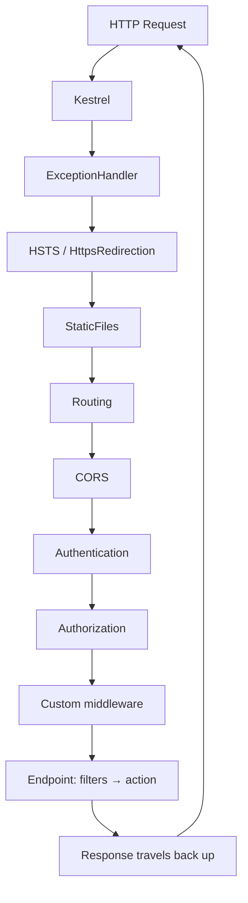
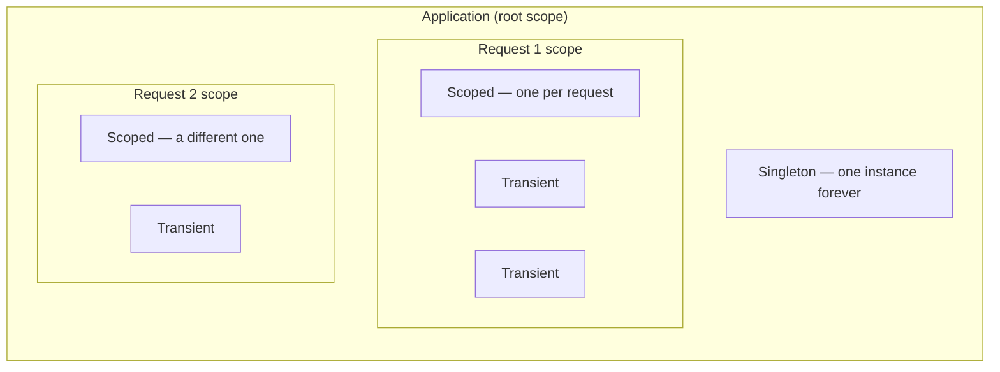
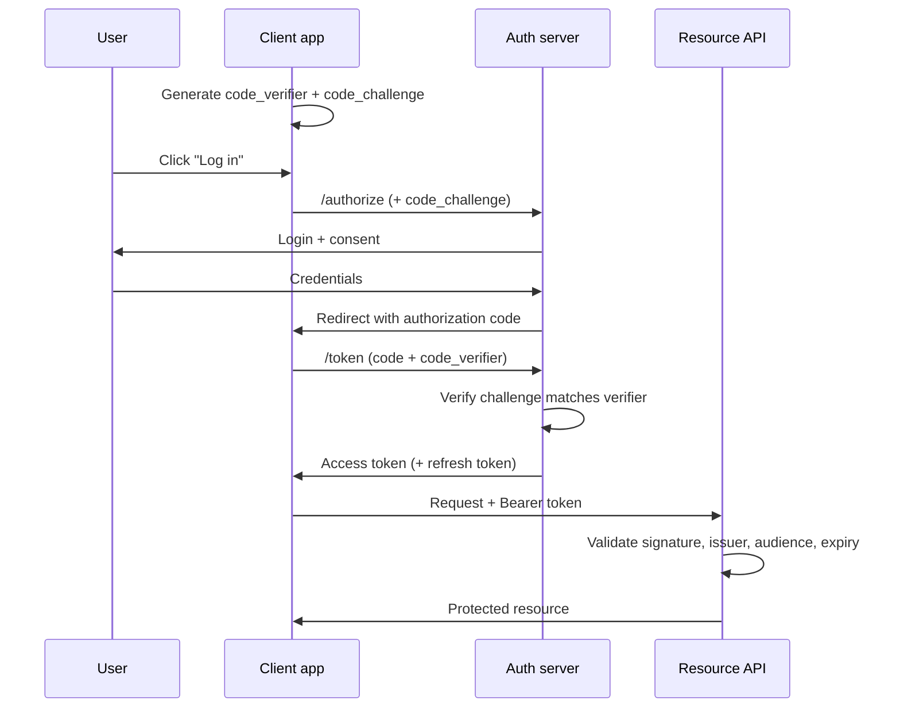
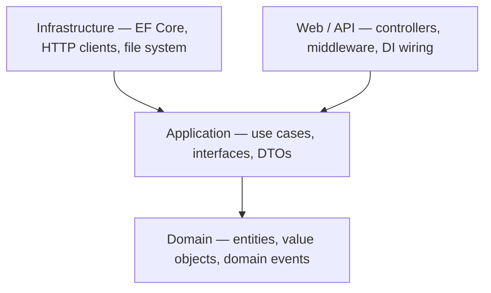

# Diagrams Worth Memorizing

**[← Roadmap](ROADMAP.md)** · **[README](index.md)**

> Every 🎯 topic in the roadmap should end up here. These are the drawings that turn a
> rambling verbal answer into a confident one — when you can draw it, you stop
> backtracking, and the interviewer can follow you.
>
> **Practise on paper.** Being able to read a diagram is not the same as being able to
> produce one under pressure with a marker in your hand.

Diagrams use Mermaid, which renders in the VS Code preview (with Markdown Preview
Enhanced), on GitHub, and in the exported PDF.

---

## 1. The ASP.NET Core request pipeline · [5.1](notes/05-middleware-pipeline/5.01-what-is-middleware.md)

The single most useful diagram in this repo. If you can draw this and narrate it, you can
answer a large fraction of every ASP.NET Core interview.

**The narration:** each middleware gets the `HttpContext`, does work *before* calling
`next()`, then does work *after* it returns. So the pipeline is a nested set of
try/finally-shaped calls, not a flat list — which is exactly why order matters and why
response-modifying middleware has to be registered *early*.

---

## 2. DI service lifetimes · [6.3](notes/06-dependency-injection/6.03-service-lifetimes.md)

**The narration:** transient is per-injection, scoped is per-request, singleton is per-app.
The captive dependency problem is what happens when you draw an arrow from `S` into
`SC1` — the singleton pins a request-scoped object alive forever.

---

## 3. OAuth 2.0 authorization code flow with PKCE · [15.8](notes/15-authentication/15.08-oauth2.md)

---

## 4. Clean Architecture layers · [22.7](notes/22-architecture-patterns/22.07-clean-architecture.md)

**The one rule:** dependencies point inward. Domain knows nothing about anything. The
interface for a repository lives in Application; the implementation lives in
Infrastructure. That inversion is the entire point — everything else is folder naming.

---

## To be added

Each of these is a 🎯 topic in the roadmap. Draw it when you write the note.

- [ ] Kestrel vs IIS hosting models — [4.9](notes/04-fundamentals-startup/4.09-kestrel-iis-httpsys.md)
- [ ] Application lifecycle and graceful shutdown — [4.6](notes/04-fundamentals-startup/4.06-app-lifecycle.md)
- [ ] Middleware vs filters — where each sits — [5.13](notes/05-middleware-pipeline/5.13-middleware-vs-filters.md)
- [ ] The filter pipeline and its five types — [12.1](notes/12-filters/12.01-filter-pipeline.md)
- [ ] GC generations and promotion — [3.4](notes/03-dotnet-runtime/3.04-garbage-collection.md)
- [ ] async/await state machine — [2.11](notes/02-collections-linq-async/2.11-async-await-internals.md)
- [ ] Thread vs Task vs ThreadPool — [2.10](notes/02-collections-linq-async/2.10-threads-vs-tasks.md)
- [ ] CORS preflight exchange — [10.10](notes/10-web-api-rest/10.10-cors.md)
- [ ] The N+1 query problem — [13.9](notes/13-entity-framework-core/13.09-n-plus-one.md)
- [ ] Index B-tree structure — [14.2](notes/14-databases/14.02-indexes.md)
- [ ] Isolation levels vs read phenomena (the classic grid) — [14.3](notes/14-databases/14.03-isolation-levels.md)
- [ ] CSRF attack sequence — [17.4](notes/17-application-security/17.04-csrf.md)
- [ ] Cache-aside read and write paths — [19.1](notes/19-caching-performance/19.01-caching-strategies.md)
- [ ] Circuit breaker state machine — [19.11](notes/19-caching-performance/19.11-polly-resilience.md)
- [ ] Saga: orchestration vs choreography — [23.8](notes/23-microservices/23.08-saga-outbox.md)
- [ ] Outbox pattern — [23.8](notes/23-microservices/23.08-saga-outbox.md)
- [ ] API Gateway / BFF topology — [23.10](notes/23-microservices/23.10-api-gateway-bff.md)
- [ ] Blue-green vs canary rollout — [24.11](notes/24-devops-hosting/24.11-deployment-strategies.md)
