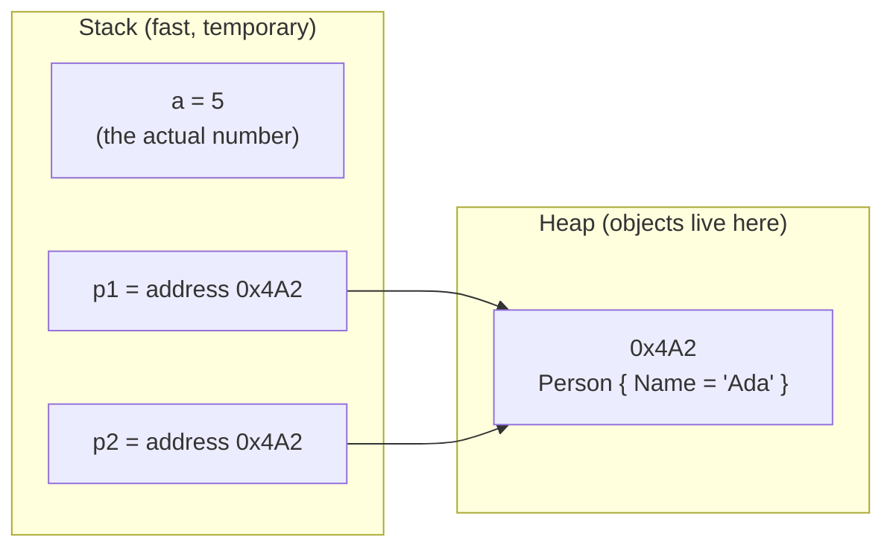

# 1.1 — Value Types vs Reference Types, Stack vs Heap, Boxing

> **[← Roadmap](../../ROADMAP.md)** · **Section:** [1. C# Language Fundamentals](../../ROADMAP.md#1-c-language-fundamentals)
> **Next:** [1.2 struct vs class vs record](1.02-struct-class-record.md)

**Markers:** 🔥 ⚠️ 🎯 · **Confidence:** 🔴 · **Last reviewed:** —

---

## TL;DR

- A **value type** holds the real data inside the variable. A **reference type** holds only an address. The data itself sits somewhere else.
- When you copy a variable, you always copy what is inside it. For a value type that is the data. For a reference type that is the address — so now two variables point to the same object.
- "Value types live on the stack" is a common answer, but it is not fully correct. Where the data lives depends on where you declared it, not on what type it is.

---

## The concept

Think of a variable as a small box that you write something in.

**A value type is like writing a phone number on a piece of paper.**
If you copy that paper, you now have two papers, each with its own phone number. Change
one paper, and the other paper is not affected. They are completely separate.

Value types are: `int`, `double`, `bool`, `char`, `decimal`, `enum`, `struct`, and
`record struct`.

**A reference type is like writing a house address on a piece of paper.**
If you copy that paper, you have two papers — but both papers point to the *same house*.
If someone repaints the house, both papers still point to that same repainted house. The
papers are separate, but the house is shared.

Reference types are: `class`, `interface`, `delegate`, `record`, `string`, arrays, and
`object`.

This is the most common C# question in interviews. Interviewers ask it because it predicts
a very real bug: writing a method that accidentally changes the caller's object.

---

## How it works

### What happens when you copy

```csharp
// Value type — like copying the phone number
int a = 5;
int b = a;      // b now holds its own copy of the number 5
b = 10;         // we change b
                // a is STILL 5 — the two are unrelated
```

```csharp
// Reference type — like copying the house address
var p1 = new Person { Name = "Ada" };
var p2 = p1;    // p2 now holds the same address as p1
                // both point to ONE Person object
p2.Name = "Grace";

// p1.Name is now "Grace" too!
// We never touched p1, but p1 and p2 are the same object.
```

That second example is the one that causes real bugs. You pass an object into a method,
the method changes it, and suddenly your original object has changed too.

### Stack vs heap

You will often hear: "value types go on the stack, reference types go on the heap."

First, what are these two words?

- **Stack** — a small, very fast area of memory. It works like a stack of plates: the last
  thing you put on is the first thing you take off. When a method finishes, everything it
  put on the stack disappears automatically.
- **Heap** — a bigger area of memory where objects live. Things here stay until the
  garbage collector decides nobody is using them any more.

Now, the simple answer is *mostly* true, but an interviewer may push back on it. Here is
the fuller picture:

| Where you declared it | Where it actually lives |
|---|---|
| An `int` inside a method (a local variable) | Stack |
| An `int` that is a field inside a class | **Heap** — inside that object |
| An `int` captured by a lambda | **Heap** — inside a hidden closure object |
| An `int` in an `async` method, used after an `await` | **Heap** — inside the state machine object |
| A `Person` variable inside a method (the address itself) | Stack |
| The actual `Person` object | Heap |

So a value type follows whatever is holding it. If a class lives on the heap, its `int`
fields live on the heap too — they are part of that object.

**The safer thing to say in an interview:** value types have *copy behaviour* and
reference types have *shared behaviour*. That is what C# actually promises. Stack versus
heap is a detail of how the runtime happens to do it, and the C# specification
deliberately does not guarantee it.



Notice that `p1` and `p2` are two separate boxes on the stack, but both arrows point to
the same single object on the heap.

### Boxing and unboxing

Sometimes C# needs to treat a value type as if it were an object. To do that, it wraps the
value in a small box on the heap. That is called **boxing**. Taking it back out again is
**unboxing**.

```csharp
int i = 42;
object boxed = i;         // BOXING: creates a new object on the heap
                          // and copies 42 into it
int back = (int)boxed;    // UNBOXING: checks the type, then copies 42 back out
```

Why should you care? Because boxing costs memory and time, and **nothing in the code tells
you it is happening**. There is no keyword, no warning. It just quietly allocates.

Here is where it sneaks in:

```csharp
ArrayList list = new();
list.Add(42);                    // BOXES. ArrayList stores everything as object.

List<int> generic = new();
generic.Add(42);                 // No boxing. The list knows it holds int.

Console.WriteLine("Val: " + 42); // BOXES. The int must become an object
                                 // to be joined with a string.
```

This is actually the main reason **generics** were added to C#. Before generics, every
collection stored `object`, so every number you put in a list got boxed. Generics let the
collection know the real type, so no boxing is needed. If an interviewer asks "why do we
have generics?", this is a strong part of the answer.

### Equality — what does `==` compare?

- Value types compare the **actual data**.
- Reference types compare the **address** — meaning "are these literally the same object?"

```csharp
5 == 5                                   // true — same number

new Person("Ada") == new Person("Ada")   // false!
// Two separate objects. Same contents, but different addresses.

"abc" == "abc"                           // true
// string is special — see below
```

`string` is the confusing one. It is a reference type, but it compares by content, not by
address. The `string` type deliberately changes what `==` does. More on that in
[1.3](1.03-strings-and-stringbuilder.md).

---

## Code

This example shows all four cases you might be asked about. Read the comments carefully —
case 3 is the one people get wrong.

```csharp
// Case 1: pass a value type
static void MutateValue(int x) => x = 99;

// Case 2: change the object a reference points to
static void MutateReference(Person p) => p.Name = "Changed";

// Case 3: point the parameter at a brand new object
static void ReassignReference(Person p) => p = new Person { Name = "New" };

// Case 4: pass the variable itself, not a copy
static void MutateWithRef(ref int x) => x = 99;
```

Now let us call them:

```csharp
var n = 1;

MutateValue(n);
// n is STILL 1.
// The method got its own copy of the number. It changed the copy.

MutateWithRef(ref n);
// n is now 99.
// 'ref' means "here is the actual variable, not a copy".

var person = new Person { Name = "Ada" };

MutateReference(person);
// person.Name is now "Changed".
// The method got a copy of the ADDRESS, but the address points
// to the same object. So changing the object is visible outside.

ReassignReference(person);
// person.Name is STILL "Changed" — NOT "New".
// The method changed its own copy of the address to point somewhere new.
// Our 'person' variable still holds the OLD address.
```

That last case trips up a lot of people. Here is the key idea in one sentence:

> With a reference type, you can **change the object**, but you cannot **swap which object
> the caller is looking at** — unless you use `ref`.

Going back to the paper analogy: you can go to the house and repaint it (everyone sees the
change). But if you scribble a *different* address on your own copy of the paper, that
does not change what is written on my paper.

---

## Interview questions

**Q: What is the difference between a value type and a reference type?**

A value type stores the actual data inside the variable, so when you assign it to another
variable, the data gets copied. The two are then completely independent. A reference type
stores an address that points to an object on the heap. When you assign it, you copy the
address — so both variables now point to the same object, and changing it through one is
visible through the other. Value types are things like `int`, `struct` and `enum`.
Reference types are classes, interfaces, delegates, arrays and `string`.

**Q: Do value types always live on the stack?**

No, and that is a common oversimplification. A value type declared as a local variable
inside a method usually does live on the stack. But if it is a field inside a class, it
lives on the heap as part of that object. The same is true if a lambda captures it, or if
it survives across an `await` in an async method — in both cases the compiler moves it
into a hidden object on the heap. What the language actually guarantees is copy behaviour,
not a storage location.

**Q: What is boxing and why does it matter?**

Boxing is when the runtime wraps a value type in an object on the heap so it can be used
where an object is expected. It costs a memory allocation plus a copy, and unboxing costs
a type check plus another copy. It matters because it is completely invisible in the code
— there is no keyword and no warning — so it is easy to do accidentally in a loop and
create a lot of garbage. Using a non-generic collection like `ArrayList`, or storing a
number in an `object`, will both box. Avoiding this was one of the main reasons generics
were added to C#.

**Q: If I pass an object into a method and the method assigns a new object to the parameter, does the caller see the change?**

No. The reference is passed by value, which means the method gets its own copy of the
address. Assigning a new object to that copy only changes the method's local parameter —
the caller's variable still holds the original address. But if the method changes a
property on the object instead of replacing it, the caller *will* see that, because both
are looking at the same object. To actually replace the caller's object you would need to
declare the parameter as `ref Person`.

---

## Traps ⚠️

- **"Value types are on the stack."** Only when they are local variables. As class fields,
  captured lambda variables, or async locals, they are on the heap.
- **"Passing a class is pass by reference."** It is passing *a reference*, but the
  reference itself is passed *by value*. That difference only shows up when you reassign
  the parameter — which is exactly when it bites.
- **`string` looks like a value type.** It is a reference type, but it cannot be changed
  and it compares by content. So it behaves like a value type most of the time, which
  makes the times it does not behave that way very confusing.
- **Boxing is completely silent.** `object o = 42;` allocates. So does
  `IComparable c = 42;`. Nothing warns you.
- **Mutable structs are dangerous.** A `struct` you can change is a known trap, because
  you can easily end up changing a copy without realising. Covered in
  [1.2](1.02-struct-class-record.md).

---

## Related

- [1.2 struct vs class vs record](1.02-struct-class-record.md) — how to choose between them
- [1.3 Strings](1.03-strings-and-stringbuilder.md) — the reference type that acts like a value type
- [1.10 Generics](1.10-generics.md) — how generics remove boxing
- [1.18 `ref`, `out`, `in`](1.18-tuples-ref-out-in.md) — passing the real variable
- [3.4 Garbage collection](../03-dotnet-runtime/3.04-garbage-collection.md) — the cost of putting things on the heap

---

## Sources

- [Microsoft Learn — Value types](https://learn.microsoft.com/dotnet/csharp/language-reference/builtin-types/value-types)
- [Microsoft Learn — Reference types](https://learn.microsoft.com/dotnet/csharp/language-reference/keywords/reference-types)
- [Microsoft Learn — Boxing and unboxing](https://learn.microsoft.com/dotnet/csharp/programming-guide/types/boxing-and-unboxing)
