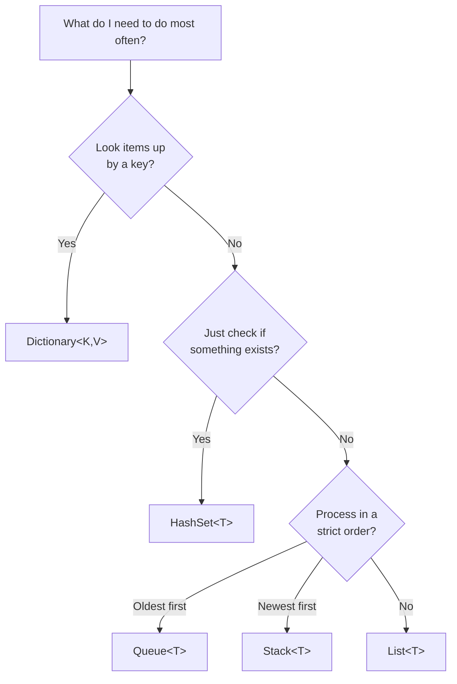

# 2.2 — Core Collections and their Big-O

> **[← Roadmap](../../ROADMAP.md)** · **Section:** [2. Collections, LINQ and Async](../../ROADMAP.md#2-collections-linq-and-async)
> **Prev:** [2.1 Collection interfaces](2.01-collection-interfaces.md) · **Next:** [2.3 Concurrent collections](2.03-concurrent-collections.md)

**Markers:** ⭐ 🎯 · **Confidence:** 🔴 · **Last reviewed:** —

---

## TL;DR

- **`List<T>`** for ordered items you loop through. **`Dictionary<K,V>`** for looking things up by a key. **`HashSet<T>`** for "have I seen this before?".
- The big one: **searching a `List` gets slower as it grows; searching a `Dictionary` or `HashSet` does not.**
- Picking `List` where you needed `Dictionary` is the classic cause of code that is fine in testing and unusable in production.

---

## The concept

First, what does **Big-O** mean? It is shorthand for "how does this get slower as the
collection grows?"

- **O(1)** — constant. Same speed with 10 items or 10 million. It jumps straight to the answer.
- **O(n)** — linear. Twice the items, twice the time. It has to look at everything.
- **O(log n)** — logarithmic. Grows very slowly. Doubling the items adds one extra step.

A useful picture for the two main types:

**A `List<T>` is like a row of numbered lockers.** If you know the locker number, you open
it instantly — that is O(1). But if you only know what is *inside* and want to find which
locker it is in, you have to open them one by one — O(n).

**A `Dictionary<K,V>` is like a coat check.** You hand over a ticket and get your coat back
immediately, no searching, however many coats there are. That is O(1) lookup by key, and it
is the reason dictionaries exist.

---

## How it works

### The table worth memorising 🎯

| Type | Add | Remove | Find by value | Find by key/index | Keeps order? |
|---|:--:|:--:|:--:|:--:|:--:|
| `List<T>` | O(1)* | O(n) | O(n) | O(1) by index | ✅ insertion order |
| `Dictionary<K,V>` | O(1)* | O(1) | O(n) | **O(1) by key** | ❌ no guarantee |
| `HashSet<T>` | O(1)* | O(1) | **O(1)** | — | ❌ no guarantee |
| `Queue<T>` | O(1) | O(1) | O(n) | — | ✅ first in, first out |
| `Stack<T>` | O(1) | O(1) | O(n) | — | ✅ last in, first out |
| `SortedDictionary<K,V>` | O(log n) | O(log n) | O(n) | O(log n) | ✅ sorted by key |
| `LinkedList<T>` | O(1) | O(1)** | O(n) | O(n) | ✅ insertion order |

\* *Amortised — meaning "on average". Occasionally the collection is full and has to
allocate a bigger internal array and copy everything across, which is O(n). Spread over
many adds, the average stays O(1).*

\*\* *O(1) only if you already hold the node. Finding it first is O(n).*

### `List<T>` — the default

An array underneath that grows when needed.

```csharp
var list = new List<Order>();
list.Add(order);           // O(1) — usually just writes to the next slot
list[5];                   // O(1) — jump straight to position 5
list.Contains(order);      // O(n) — checks every item until it finds a match
list.Remove(order);        // O(n) — find it, then shift everything after it down
```

**Performance tip worth knowing:** if you know roughly how many items you will add, say so
up front:

```csharp
var list = new List<Order>(capacity: 10_000);
// Without this, the list starts at 4 and doubles: 4, 8, 16, 32...
// Reaching 10,000 means ~11 reallocations and ~20,000 copied references.
```

### `Dictionary<K,V>` — lookup by key

Uses **hashing**: it runs the key through a function that produces a number, and uses that
number to jump straight to the right storage slot. No searching involved — that is why it
is O(1).

```csharp
var byId = new Dictionary<Guid, Order>();
byId[order.Id] = order;              // O(1)
var found = byId[someId];            // O(1) — throws if the key is missing

if (byId.TryGetValue(someId, out var o))    // O(1), no exception if missing
    Console.WriteLine(o.Total);
```

**Use `TryGetValue`, not `ContainsKey` followed by an index.** The second one hashes the
key twice for no reason:

```csharp
if (byId.ContainsKey(id))     // hashes the key
    var x = byId[id];         // hashes it AGAIN

byId.TryGetValue(id, out var x);   // one lookup, does both
```

### `HashSet<T>` — "have I seen this?"

Same hashing idea, but it stores only values and each one only once.

```csharp
var seen = new HashSet<string>();
seen.Add("a");           // returns true — it was new
seen.Add("a");           // returns false — already there. No duplicate stored.
seen.Contains("a");      // O(1)
```

This is the fix for a very common slow pattern:

```csharp
// SLOW: O(n × m). For 10,000 orders against 10,000 blocked IDs
// that is 100 MILLION comparisons.
var blocked = new List<Guid> { /* 10,000 ids */ };
var flagged = orders.Where(o => blocked.Contains(o.CustomerId)).ToList();

// FAST: O(n). Each Contains is now instant.
var blocked = new HashSet<Guid> { /* 10,000 ids */ };
var flagged = orders.Where(o => blocked.Contains(o.CustomerId)).ToList();
```

**One character changed. Roughly ten-thousand-fold speed difference.** This exact fix comes
up constantly in real code review, which is why interviewers like the question.

### `Queue<T>` and `Stack<T>`

```csharp
var queue = new Queue<Job>();     // FIFO — first in, first out. Like a checkout queue.
queue.Enqueue(job);
var next = queue.Dequeue();       // the OLDEST item

var stack = new Stack<Page>();    // LIFO — last in, first out. Like a pile of plates.
stack.Push(page);
var last = stack.Pop();           // the NEWEST item
```

Use `Queue` for processing in arrival order, `Stack` for undo history or backtracking.

### Choosing — the decision path 🎯



---

## Code

A realistic before-and-after, the kind of thing that turns up in a code review:

```csharp
// BEFORE — looks harmless, and is fine with 50 customers.
// With 50,000 it takes minutes.
public List<Order> FindVipOrders(List<Order> orders, List<Guid> vipCustomerIds)
{
    var result = new List<Order>();
    foreach (var order in orders)
    {
        if (vipCustomerIds.Contains(order.CustomerId))    // O(n) EVERY time
            result.Add(order);
    }
    return result;
}
```

Trace the cost: for each of the orders, `Contains` walks the whole VIP list. So 50,000
orders × 50,000 VIPs = 2.5 billion comparisons.

```csharp
// AFTER — build the lookup once, then every check is instant.
public List<Order> FindVipOrders(List<Order> orders, IEnumerable<Guid> vipCustomerIds)
{
    var vips = vipCustomerIds.ToHashSet();       // O(n) once, up front

    return orders
        .Where(o => vips.Contains(o.CustomerId)) // O(1) per check
        .ToList();
}
```

Now it is 50,000 + 50,000 = 100,000 operations instead of 2.5 billion.

**The general rule: if you find yourself calling `Contains` on a `List` inside a loop,
convert it to a `HashSet` before the loop.**

---

## Interview questions

**Q: When would you use a `Dictionary` instead of a `List`?**

Whenever the main thing I do is look items up by some identifier. A `List` has to walk
through items one at a time to find a match, so lookup gets slower as it grows. A
`Dictionary` hashes the key and jumps straight to the right slot, so it stays fast
regardless of size. The trade-off is that a dictionary does not guarantee any particular
order and it uses more memory, so if I mostly just loop through everything in sequence, a
`List` is the simpler choice.

**Q: What is the difference between a `List` and a `HashSet`?**

A `List` keeps items in the order you added them, allows duplicates, and finding a specific
item means scanning. A `HashSet` does not keep order, silently ignores duplicates, and can
check whether an item exists instantly because it uses hashing. So if I need "have I seen
this before?" or want to remove duplicates, `HashSet` is right. If order matters or I need
to index by position, `List` is right.

**Q: You see `list.Contains(x)` inside a `foreach` over another list. What's wrong?**

That is O(n × m) — for every item in the outer collection it scans the entire inner
collection. It looks fine with small test data and becomes unusable in production. The fix
is to build a `HashSet` from the inner list once before the loop, after which each
`Contains` is O(1). It turns quadratic work into linear, which for two lists of ten thousand
is the difference between a hundred million comparisons and twenty thousand.

**Q: What does "amortised O(1)" mean for `List.Add`?**

`List<T>` is backed by an array. Most adds just write into the next free slot, which is
O(1). But when the array fills up, it allocates a new one at double the size and copies
everything over, which is O(n). Because the doubling means that copy happens increasingly
rarely, the average cost per add across many adds still works out as constant — that is
what "amortised" means. If you know the final size, passing a capacity to the constructor
avoids the reallocations entirely.

---

## Traps ⚠️

- **`List.Contains` inside a loop is quadratic.** The single most common performance bug in
  this topic. Use a `HashSet`.
- **`Dictionary` and `HashSet` do not guarantee order.** Never rely on the order you get
  back from iterating one, even if it looks stable in testing.
- **A custom class used as a dictionary key must override `Equals` and `GetHashCode`.**
  Without that, two objects with identical contents are treated as different keys and
  lookups mysteriously fail. Records do this for you — see
  [1.2](../01-csharp-fundamentals/1.02-struct-class-record.md).
- **Mutating an object after using it as a key breaks the dictionary.** Its hash changes, so
  it lands in a different slot and can never be found again. Keys should be immutable.
- **`dictionary[missingKey]` throws.** `TryGetValue` does not. Use it.
- **`ContainsKey` followed by `[key]` hashes twice.** `TryGetValue` does it in one pass.
- **None of these are thread-safe.** Two threads writing to a `Dictionary` at once can
  corrupt it or spin forever. See [2.3](2.03-concurrent-collections.md).

---

## Related

- [2.1 Collection interfaces](2.01-collection-interfaces.md) — the contracts these types implement
- [2.3 Concurrent collections](2.03-concurrent-collections.md) — the thread-safe versions
- [1.2 Records](../01-csharp-fundamentals/1.02-struct-class-record.md) — free `Equals`/`GetHashCode` for keys
- [1.1 Value vs reference types](../01-csharp-fundamentals/1.01-value-vs-reference-types.md) — why key equality behaves as it does
- [19.15 Diagnosing a slow endpoint](../19-caching-performance/19.15-slow-endpoint-playbook.md) — where this shows up in practice

---

## Sources

- [Microsoft Learn — Collections and data structures](https://learn.microsoft.com/dotnet/standard/collections/)
- [Microsoft Learn — Choosing a collection class](https://learn.microsoft.com/dotnet/standard/collections/selecting-a-collection-class)
