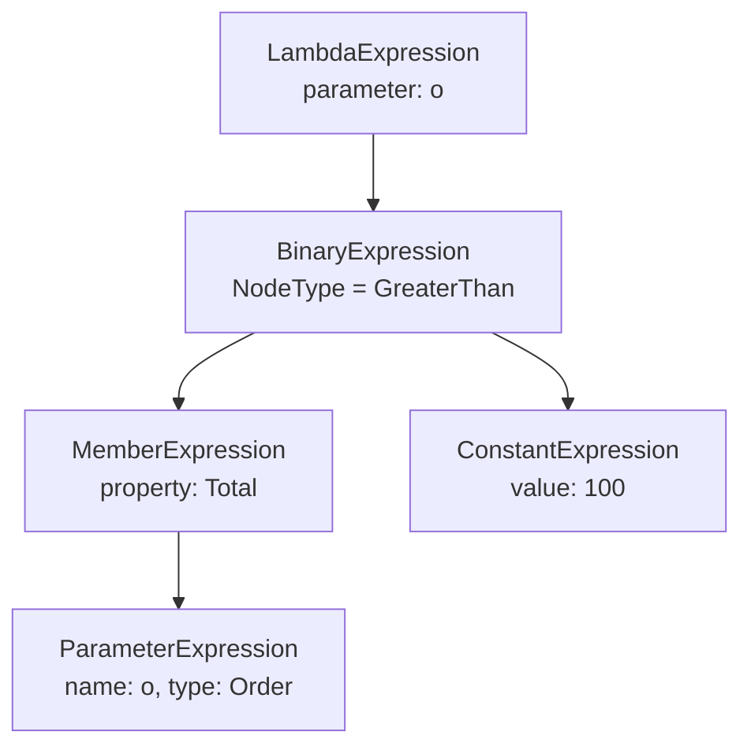

# 2.7 — IQueryable and Expression Trees: How LINQ Becomes SQL

> **[← Roadmap](../../ROADMAP.md)** · **Section:** [2. Collections, LINQ and Async](../../ROADMAP.md#2-collections-linq-and-async)
> **Prev:** [2.6 Deferred execution](2.06-deferred-execution.md) · **Next:** [2.8 Advanced LINQ operators](2.08-linq-advanced-operators.md)

**Markers:** ⭐ 🧠 · **Confidence:** 🔴 · **Last reviewed:** —

---

## TL;DR

- `Func<T,bool>` is **compiled code** — you can run it, but you cannot look inside it.
- `Expression<Func<T,bool>>` is **data describing code** — a tree you can read, inspect and translate into something else, like SQL.
- That single difference is the whole reason EF Core can turn your C# `Where` into a SQL `WHERE`.

---

## The concept

Here are two lines that look almost identical:

```csharp
Func<Order, bool>             a = o => o.Total > 100;
Expression<Func<Order, bool>> b = o => o.Total > 100;
```

Same lambda on the right. Completely different things on the left.

**`a` is a machine.** You can feed an order in and get `true` or `false` out. But you cannot
ask it "what are you comparing?" or "what number are you checking against?" It is compiled
instructions. Opaque.

**`b` is a blueprint of that machine.** It is a tree of objects describing the code:
"a greater-than comparison, whose left side is the `Total` property of the parameter, and
whose right side is the constant 100." You can walk that tree, read every part, and — crucially
— **write something else out of it.**

Which is exactly what EF Core does. It walks the tree and emits `WHERE [Total] > 100`.

That is the entire mechanism behind LINQ-to-SQL, and it is why the same `Where` you write
against a `List` can also run inside your database.

---

## How it works

### What the tree actually looks like

For `o => o.Total > 100`, the compiler builds this structure:



Every node is a real object you can inspect at runtime:

```csharp
Expression<Func<Order, bool>> expr = o => o.Total > 100;

var body = (BinaryExpression)expr.Body;

Console.WriteLine(body.NodeType);          // GreaterThan
Console.WriteLine(body.Left);              // o.Total
Console.WriteLine(body.Right);             // 100

var left = (MemberExpression)body.Left;
Console.WriteLine(left.Member.Name);       // "Total"
```

A database provider does this recursively over the whole tree, mapping each node type to
SQL. `GreaterThan` becomes `>`, `MemberExpression` becomes a column name, `ConstantExpression`
becomes a parameter.

### Why the two overloads exist

Look at the two `Where` methods:

```csharp
// LINQ to Objects — works in memory
public static IEnumerable<T> Where<T>(
    this IEnumerable<T> source,
    Func<T, bool> predicate);          // ← compiled code

// LINQ to a query provider — translated
public static IQueryable<T> Where<T>(
    this IQueryable<T> source,
    Expression<Func<T, bool>> predicate);   // ← a tree
```

**The C# compiler picks which one based on the type of the thing you are calling it on.**
That is why the trap from [2.1](2.01-collection-interfaces.md) is so easy to fall into:

```csharp
IQueryable<Order> q = db.Orders;
q.Where(o => o.Total > 100);       // Expression overload → becomes SQL

IEnumerable<Order> e = db.Orders;  // just changing the declared type...
e.Where(o => o.Total > 100);       // ...picks the Func overload → runs in memory
```

The lambda is identical. The declared type of the variable decided whether your filter ran
in the database or after downloading the whole table.

### You can compile a tree back into code

```csharp
Expression<Func<Order, bool>> expr = o => o.Total > 100;

Func<Order, bool> compiled = expr.Compile();   // build real executable code
var result = compiled(myOrder);                // now you can run it
```

`Compile()` is expensive — it generates IL at runtime. Never call it inside a loop. If you
need it repeatedly, compile once and cache the result.

### Building a tree by hand

You rarely need this, but it is what libraries do when they build queries dynamically:

```csharp
// Constructing 'o => o.Total > 100' manually
var param    = Expression.Parameter(typeof(Order), "o");
var property = Expression.Property(param, nameof(Order.Total));
var constant = Expression.Constant(100m);
var body     = Expression.GreaterThan(property, constant);

var lambda = Expression.Lambda<Func<Order, bool>>(body, param);

// Usable exactly like a written lambda
var results = db.Orders.Where(lambda).ToList();
```

This is how dynamic filtering and sorting from user input is implemented — a search screen
where the user picks the column and operator.

---

## ⚠️ Not everything can be translated

The provider can only translate node types it understands. Your own C# methods are opaque to
it:

```csharp
// This method exists only in .NET. SQL Server has never heard of it.
public static bool IsHighValue(Order o) => o.Total > 1000;

db.Orders.Where(o => IsHighValue(o)).ToList();
// EF Core throws:
//   "The LINQ expression could not be translated"
```

EF Core sees a `MethodCallExpression` pointing at your method and has no mapping for it. In
older EF versions this would **silently fall back to client evaluation** — downloading the
whole table and filtering in memory. That silent fallback caused so many production
disasters that EF Core 3.0 changed it to throw instead. Throwing is the better behaviour: a
loud failure at development time beats a quiet one at scale.

Things that typically cannot be translated:

```csharp
.Where(o => MyHelper(o))                      // your own methods
.Where(o => o.Total.ToString().Length > 3)    // some framework methods
.Where(o => customList.MyExtension(o))        // custom extension methods
.Where(o => o.CreatedAt.ToLocalTime() > x)    // no SQL equivalent
```

**The workaround** is to express the logic inline so the provider can see it:

```csharp
// Instead of a method call, use the expression directly
db.Orders.Where(o => o.Total > 1000);

// Or store the expression so it stays translatable AND reusable
public static Expression<Func<Order, bool>> IsHighValue =>
    o => o.Total > 1000;

db.Orders.Where(IsHighValue);      // works — it is a tree, not compiled code
```

That last pattern is worth knowing. Storing an `Expression<Func<T,bool>>` in a static
property gives you a named, reusable, still-translatable filter. It is the basis of the
Specification pattern — see
[22.13](../22-architecture-patterns/22.13-specification-result.md).

---

## Code

Dynamic sorting from a user-supplied column name, which is the most common real use:

```csharp
public static IQueryable<T> OrderByColumn<T>(
    this IQueryable<T> source,
    string columnName,
    bool descending)
{
    // Build:  x => x.<columnName>
    var param    = Expression.Parameter(typeof(T), "x");
    var property = Expression.PropertyOrField(param, columnName);
    var lambda   = Expression.Lambda(property, param);

    // Pick OrderBy or OrderByDescending
    var method = descending ? "OrderByDescending" : "OrderBy";

    // Call it via reflection, because the key type isn't known at compile time
    var call = Expression.Call(
        typeof(Queryable),
        method,
        [typeof(T), property.Type],
        source.Expression,
        Expression.Quote(lambda));

    return source.Provider.CreateQuery<T>(call);
}
```

Used from a controller:

```csharp
var page = await _db.Orders
    .Where(o => o.CustomerId == customerId)
    .OrderByColumn(request.SortBy, request.Descending)   // still SQL!
    .Skip(request.Page * 20)
    .Take(20)
    .ToListAsync(ct);
```

The sort happens **in the database**, on a column chosen at runtime.

⚠️ **`PropertyOrField` throws if the name does not exist**, and the name came from a user.
Always validate against an allow-list first — otherwise you have handed users the ability to
probe your schema through error messages:

```csharp
private static readonly HashSet<string> Sortable =
    ["CreatedAt", "Total", "Status"];

if (!Sortable.Contains(request.SortBy))
    throw new ValidationException($"Cannot sort by '{request.SortBy}'");
```

---

## Interview questions

**Q: What is the difference between `Func<T, bool>` and `Expression<Func<T, bool>>`?**

`Func<T, bool>` is a compiled delegate — you can invoke it, but it is a black box, so nothing
can inspect what it does. `Expression<Func<T, bool>>` is a data structure representing that
same lambda as a tree of objects: a comparison node, a property access node, a constant node
and so on. Because it is data, a library can walk it and translate it into something else.
That is exactly how EF Core turns a C# `Where` into a SQL `WHERE` clause. You can turn an
expression into a delegate with `Compile()`, but not the other way round.

**Q: How does EF Core turn my LINQ into SQL?**

`IQueryable<T>`'s operators take expression trees rather than delegates, so when you write
`Where(o => o.Total > 100)` the compiler hands EF Core a tree describing that comparison
instead of compiled code. Nothing runs at that point — the operators just build up a bigger
tree. When you finally enumerate, EF Core's provider walks the tree, maps each node to SQL,
and sends one statement to the database. Which overload the compiler chooses depends purely
on the static type of the source, which is why declaring something as `IEnumerable` instead
of `IQueryable` silently moves the work from the database into your process.

**Q: Why does EF Core throw "the LINQ expression could not be translated"?**

Because the expression tree contains a node the provider cannot map to SQL — most often a
call to one of your own methods, which exists only in .NET. Earlier versions of EF Core would
silently fall back to fetching everything and filtering in memory, which caused severe
performance problems that only appeared at production data volumes. EF Core 3.0 changed this
to throw so the problem surfaces during development. The fix is to write the logic inline so
the provider can see it, or to store it as an `Expression<Func<T,bool>>` rather than a normal
method, which keeps it translatable and reusable.

**Q: When would you build an expression tree by hand?**

Mainly for dynamic queries where the shape is not known at compile time — a search or grid
screen where the user picks which column to sort or filter by. Building the tree manually
lets that sort happen in the database rather than pulling everything back and sorting in
memory. It is also how specification-pattern libraries and dynamic filtering libraries work.
The important caveat is validation: property names coming from user input must be checked
against an allow-list, or you have exposed your schema.

---

## Traps ⚠️

- **Declaring a variable as `IEnumerable` instead of `IQueryable` changes which overload the
  compiler picks**, silently moving work out of the database.
- **Calling your own methods inside a query breaks translation.** Express the logic inline
  or store it as an `Expression<Func<T,bool>>`.
- **`Compile()` is expensive** — it generates IL at runtime. Never inside a loop.
- **Expression trees can only represent expressions, not statements.** No `if` blocks, no
  loops, no assignments in a lambda you intend to translate.
- **Building trees from user-supplied names is an injection risk.** Validate against an
  allow-list.
- **Not all providers support the same operators.** Something that translates against SQL
  Server may fail against SQLite or Cosmos.
- **A query that throws "could not be translated" is a *good* outcome.** The alternative —
  silent client evaluation — is far worse.

---

## Related

- [2.1 IEnumerable vs IQueryable](2.01-collection-interfaces.md) — where this trap starts
- [2.6 Deferred execution](2.06-deferred-execution.md) — why the tree can keep growing
- [1.11 Delegates](../01-csharp-fundamentals/1.11-delegates.md) — what `Func<T,bool>` is
- [1.23 Reflection](../01-csharp-fundamentals/1.23-attributes-reflection.md) — the related runtime-inspection tool
- [13.10 Client vs server evaluation](../13-entity-framework-core/13.10-client-vs-server-eval.md) — the EF Core consequences
- [22.13 Specification pattern](../22-architecture-patterns/22.13-specification-result.md) — reusable stored expressions

---

## Sources

- [Microsoft Learn — Expression trees](https://learn.microsoft.com/dotnet/csharp/advanced-topics/expression-trees/)
- [Microsoft Learn — How EF Core queries work](https://learn.microsoft.com/ef/core/querying/how-query-works)
