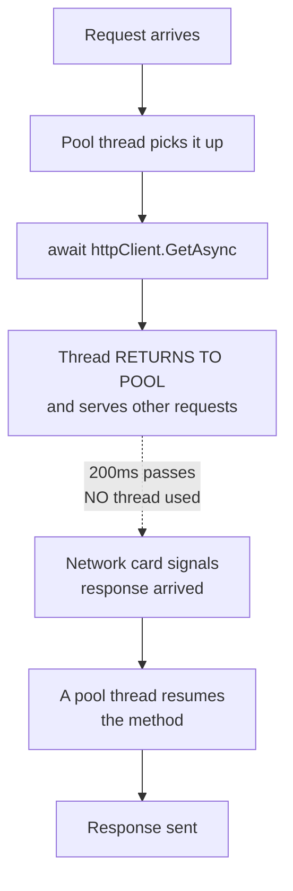

# 2.10 — Threads, ThreadPool, Task vs Thread

> **[← Roadmap](../../ROADMAP.md)** · **Section:** [2. Collections, LINQ and Async](../../ROADMAP.md#2-collections-linq-and-async)
> **Prev:** [2.9 First vs Single](2.09-first-single-default.md) · **Next:** [2.11 async/await internals](2.11-async-await-internals.md)

**Markers:** 🔥 🎯 · **Confidence:** 🔴 · **Last reviewed:** —

---

## TL;DR

- A **thread** is an actual worker provided by the operating system. Creating one is expensive — about 1 MB of memory each.
- The **thread pool** is a reusable set of threads .NET keeps around, so you do not pay that cost every time.
- A **`Task` is not a thread.** It is a *promise of a future result*. Some tasks use a thread; many use none at all.

---

## The concept

These three words get used interchangeably and they are not the same thing at all.

**A thread is a worker.** The operating system gives your process workers, and each one can
execute code. Hiring one is slow and each costs roughly a megabyte of memory for its stack.

**The thread pool is an agency.** Rather than hiring and firing workers constantly, .NET
keeps a pool of them. You hand it work, an idle worker picks it up, and when they finish
they go back to the pool instead of being dismissed.

**A `Task` is a job ticket.** It represents work that will eventually produce a result. It
says nothing about *who* does the work. Some tickets are handed to a pool worker. Others are
given to a device — a disk or a network card — which does the work with **no worker
involved at all.**

That last point is the one interviews are really testing, and it is the difference between
understanding async and just using it.

---

## How it works

### Creating a raw thread — rarely correct now

```csharp
var thread = new Thread(() =>
{
    Console.WriteLine("running on my own thread");
});
thread.Start();
thread.Join();      // wait for it to finish
```

Costs: about 1 MB of stack memory, plus roughly a millisecond to create and destroy. Spawn a
thousand and you have used a gigabyte of memory doing nothing useful.

You would only create a raw `Thread` deliberately when you need something the pool cannot
give you — a dedicated long-running loop, a specific priority, a foreground thread that
keeps the process alive, or a specific apartment state for COM interop.

### The thread pool

```csharp
ThreadPool.QueueUserWorkItem(_ => Console.WriteLine("running on a pool thread"));

// Task.Run is the modern way to do the same thing
Task.Run(() => Console.WriteLine("running on a pool thread"));
```

The pool reuses threads, grows when work queues up, and shrinks when it goes quiet. Because
threads are recycled, you must never leave one in a broken state — do not change its culture
or priority and forget to restore it.

### The crucial part: a `Task` is not a thread

Two tasks. One uses a thread; the other does not.

```csharp
// CPU-bound: there IS real computing to do,
// so a pool thread runs it.
var sum = await Task.Run(() =>
{
    var total = 0;
    for (var i = 0; i < 100_000_000; i++) total += i;
    return total;
});
```

```csharp
// I/O-bound: NO thread is used while waiting.
var response = await httpClient.GetAsync("https://example.com");
```

For the second one, here is what actually happens:

1. Your code calls `GetAsync`.
2. The request is handed to the operating system's network stack.
3. **Your thread returns to the pool and serves other work.**
4. Time passes — maybe 200 milliseconds. **Zero threads are involved.** The network card is
   doing the work.
5. The response arrives. The OS signals completion.
6. A thread is taken from the pool to continue your method after the `await`.

**There is no thread sitting and waiting.** This is the single most important idea in async
programming, and the reason it scales.



### Why this matters for a web server

Imagine 1,000 concurrent requests, each waiting 200 ms on a database.

**Blocking (synchronous):** each request holds a thread for the whole 200 ms. You need 1,000
threads. At ~1 MB each that is a gigabyte of stack memory, plus the CPU cost of the OS
switching between them constantly. The default pool will not grow that fast, so requests
queue and latency collapses.

**Async:** each request releases its thread while waiting. A handful of threads serve all
1,000 requests, because at any instant almost none of them need a worker — they are all just
waiting on the database.

**That is the entire reason ASP.NET Core is async throughout.** Not to make one request
faster — an async request is very slightly slower — but to serve far more requests with the
same hardware.

### Choosing

| Situation | Use |
|---|---|
| Waiting for I/O — network, disk, database | `await` the async method directly |
| Real CPU work you want off the current thread | `Task.Run(...)` |
| A long-running dedicated loop | `Thread` with `IsBackground = true`, or a `BackgroundService` |
| Background work in ASP.NET Core | `BackgroundService` ([21.1](../21-advanced-features/21.01-background-services.md)) |

---

## ⚠️ Do not wrap I/O in `Task.Run`

```csharp
// WRONG — pointless and harmful
var data = await Task.Run(() => httpClient.GetAsync(url).Result);
```

This takes a pool thread, **blocks it** on `.Result` for the whole network call, and gains
nothing. You have converted efficient thread-free waiting back into thread-blocking waiting,
and added an extra thread hop.

```csharp
// RIGHT
var data = await httpClient.GetAsync(url);
```

**The rule: `Task.Run` is for CPU work. For I/O, `await` the async method directly.**

And in ASP.NET Core specifically, `Task.Run` is usually wrong even for CPU work — the request
is already on a pool thread, so moving the work to *another* pool thread just adds overhead
without freeing anything. It helps in desktop apps, where it gets work off the single UI
thread.

---

## Code

```csharp
public class ReportService(HttpClient http, AppDbContext db)
{
    public async Task<Report> BuildAsync(Guid id, CancellationToken ct)
    {
        // I/O — awaited directly. No thread held while these wait.
        // WhenAll runs them concurrently, so total time is the SLOWEST,
        // not the sum. See 2.12.
        var ordersTask = db.Orders.Where(o => o.CustomerId == id).ToListAsync(ct);
        var ratesTask  = http.GetFromJsonAsync<Rates>("/rates", ct);

        await Task.WhenAll(ordersTask, ratesTask);

        var orders = await ordersTask;
        var rates  = await ratesTask;

        // Genuinely CPU-heavy work over a large result set.
        // Task.Run is defensible here IF this takes long enough to matter.
        var stats = await Task.Run(() => ComputeStatistics(orders, rates), ct);

        return new Report(orders.Count, stats);
    }

    private static Statistics ComputeStatistics(List<Order> orders, Rates rates)
    {
        // ... heavy number crunching over hundreds of thousands of rows ...
    }
}
```

Note the honesty in that comment. If `ComputeStatistics` takes 2 milliseconds, `Task.Run` is
pure overhead — just call it directly. It only earns its place when the work is long enough
that occupying a request thread genuinely hurts throughput.

---

## Interview questions

**Q: What is the difference between a `Thread` and a `Task`?**

A `Thread` is an actual operating system worker with its own stack, costing about a megabyte
of memory and a millisecond or so to create. A `Task` is a much higher-level thing — it
represents an operation that will complete in the future and produce a result. Crucially, a
task does not imply a thread. `Task.Run` does hand work to a thread-pool thread, but an
async I/O operation like an HTTP call uses no thread at all while it waits — the work is done
by the network hardware and the operating system, and a thread is only needed again once the
result arrives.

**Q: If `await` doesn't use a thread while waiting, what is actually happening?**

The operation is handed down to the operating system, which registers a completion callback
with the device driver. Your thread is then free and goes back to the pool to serve other
work. When the data arrives, the OS signals completion and the runtime schedules the rest of
your method onto an available pool thread. So during the wait there genuinely is no thread
associated with the operation — that is why a server with a handful of threads can handle
thousands of concurrent requests that are all waiting on a database.

**Q: Why is ASP.NET Core async all the way through?**

Throughput, not speed. An individual async request is marginally slower than a synchronous
one because of the state machine overhead. But because threads are released during I/O
waits, a small pool can serve a very large number of concurrent requests. Synchronously, each
in-flight request pins a thread for its entire duration, so a thousand concurrent requests
need a thousand threads — around a gigabyte of stack plus heavy context switching. Async
turns that into a handful of threads.

**Q: When should you use `Task.Run`?**

For genuinely CPU-bound work that you want off the current thread, and mainly in desktop
applications where it keeps the UI thread responsive. In ASP.NET Core it is usually the wrong
answer, because the request is already running on a pool thread — moving work to another pool
thread adds a hop without freeing any capacity. And you should never wrap an I/O call in it,
because that blocks a pool thread on something that was designed not to need one.

---

## Traps ⚠️

- **"A Task runs on a separate thread."** Not necessarily, and usually not for I/O. This is
  the most common misconception in the whole topic.
- **Wrapping I/O in `Task.Run`** converts thread-free waiting back into thread-blocking
  waiting.
- **`Task.Run` in ASP.NET Core rarely helps.** You are already on a pool thread.
- **Creating raw threads for short work is very wasteful.** ~1 MB and ~1 ms each.
- **Pool threads are recycled.** Changing culture, priority or thread-local state without
  restoring it leaks that change into unrelated later work.
- **`Thread.Sleep` blocks a thread; `Task.Delay` does not.** Never use `Thread.Sleep` in
  async code.
- **Blocking pool threads causes thread-pool starvation** — the pool only adds new threads
  slowly, so latency spikes badly under load. See
  [19.12](../19-caching-performance/19.12-threadpool-starvation.md).

---

## Related

- [2.11 async/await internals](2.11-async-await-internals.md) — how the resume actually works
- [2.12 Task vs ValueTask](2.12-task-valuetask.md) — running tasks concurrently
- [2.13 Deadlocks](2.13-async-deadlocks.md) — what blocking a thread costs you
- [2.18 Thread safety](2.18-thread-safety.md) — sharing data across threads
- [19.12 Thread-pool starvation](../19-caching-performance/19.12-threadpool-starvation.md) — the production failure mode
- [21.1 Background services](../21-advanced-features/21.01-background-services.md) — long-running work done properly

---

## Sources

- [Microsoft Learn — Managed threading](https://learn.microsoft.com/dotnet/standard/threading/)
- [Microsoft Learn — Task-based asynchronous pattern](https://learn.microsoft.com/dotnet/standard/asynchronous-programming-patterns/task-based-asynchronous-pattern-tap)
