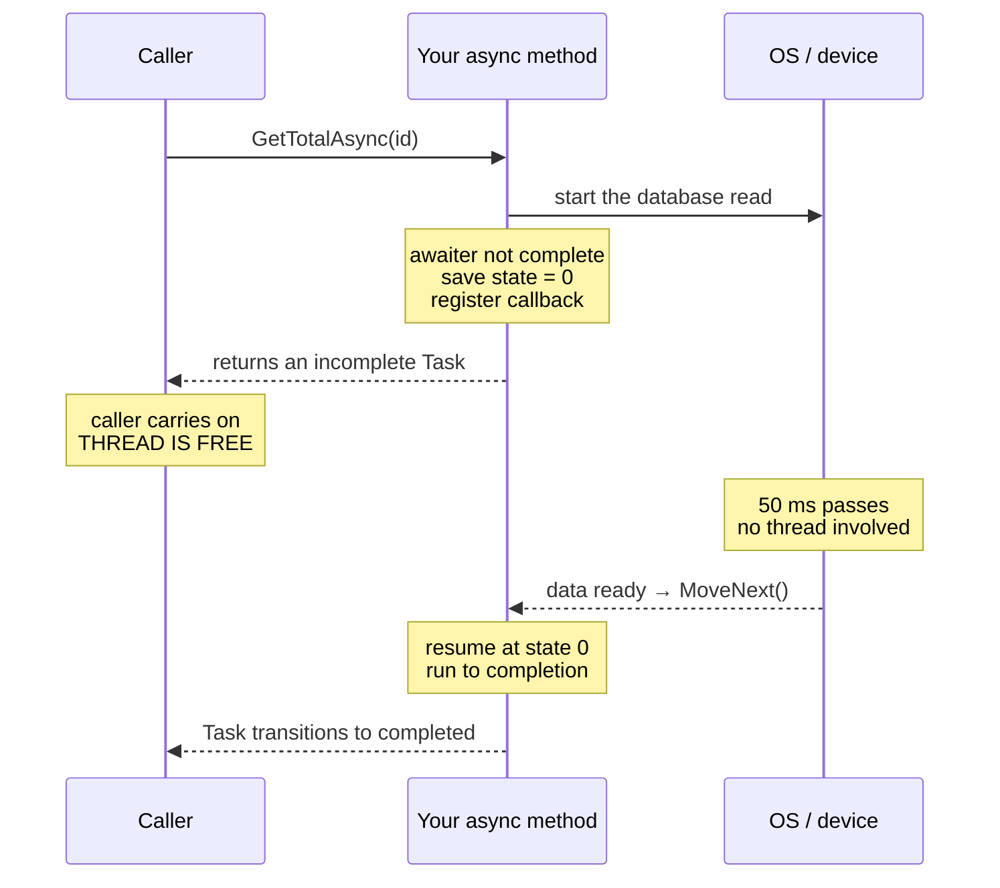

# 2.11 — async / await: The State Machine Underneath

> **[← Roadmap](../../ROADMAP.md)** · **Section:** [2. Collections, LINQ and Async](../../ROADMAP.md#2-collections-linq-and-async)
> **Prev:** [2.10 Threads vs Tasks](2.10-threads-vs-tasks.md) · **Next:** [2.12 Task vs ValueTask](2.12-task-valuetask.md)

**Markers:** 🔥 🎯 🧠 · **Confidence:** 🔴 · **Last reviewed:** —

---

## TL;DR

- `async`/`await` is **compiler magic, not runtime magic.** The compiler chops your method into pieces and rebuilds it as a state machine class.
- `await` means **"if this isn't finished, return to my caller now, and resume here later."**
- The method returns at the first incomplete `await`. Everything after that runs as a callback.

---

## The concept

`await` looks like it pauses your method. It does not — pausing would mean a thread sitting
idle, which is exactly what async exists to avoid.

What actually happens is closer to **leaving a bookmark and walking away.**

Imagine reading a long book, and partway through you have to wait for a delivery. Instead of
standing at the door doing nothing, you put a bookmark in, close the book, and go do
something else. When the delivery arrives, someone — not necessarily you — picks the book up
at the bookmark and carries on.

That is `await`. The bookmark is a **state number**. Closing the book is **returning to your
caller**. Picking it up again is a **callback** when the operation completes.

The compiler builds all of this for you. Understanding that it is compile-time rewriting,
not some runtime trick, is what makes the rest of async make sense.

---

## How it works

### What you write

```csharp
public async Task<int> GetTotalAsync(Guid id)
{
    var orders = await _db.GetOrdersAsync(id);      // pause point 1
    var rates  = await _http.GetRatesAsync();       // pause point 2
    return orders.Sum(o => o.Total * rates.Usd);
}
```

### What the compiler produces

Roughly this — a class with a `MoveNext` method and a state number:

```csharp
// Compiler-generated, simplified heavily
class GetTotalAsyncStateMachine : IAsyncStateMachine
{
    public int _state = -1;
    public AsyncTaskMethodBuilder<int> _builder;
    public Guid id;                                 // parameters become FIELDS

    private List<Order> _orders;                    // locals become FIELDS too
    private Rates _rates;
    private TaskAwaiter<List<Order>> _awaiter1;
    private TaskAwaiter<Rates> _awaiter2;

    public void MoveNext()
    {
        switch (_state)
        {
            case -1:                                // first entry
                _awaiter1 = _db.GetOrdersAsync(id).GetAwaiter();
                if (!_awaiter1.IsCompleted)
                {
                    _state = 0;
                    _awaiter1.OnCompleted(MoveNext); // "call me back, then RETURN"
                    return;                          // ← the method exits HERE
                }
                goto case 0;

            case 0:                                 // resumed after await 1
                _orders = _awaiter1.GetResult();
                _awaiter2 = _http.GetRatesAsync().GetAwaiter();
                if (!_awaiter2.IsCompleted)
                {
                    _state = 1;
                    _awaiter2.OnCompleted(MoveNext);
                    return;
                }
                goto case 1;

            case 1:                                 // resumed after await 2
                _rates = _awaiter2.GetResult();
                _builder.SetResult(_orders.Sum(o => o.Total * _rates.Usd));
                return;
        }
    }
}
```

Three things worth pulling out of that:

1. **Your locals became fields.** They have to survive between calls to `MoveNext`, so they
   move onto the heap. That is why a value type held across an `await` lives on the heap —
   see [1.1](../01-csharp-fundamentals/1.01-value-vs-reference-types.md).
2. **`return` happens at the first incomplete await.** The method genuinely exits and control
   goes back to the caller. Nothing is blocked.
3. **`OnCompleted(MoveNext)` is a callback registration.** "When you finish, call me again,
   and I will pick up at the state I saved."

### The fast path

Notice `if (!_awaiter1.IsCompleted)`. If the operation already finished — a cache hit, a
buffered stream read — there is **no state saved, no callback, no return.** Execution falls
straight through synchronously.

This is a deliberate optimisation and it matters: it is why an async method that usually
completes immediately is cheap, and it is the reason `ValueTask` exists
([2.12](2.12-task-valuetask.md)).

### `async` on the signature does nothing by itself

```csharp
public async Task<int> Foo()      // 'async' is NOT part of the public contract
```

`async` is an **instruction to the compiler**, not information for callers. It says "rewrite
this method into a state machine and let me use `await` inside it". Callers only see
`Task<int>`.

That is why you can override a non-async method with an async one, and why removing `async`
while returning the task directly is a valid optimisation:

```csharp
// With async: builds a state machine to await and re-wrap
public async Task<Order> GetAsync(Guid id)
    => await _repo.GetAsync(id);

// Without: just passes the task straight through. No state machine at all.
public Task<Order> GetAsync(Guid id)
    => _repo.GetAsync(id);
```

The second is slightly faster. **But be careful** — without `async`, exceptions thrown
*before* the task is returned propagate synchronously rather than being captured in the task,
and `using` blocks dispose immediately rather than after the operation completes. Only elide
`async` when the method body is a single pass-through return.

### The three return types

| Return type | Use for |
|---|---|
| `Task` | An async method that returns nothing |
| `Task<T>` | An async method that returns a value |
| `void` | **Only** event handlers. See [2.15](2.15-async-void.md) — it is otherwise a bug |

---

## The full picture 🎯



---

## Code

The cost of the state machine is real but small, and worth knowing when it matters:

```csharp
// Allocates: a state machine box + a Task object, every call
public async Task<int> GetCountAsync(Guid id)
{
    var cached = _cache.Get(id);
    if (cached is not null) return cached.Value;    // usually hits here!

    return await _db.CountAsync(id);
}
```

If that cache hits 99% of the time, you are allocating a `Task<int>` on nearly every call for
a value you already had. `ValueTask` avoids it:

```csharp
public ValueTask<int> GetCountAsync(Guid id)
{
    var cached = _cache.Get(id);
    if (cached is not null)
        return new ValueTask<int>(cached.Value);    // no allocation

    return new ValueTask<int>(_db.CountAsync(id));  // falls back to a real Task
}
```

**Only do this after measuring.** For a method called a few hundred times per second, the
allocation is irrelevant and `Task` is clearer. See [2.12](2.12-task-valuetask.md).

---

## Interview questions

**Q: What does the compiler do with an `async` method?**

It rewrites it into a state machine. The method body is split at each `await` into segments,
and those become cases in a `switch` inside a generated `MoveNext` method. Your local
variables and parameters become fields on that generated class so they survive across the
pause points. At each `await`, the compiler checks whether the operation has already
completed — if so it falls straight through, and if not it saves the current state number,
registers `MoveNext` as a completion callback, and returns to the caller. So the method
genuinely exits at the first incomplete await and the rest runs later as a callback.

**Q: What actually happens when you hit an `await`?**

The awaited operation is started, and the awaiter is asked whether it is already complete. If
it is, execution continues synchronously with no overhead at all. If not, the state machine
records where it got to, hooks `MoveNext` up as a callback on the operation, and returns an
incomplete `Task` to the caller — which frees the thread to do other work. When the operation
finishes, the callback fires, `MoveNext` runs again, and it resumes at the saved state.

**Q: Where do local variables live in an async method?**

On the heap, inside the generated state machine object — at least any that are used after an
`await`. They cannot stay on the stack, because the stack frame disappears when the method
returns at the pause point. This is why you cannot use a `Span<T>` across an `await`: spans
are stack-only by design and cannot be stored in a heap object. It is also why capturing
large objects in an async method keeps them alive for the whole operation.

**Q: Does `async` change the method's signature?**

No. `async` is a compiler directive, not part of the contract. It tells the compiler to build
a state machine and permits `await` inside the body, but callers only ever see the return
type. That is why you can implement a non-async interface method with an async one, and why
you can sometimes remove `async` and return the task directly as a small optimisation —
though only for a straight pass-through, because dropping `async` changes how exceptions and
`using` blocks behave.

---

## Traps ⚠️

- **"`await` pauses the thread."** It does the opposite — it releases the thread and returns
  to the caller.
- **Locals move to the heap.** So a `Span<T>` cannot cross an `await`, and captured objects
  stay alive for the whole operation.
- **The state machine allocates.** Usually irrelevant, but measurable in very hot paths —
  that is what `ValueTask` addresses.
- **Removing `async` for a pass-through changes exception timing.** Without `async`, an
  exception thrown before the task is returned propagates synchronously instead of being
  captured in the task.
- **Never elide `async` around a `using`.** Without `async` the dispose runs before the
  operation completes, closing the resource too early.
- **`async void` cannot be awaited and its exceptions crash the process.** See
  [2.15](2.15-async-void.md).
- **An async method that never awaits runs entirely synchronously** and the compiler warns
  you — the state machine overhead is paid for nothing.

---

## Related

- [2.10 Threads vs Tasks](2.10-threads-vs-tasks.md) — why no thread is held while waiting
- [2.12 Task vs ValueTask](2.12-task-valuetask.md) — avoiding the allocation
- [2.13 Deadlocks](2.13-async-deadlocks.md) — what blocking on this breaks
- [2.15 async void](2.15-async-void.md) — the one return type to avoid
- [2.16 Async exceptions](2.16-async-exceptions.md) — how the state machine captures them
- [1.1 Stack vs heap](../01-csharp-fundamentals/1.01-value-vs-reference-types.md) — why locals get promoted
- [1.25 Span](../01-csharp-fundamentals/1.25-span-memory.md) — why it cannot cross an await

---

## Sources

- [Microsoft Learn — Async in depth](https://learn.microsoft.com/dotnet/csharp/asynchronous-programming/async-scenarios)
- [Microsoft Learn — Task asynchronous programming model](https://learn.microsoft.com/dotnet/csharp/asynchronous-programming/task-asynchronous-programming-model)
