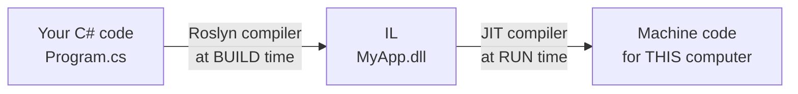

# 3.2 — CLR, CTS, CLS, IL, JIT, AOT, ReadyToRun

> **[← Roadmap](../../ROADMAP.md)** · **Section:** [3. .NET Runtime and Platform](../../ROADMAP.md#3-net-runtime-and-platform)
> **Prev:** [3.1 .NET history](3.01-dotnet-history.md) · **Next:** [3.3 Managed vs unmanaged](3.03-managed-vs-unmanaged.md)

**Markers:** ⭐ 🎯 · **Confidence:** 🔴 · **Last reviewed:** —

---

## TL;DR

- Your C# is **not** compiled straight to machine code. It is compiled to a middle language called **IL**.
- When you run the app, the **CLR** turns that IL into real machine code, one method at a time, as each is first needed. That step is called **JIT**.
- The other acronyms are small ideas around that: **CTS** (the type rules), **CLS** (the shared subset), **AOT** and **ReadyToRun** (doing the JIT work early).

---

## The concept

### The one story that explains all seven acronyms

A CPU only understands machine code, and machine code is different on every kind of CPU. An
Intel laptop and an ARM phone speak different languages.

Most older languages solved this by compiling straight to machine code. That works, but it
means one build per CPU type, decided at build time.

.NET does something different. It compiles in **two stages**:



**Stage one happens when you build.** The C# compiler (called Roslyn) turns your code into
**IL** — Intermediate Language. IL is a simple, CPU-independent set of instructions. Your
`.dll` file contains IL, not machine code.

**Stage two happens when you run.** The **CLR** — the Common Language Runtime, the engine
that runs .NET programs — reads that IL and converts it into machine code for whatever CPU
it happens to be running on. It does this **just in time**, hence **JIT**.

That is the whole idea. Every acronym in this note is a piece of that story.

### Why bother with two stages?

Three genuine benefits:

1. **One build runs anywhere.** The same `.dll` works on Windows, Linux, x64 and ARM,
   because the machine-specific step is deferred until you know the machine.
2. **The JIT knows things the build machine could not.** It sees the actual CPU and can use
   instructions specific to it. In some cases this beats compiling ahead of time.
3. **It can improve while running.** The runtime watches which methods are called most and
   recompiles those with heavier optimisation. This is called **tiered compilation**, and it
   is why a .NET service often gets faster in its first minute of traffic.

The cost is startup time. The first call to every method pays for its compilation.

---

## How it works

### The simple version — the acronyms, one line each

| Acronym | Stands for | In plain terms |
|---|---|---|
| **IL** | Intermediate Language | The middle language your C# becomes. CPU-independent. |
| **CLR** | Common Language Runtime | The engine that runs your code. Does JIT, memory, GC, exceptions. |
| **JIT** | Just-In-Time compilation | Turning IL into machine code as each method is first called. |
| **CTS** | Common Type System | The rules for what a type *is*, shared by all .NET languages. |
| **CLS** | Common Language Specification | The safe subset every .NET language must understand. |
| **AOT** | Ahead-Of-Time compilation | Doing the machine-code step at build time instead. |
| **ReadyToRun** | — | A middle ground: pre-compiled, but IL is kept as a fallback. |

You can see the IL for yourself. This C#:

```csharp
public int Add(int a, int b) => a + b;
```

becomes roughly this IL:

```
ldarg.1        // load the first argument
ldarg.2        // load the second argument
add            // add them
ret            // return the result
```

Simple, readable, and not tied to any CPU. Tools like ILSpy or [sharplab.io](https://sharplab.io)
let you inspect this for any code you write, which is genuinely useful for understanding what
the compiler does with features like `async` and `yield`.

### CTS and CLS — the two easily-confused ones

These exist because .NET was designed for **several languages**, not just C#. VB.NET and F#
compile to the same IL and can use each other's libraries.

For that to work, they must agree on some things.

**CTS — the Common Type System** defines what a type is. That every type derives from
`object`, that there are value types and reference types, what an interface is. It is the
shared model of types that all .NET languages build on.

**CLS — the Common Language Specification** is a *subset* of CTS: the features every .NET
language is guaranteed to support.

Why does a subset matter? Because C# has features other languages do not. C# is
case-sensitive, so it allows two members differing only by case:

```csharp
public void Process() { }
public void process() { }     // legal C#, but NOT CLS-compliant
```

VB.NET is case-insensitive. It cannot tell those two apart, so it could never call your
library properly.

If you are writing a library that other .NET languages might consume, you can ask the
compiler to check:

```csharp
[assembly: CLSCompliant(true)]     // warns about anything outside the safe subset
```

In practice, if your library is only used from C#, you can ignore CLS entirely. It matters
mainly to people publishing general-purpose packages.

**The memory aid:** *CTS is the full rulebook. CLS is the part everyone agreed to follow.*

### How it actually works — JIT and tiered compilation

The JIT does not compile your whole program at startup. It compiles **one method, the first
time that method is called**, then caches the result. A method you never call is never
compiled.

Modern .NET adds **tiered compilation** on top:

- **Tier 0** — the first time a method runs, compile it *quickly* with few optimisations.
  Startup stays fast.
- **Tier 1** — if a method is called many times, recompile it in the background with full
  optimisation and swap it in.

So the application starts quickly and then gets faster as the hot paths are identified.

This is worth knowing for a practical reason: **benchmarks must warm up first.** Measuring the
first few calls measures Tier 0 code and the compilation itself, not your actual steady-state
performance. BenchmarkDotNet handles this for you, which is one reason to use it rather than
a stopwatch — see
[19.14](../19-caching-performance/19.14-benchmarking-load-testing.md).

### The deeper detail — AOT and ReadyToRun

JIT costs startup time. For some workloads that matters a great deal — a serverless function
that runs for 200 milliseconds spends a large fraction of its life compiling.

Two options move that work earlier:

**ReadyToRun (R2R)** pre-compiles the IL to machine code at publish time, but **keeps the IL
too**. If the pre-compiled version cannot be used, the JIT falls back to compiling normally.
Startup is faster, the file is bigger, and everything still works everywhere.

```xml
<PublishReadyToRun>true</PublishReadyToRun>
```

**Native AOT** goes all the way. It compiles to a real native executable at build time, with
**no IL and no JIT at all**.

```xml
<PublishAot>true</PublishAot>
```

The results are dramatic — startup in single-digit milliseconds, much lower memory, and a
self-contained binary with no runtime to install. But you give things up:

- **No reflection over types the compiler could not see.** The trimmer removes unused code,
  and anything only reached by reflection looks unused. See
  [1.23](../01-csharp-fundamentals/1.23-attributes-reflection.md).
- **No runtime code generation.** `Expression.Compile()` and `Reflection.Emit` do not work,
  which rules out some ORMs and serializers.
- **You build per platform.** A Linux x64 build only runs on Linux x64.

That is why source generators have become popular — they do at build time what reflection
used to do at runtime, which keeps AOT working. More in
[21.10](../21-advanced-features/21.10-native-aot.md).

| | JIT | ReadyToRun | Native AOT |
|---|---|---|---|
| Startup | Slowest | Faster | Fastest |
| Peak speed | Best | Best | Slightly lower |
| File size | Smallest | Larger | Largest |
| Reflection | Full | Full | **Limited** |
| Build per platform | No | Partly | **Yes** |

---

## Code

Watching tiered compilation happen:

```csharp
// Called once — stays at Tier 0. Compiled quickly, never optimised further.
public void RunStartupTask() { /* ... */ }

// Called thousands of times per second — promoted to Tier 1
// with full optimisation shortly after the app warms up.
public decimal CalculatePrice(Order order) { /* ... */ }
```

You do not control this and normally should not try. But you can turn it off if you are
measuring something and want consistent numbers:

```xml
<TieredCompilation>false</TieredCompilation>
```

Publishing with each strategy:

```bash
# Normal — IL only, JIT at runtime. Needs .NET installed.
dotnet publish -c Release

# ReadyToRun — pre-compiled, IL kept as a fallback
dotnet publish -c Release -r linux-x64 -p:PublishReadyToRun=true

# Native AOT — a real native binary, no runtime needed
dotnet publish -c Release -r linux-x64 -p:PublishAot=true
```

---

## Interview questions

**Q: What happens when you compile and run a C# program?**

There are two stages. At build time the C# compiler turns your source into IL, an
intermediate language that is not tied to any CPU, and that is what goes into the `.dll`. At
run time the CLR takes that IL and compiles it into machine code for the actual processor,
one method at a time as each is first called — that is JIT compilation. The benefit is that a
single build runs on any platform, and the JIT can optimise for the specific CPU it finds. The
cost is that the first call to each method pays for its compilation, which is why startup is
slower than a natively compiled language.

**Q: What is the difference between CTS and CLS?**

CTS, the Common Type System, is the shared model of what a type is across all .NET languages
— value types versus reference types, everything deriving from `object`, how interfaces work.
CLS, the Common Language Specification, is a subset of that: the features every .NET language
is guaranteed to support. The subset exists because languages differ — C# is case-sensitive
and allows two methods differing only by case, but VB.NET is case-insensitive and could never
call them. So CTS is the full rulebook and CLS is the part everyone agreed to follow. It only
really matters if you are publishing a library for other .NET languages to consume.

**Q: What is tiered compilation?**

The JIT compiles a method twice under different priorities. The first time a method runs it is
compiled quickly with minimal optimisation, which keeps application startup fast. If the
runtime then notices that method being called frequently, it recompiles it in the background
with full optimisation and swaps the new version in. So the app starts quickly and gets
faster as the hot paths reveal themselves. It matters practically when benchmarking, because
measuring the first few calls measures unoptimised code plus the compilation cost rather than
real throughput.

**Q: What is Native AOT, and what does it cost you?**

Native AOT compiles all the way to a native executable at build time, with no IL and no JIT.
Startup drops to a few milliseconds, memory use falls, and you get a self-contained binary
with no runtime to install — which is very attractive for serverless and short-lived
containers. The trade-off is that a lot of dynamic behaviour stops working: reflection over
types the compiler could not see, `Expression.Compile`, and `Reflection.Emit`. That rules out
some serializers and ORMs. You also have to build separately for each target platform. It is
a large part of why .NET has been moving to source generators, which do the equivalent work at
compile time.

---

## Traps ⚠️

- **"C# compiles to machine code."** It compiles to IL. Machine code comes later, from the JIT.
- **The `.dll` contains IL, not machine code.** That is why tools like ILSpy can decompile
  it back to readable C#, and why obfuscators exist.
- **Confusing CTS and CLS.** CTS is the whole type system; CLS is the smaller safe subset.
- **Benchmarking without a warm-up measures Tier 0 code**, not your real performance.
- **Native AOT silently breaks reflection.** It compiles fine, then fails at runtime with a
  missing type — a failure you may not see until production.
- **ReadyToRun does not remove the JIT**, it just gives it less to do. AOT removes it
  entirely.
- **AOT builds are platform-specific.** One build per target, unlike normal .NET.

---

## Related

- [3.1 .NET history](3.01-dotnet-history.md) — which runtime you are on
- [3.3 Managed vs unmanaged](3.03-managed-vs-unmanaged.md) — what "managed" means
- [3.4 Garbage collection](3.04-garbage-collection.md) — the CLR's other main job
- [1.23 Reflection](../01-csharp-fundamentals/1.23-attributes-reflection.md) — why AOT restricts it
- [21.10 Native AOT](../21-advanced-features/21.10-native-aot.md) — using it in ASP.NET Core
- [19.14 Benchmarking](../19-caching-performance/19.14-benchmarking-load-testing.md) — why warm-up matters

---

## Sources

- [Microsoft Learn — .NET architectural components](https://learn.microsoft.com/dotnet/standard/components)
- [Microsoft Learn — Managed execution process](https://learn.microsoft.com/dotnet/standard/managed-execution-process)
- [Microsoft Learn — Tiered compilation](https://learn.microsoft.com/dotnet/core/runtime-config/compilation)
