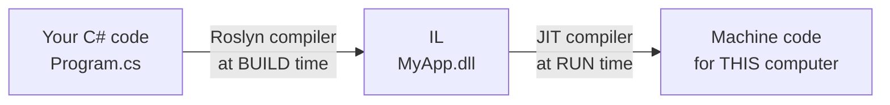

# 3.2 — CLR, CTS, CLS, IL, JIT, AOT, ReadyToRun

> **[← Roadmap](../../ROADMAP.md)** · **Section:** [3. .NET Runtime and Platform](../../ROADMAP.md#3-net-runtime-and-platform)
> **Prev:** [3.1 .NET history](3.01-dotnet-history.md) · **Next:** [3.3 Managed vs unmanaged](3.03-managed-vs-unmanaged.md)

**Markers:** ⭐ 🎯 · **Confidence:** 🔴 · **Last reviewed:** —

---

## TL;DR

C# is compiled in **two stages**. First your source becomes **IL**, a CPU-independent middle
language — that is what goes in the `.dll`. Then, while the app runs, the **CLR** turns that
IL into real machine code for the actual processor.

- The second stage happens **one method at a time, as each is first called**. That is **JIT**.
- **AOT** and **ReadyToRun** move that second stage to build time, trading flexibility for startup speed.
- **CTS** and **CLS** are the rules that let C#, VB.NET and F# share compiled code.

---

## Definitions

| Term | What it is | What it means |
|---|---|---|
| **Roslyn** | *the C# compiler* | What runs when you press Build. Turns `.cs` files into IL. |
| **IL** | *a language* | Intermediate Language. A simple instruction set **not tied to any CPU**. Your `.dll` contains this, not machine code. |
| **Assembly** | *a file* | The `.dll` or `.exe` Roslyn produces. Holds IL plus metadata describing every type inside. |
| **Metadata** | *data inside the assembly* | A description of every type, method and field. Reflection reads this. |
| **CLR** | *the runtime engine* | Common Language Runtime. Runs your code — JIT compilation, memory, garbage collection, exceptions. |
| **JIT** | *a compilation step* | Just-In-Time. The CLR turning IL into machine code **the moment a method is first called**, then caching it. |
| **Tiered compilation** | *a JIT strategy* | Compile fast first for quick startup, then recompile hot methods with full optimisation. |
| **Managed code** | *code the CLR runs* | Your C#. The CLR handles its memory and safety. |
| **CTS** | *a specification* | Common Type System. The shared rules for what a *type* is across all .NET languages. |
| **CLS** | *a specification* | Common Language Specification. A **subset** of CTS containing only what every .NET language supports. |
| **AOT** | *a compilation step* | Ahead-Of-Time. Compiling straight to native machine code at **build** time, leaving no IL and no JIT. |
| **ReadyToRun (R2R)** | *a compilation step* | A middle ground. Pre-compiles to machine code but **keeps the IL** as a fallback. |
| **Trimming** | *a build step* | Removing unused code to shrink output. Used with AOT, and the reason reflection breaks there. |

---

## The concept

### The one story that explains all seven acronyms

A CPU only understands machine code, and machine code differs by processor. An Intel laptop
and an ARM phone speak different languages.

Most older languages compile straight to machine code. That works, but it means one build per
CPU type, decided when you build.

.NET does something different. It compiles in **two stages**:



**Stage one, when you build.** Roslyn turns your C# into **IL** — a simple, CPU-independent
instruction set. Your `.dll` contains IL, not machine code.

**Stage two, when you run.** The **CLR** reads that IL and converts it to machine code for
whatever CPU it finds. It does this **just in time**, hence **JIT**.

Every acronym in this note is a piece of that story.

### Why bother with two stages?

Three real benefits:

1. **One build runs anywhere.** The same `.dll` works on Windows, Linux, x64 and ARM, because
   the machine-specific step waits until the machine is known.
2. **The JIT knows things the build machine could not.** It sees the actual CPU and can use
   instructions specific to it.
3. **It improves while running.** The runtime notices which methods are hot and recompiles
   them with heavier optimisation. This is why a .NET service often gets faster in its first
   minute of traffic.

The cost is startup time. The first call to every method pays for its compilation.

---

## How it works

### The simple version — what IL looks like

This C#:

```csharp
public int Add(int a, int b) => a + b;
```

becomes roughly this IL:

```
ldarg.1        // load the first argument
ldarg.2        // load the second argument
add            // add them
ret            // return the result
```

Simple, readable, tied to no CPU. Tools like ILSpy or [sharplab.io](https://sharplab.io) let
you inspect this for any code you write — genuinely useful for seeing what the compiler does
with `async`, `yield` and records.

This is also why decompilers exist. A `.dll` full of IL plus metadata can be turned back into
readable C#, which is why commercial software often ships obfuscated.

### CTS and CLS — the two people mix up

These exist because .NET was designed for **several languages**. VB.NET and F# compile to the
same IL and can use each other's libraries. For that, they must agree on some things.

**CTS — Common Type System** defines what a type *is*. Every type derives from `object`, there
are value types and reference types, interfaces work a certain way. It is the shared model.

**CLS — Common Language Specification** is a *subset* of CTS: the features **every** .NET
language is guaranteed to support.

Why a subset? Because languages differ. C# is case-sensitive, so this is legal:

```csharp
public void Process() { }
public void process() { }     // legal C#, but NOT CLS-compliant
```

VB.NET is case-insensitive. It cannot tell those apart, so it could never use your library
properly.

If you publish a library other .NET languages might consume, ask the compiler to check:

```csharp
[assembly: CLSCompliant(true)]     // warns about anything outside the safe subset
```

If your library is only ever used from C#, you can ignore CLS entirely.

**The memory aid:** *CTS is the full rulebook. CLS is the part every language agreed to follow.*

### How it actually works — JIT and tiered compilation

The JIT does not compile your program at startup. It compiles **one method, the first time
that method is called**, then caches the result. A method you never call is never compiled.

Modern .NET adds **tiered compilation**:

- **Tier 0** — first run: compile *quickly* with few optimisations. Startup stays fast.
- **Tier 1** — if a method is called many times, recompile it in the background with full
  optimisation and swap it in.

So the app starts fast and gets faster as the hot paths reveal themselves.

This matters practically: **benchmarks must warm up first.** Measuring the first few calls
measures Tier 0 code plus the compilation itself, not your real throughput. BenchmarkDotNet
handles that automatically, which is one reason to use it over a stopwatch — see
[19.14](../19-caching-performance/19.14-benchmarking-load-testing.md).

### The deeper detail — AOT and ReadyToRun

JIT costs startup time. For a serverless function that runs for 200 milliseconds, a large
fraction of its life is compilation.

Two options move that work earlier.

**ReadyToRun (R2R)** pre-compiles IL to machine code at publish time but **keeps the IL too**.
If the pre-compiled version cannot be used, the JIT compiles normally. Faster startup, bigger
file, everything still works everywhere.

```xml
<PublishReadyToRun>true</PublishReadyToRun>
```

**Native AOT** goes all the way — a real native executable, with **no IL and no JIT at all**.

```xml
<PublishAot>true</PublishAot>
```

The gains are dramatic: startup in single-digit milliseconds, much lower memory, a
self-contained binary needing no installed runtime. What you give up:

- **Reflection over types the compiler could not see.** Trimming removes unused code, and
  anything reached only by reflection looks unused. See
  [1.23](../01-csharp-fundamentals/1.23-attributes-reflection.md).
- **Runtime code generation.** `Expression.Compile()` and `Reflection.Emit` do not work,
  ruling out some ORMs and serializers.
- **One build per platform.** A Linux x64 build runs only on Linux x64.

This is a large part of why source generators became popular — they do at build time what
reflection used to do at runtime, which keeps AOT working. See
[21.10](../21-advanced-features/21.10-native-aot.md).

| | JIT | ReadyToRun | Native AOT |
|---|---|---|---|
| Startup | Slowest | Faster | Fastest |
| Peak speed | Best | Best | Slightly lower |
| File size | Smallest | Larger | Largest |
| Reflection | Full | Full | **Limited** |
| Build per platform | No | Partly | **Yes** |

---

## Code

Publishing with each strategy:

```bash
# Normal — IL only, JIT at runtime. Needs .NET installed on the target.
dotnet publish -c Release

# ReadyToRun — pre-compiled, IL kept as a fallback
dotnet publish -c Release -r linux-x64 -p:PublishReadyToRun=true

# Native AOT — a real native binary, no runtime needed
dotnet publish -c Release -r linux-x64 -p:PublishAot=true
```

Turning off tiered compilation, which you would only do while measuring:

```xml
<TieredCompilation>false</TieredCompilation>
```

---

## Interview questions

**Q: What happens when you compile and run a C# program?**

Two stages. At build time the C# compiler turns your source into IL, an intermediate language
not tied to any CPU, and that is what goes into the `.dll`. At run time the CLR compiles that
IL into machine code for the actual processor, one method at a time as each is first called —
JIT compilation. The benefit is that a single build runs on any platform and the JIT can
optimise for the specific CPU. The cost is that the first call to each method pays for its
compilation, which is why startup is slower than a natively compiled language.

**Q: What is the difference between CTS and CLS?**

CTS, the Common Type System, is the shared model of what a type is across all .NET languages —
value types versus reference types, everything deriving from `object`, how interfaces work.
CLS, the Common Language Specification, is a subset of that: the features every .NET language
is guaranteed to support. The subset exists because languages differ — C# is case-sensitive
and permits two methods differing only by case, but VB.NET is case-insensitive and could never
call them. So CTS is the full rulebook and CLS is the part everyone agreed to follow. It only
matters if you publish a library for other .NET languages.

**Q: What is tiered compilation?**

The JIT compiles a method twice with different priorities. The first time it runs, the method
is compiled quickly with minimal optimisation, keeping startup fast. If the runtime then sees
that method called frequently, it recompiles it in the background with full optimisation and
swaps it in. So the app starts quickly and gets faster as the hot paths emerge. It matters
practically when benchmarking, because measuring the first calls measures unoptimised code
plus the compilation cost rather than real steady-state performance.

**Q: What is Native AOT, and what does it cost?**

Native AOT compiles all the way to a native executable at build time, with no IL and no JIT.
Startup drops to a few milliseconds, memory falls, and you get a self-contained binary needing
no installed runtime — very attractive for serverless and short-lived containers. The
trade-off is that dynamic behaviour breaks: reflection over types the compiler could not see,
`Expression.Compile`, and `Reflection.Emit`. That rules out some serializers and ORMs. You
also build separately per platform. It is a large part of why .NET has moved towards source
generators.

---

## Traps ⚠️

- **"C# compiles to machine code."** It compiles to IL. Machine code comes later, from the JIT.
- **The `.dll` contains IL, not machine code.** That is why decompilers work and obfuscators
  exist.
- **Confusing CTS and CLS.** CTS is the whole type system; CLS is the smaller safe subset.
- **Benchmarking without warm-up measures Tier 0 code**, not real performance.
- **Native AOT silently breaks reflection.** It compiles fine, then fails at runtime with a
  missing type — often not until production.
- **ReadyToRun does not remove the JIT**, it just gives it less to do. AOT removes it entirely.
- **AOT builds are platform-specific**, unlike normal .NET output.

---

## Related

- [3.1 .NET history](3.01-dotnet-history.md) — which runtime you are on
- [3.3 Managed vs unmanaged](3.03-managed-vs-unmanaged.md) — what "managed" means
- [3.4 Garbage collection](3.04-garbage-collection.md) — the CLR's other main job
- [3.6 Assemblies](3.06-assemblies-nuget.md) — what is inside a `.dll`
- [1.23 Reflection](../01-csharp-fundamentals/1.23-attributes-reflection.md) — why AOT restricts it
- [21.10 Native AOT](../21-advanced-features/21.10-native-aot.md) — using it in ASP.NET Core
- [19.14 Benchmarking](../19-caching-performance/19.14-benchmarking-load-testing.md) — why warm-up matters

---

## Sources

- [Microsoft Learn — .NET architectural components](https://learn.microsoft.com/dotnet/standard/components)
- [Microsoft Learn — Managed execution process](https://learn.microsoft.com/dotnet/standard/managed-execution-process)
- [Microsoft Learn — Tiered compilation](https://learn.microsoft.com/dotnet/core/runtime-config/compilation)
