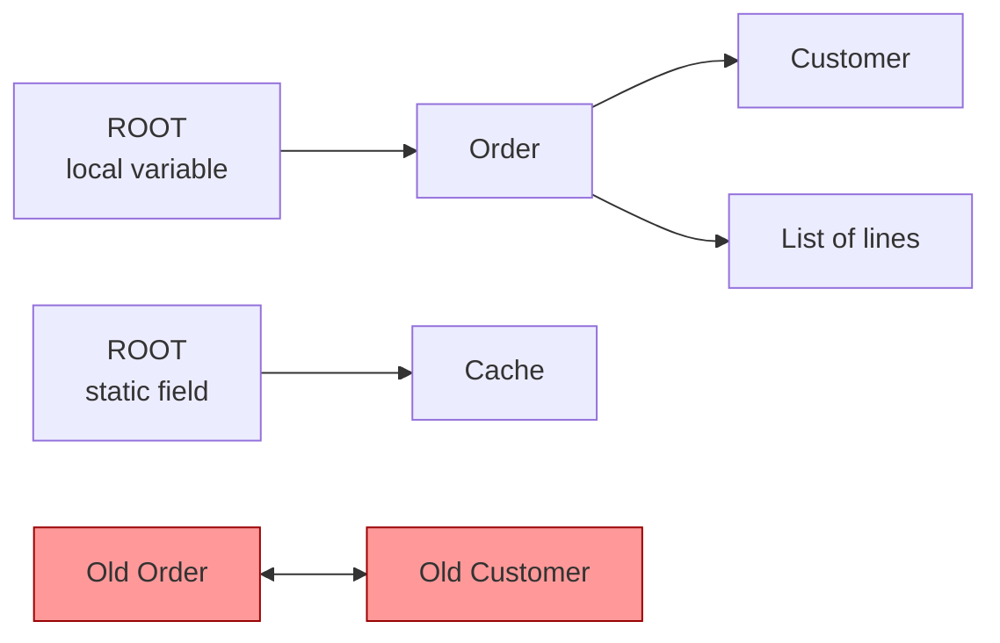
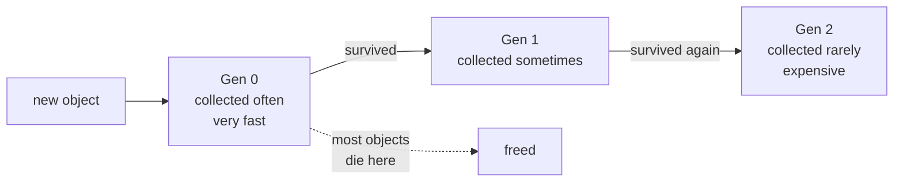

# 3.4 — Garbage Collection

> **[← Roadmap](../../ROADMAP.md)** · **Section:** [3. .NET Runtime and Platform](../../ROADMAP.md#3-net-runtime-and-platform)
> **Prev:** [3.3 Managed vs unmanaged](3.03-managed-vs-unmanaged.md) · **Next:** [3.5 Memory leaks](3.05-memory-leaks.md)

**Markers:** 🔥 🎯 · **Confidence:** 🔴 · **Last reviewed:** —

---

## TL;DR

**Garbage collection** is .NET automatically finding objects that nothing is using any more,
and freeing the memory they occupied. You never write "delete this object" in C#.

- It decides what is still in use by **starting from known roots and following every reference**. Anything it cannot reach is garbage.
- It sorts objects into **three generations** by age, and mostly only cleans the youngest — because most objects die young.
- It manages **memory only**. Files, sockets and database connections still need `IDisposable`.

---

## Definitions

| Term | What it is in .NET | What it means |
|---|---|---|
| **Heap** | *a region of memory* | Where all reference-type objects live. Managed by the GC. |
| **Stack** | *a region of memory* | Where local variables live. Cleaned up automatically when a method returns — the GC is not involved. |
| **Garbage collector (GC)** | *part of the CLR* | The component that finds and frees unreachable objects. |
| **Root** | *a starting point for the search* | A place the GC knows is definitely live: local variables of running methods, `static` fields, CPU registers. |
| **Reachable** | *a property of an object* | The GC can get to it by following references from a root. Reachable = keep. |
| **Garbage** | *a property of an object* | **Not** reachable from any root. Nothing can ever use it again, so its memory is freed. |
| **Mark / Sweep / Compact** | *the three phases of a collection* | Mark what is reachable → free what is not → slide survivors together to remove gaps. |
| **Generation** | *an age bucket on the heap* | Gen 0 (new), Gen 1 (survived once), Gen 2 (survived twice or more). |
| **Promotion** | *what happens to a survivor* | An object that survives a collection moves up to the next generation. |
| **Collection** | *one run of the GC* | A "Gen 0 collection" checks only Gen 0. A "Gen 2 collection" checks **everything** and is the expensive one. |
| **LOH** | *a separate heap* | Large Object Heap. Anything **85,000 bytes or larger** goes here. Not compacted by default. |
| **Fragmentation** | *a memory problem* | Free space exists but is split into small scattered gaps, so a large request still fails. |
| **`GC.Collect()`** | a **static method** | Forces a collection immediately. Almost always the wrong thing to call. |
| **Finalizer** | a **method**, written `~ClassName()` | Runs before an object's memory is reclaimed. Makes the object survive an extra collection, so avoid it. |
| **Server GC / Workstation GC** | *two configuration modes* | Server GC uses one heap per CPU core for speed. Workstation GC uses one heap, for lower memory. |

---

## The concept

### Start here: what problem does this solve?

In older languages like C, you asked for memory and then had to give it back yourself:

```c
char* buffer = malloc(1024);   // ask for memory
free(buffer);                  // you MUST return it
```

Two things go wrong constantly with that. **Forget to free** and the memory is lost forever —
a memory leak. **Free it twice**, or use it after freeing, and the program corrupts itself or
crashes. Whole categories of security vulnerability come from exactly this.

.NET removes the problem by tracking it for you. You create objects and simply stop using
them. The **garbage collector** notices and reclaims the memory.

```csharp
var buffer = new byte[1024];   // ask for memory
// ...and that is it. Nothing to free.
```

### The key question: how does it know what is garbage?

This is the part worth understanding properly, because the rest follows from it.

The GC does **not** count how many things point at an object. Instead it does something
simpler and more reliable.

It starts from a set of places it knows are definitely "live" — these are called **roots**:

- Local variables in methods currently running
- Static fields
- CPU registers

Then it **follows every reference** from those roots, and from whatever they point to, and so
on. Everything it can reach is in use. **Everything it cannot reach is garbage.**

A picture: **a room full of objects, with strings tying some of them to hooks on the wall.**
The hooks are the roots. Anything you can trace back to a hook, by following strings, is being
kept. Anything with no path back to a hook — even if it is tied to other objects — is rubbish
and gets swept away.

That last part matters. Two objects pointing at each other but with no path from a root are
**both** garbage. This is why .NET has no problem with circular references, whereas
reference-counting systems do.



The two red objects point at each other, but nothing points at them from a root. Both are
collected.

---

## How it works

### The simple version — the three steps

When a collection runs, the GC does three things:

1. **Mark.** Start at the roots, follow every reference, and mark everything reachable.
2. **Sweep.** Everything not marked is garbage. Its memory is now free.
3. **Compact.** Slide the surviving objects together so free space is one continuous block
   rather than scattered gaps.

That third step is worth noting. Because objects get moved, **the address of an object can
change during its life**. That is fine in normal C#, but it is exactly why you need `fixed`
and pinning when passing a pointer to non-.NET code — see
[3.3](3.03-managed-vs-unmanaged.md).

Compaction also makes allocation extremely fast. Because free memory is one continuous block,
allocating a new object is just moving a pointer forward. It is close to free.

### How it actually works — generations

Here is the observation everything is built on:

> **Most objects die very young.** A string built inside a method, a DTO created for one
> request, the result of a LINQ query — the vast majority become garbage almost immediately.
> A small minority live for the whole application.

Scanning every object every time would be wasteful, since most of the old ones are still
alive. So the GC splits the heap into three **generations** by age:

| Generation | Holds | Collected |
|---|---|---|
| **Gen 0** | Brand new objects | Very often, very fast |
| **Gen 1** | Objects that survived one collection | Less often |
| **Gen 2** | Objects that survived twice or more | Rarely, and it is expensive |

The rules are simple:

- Every new object starts in **Gen 0**.
- If it survives a collection, it is **promoted** to the next generation.
- Collecting Gen 0 only looks at Gen 0. It is quick — often under a millisecond.
- Collecting Gen 2 examines **everything**, including Gen 0 and Gen 1. This is called a
  **full collection** and it is the expensive one.



So the design deliberately makes the common case — short-lived objects — almost free, and
accepts that the rare case is slow.

**Why this matters for your code:** an object that survives long enough to reach Gen 2 is
costly to clean up later. Caching things "just in case" pushes objects into Gen 2 and makes
your full collections slower and more frequent.

### The Large Object Heap

Objects of **85,000 bytes or more** go somewhere separate: the **Large Object Heap**, or LOH.
Typically these are big arrays, large strings, or buffers.

The LOH has two special properties:

- It is collected only during a **Gen 2** collection, so large objects hang around longer.
- It is **not compacted by default**, because moving an 800 KB object is expensive.

Not compacting causes **fragmentation**. Imagine allocating and freeing many differently-sized
large arrays. You end up with free gaps scattered between live objects. Ask for a 500 KB array
and, even with 2 MB free in total, there may be no single 500 KB gap — so the process asks the
OS for more memory.

The result is an application whose memory keeps climbing even though it is not really leaking.
A classic culprit is repeatedly resizing large buffers.

**The fix is not to force compaction** — that is available but very expensive:

```csharp
// A last resort. Causes a long pause. Not for normal code.
GCSettings.LargeObjectHeapCompactionMode = GCLargeObjectHeapCompactionMode.CompactOnce;
GC.Collect();
```

The real fix is to stop churning large objects. Reuse buffers with `ArrayPool<T>`, or avoid
allocating them at all with `Span<T>` — see
[1.25](../01-csharp-fundamentals/1.25-span-memory.md) and
[19.13](../19-caching-performance/19.13-allocations.md).

### The deeper detail — GC modes

The GC has two settings that matter in production, and interviewers do ask about them.

**Workstation vs Server GC**

| | Workstation | Server |
|---|---|---|
| Heaps | One | One per CPU core |
| GC threads | One | One per core, running in parallel |
| Optimised for | Low latency, low memory | Maximum throughput |
| Default for | Desktop apps | **ASP.NET Core** |

Server GC gives each core its own heap and its own collection thread, so collections finish
much faster on a multi-core machine. The trade-off is higher memory use, since there are
several heaps.

```xml
<ServerGarbageCollection>true</ServerGarbageCollection>
```

⚠️ **This is a real container gotcha.** Server GC assumes it can use the whole machine. In a
container limited to one core with a small memory cap, having several heaps wastes memory and
can trigger the container's memory limit — which the orchestrator handles by killing the
container. If you run small containers, test with Workstation GC:

```xml
<ServerGarbageCollection>false</ServerGarbageCollection>
```

Modern .NET is much better at reading container limits automatically, and .NET 9 enabled
**DATAS** by default, which dynamically adapts the number of heaps to the actual load. But it
is still worth checking if you see containers being killed for memory.

**Concurrent / background GC** lets most of a Gen 2 collection run on a background thread
while your application keeps working, so the pause is much shorter. It is on by default and
you rarely need to change it.

---

## Code

### Do not call `GC.Collect()`

```csharp
GC.Collect();                      // almost always wrong
GC.WaitForPendingFinalizers();
```

The GC has far better information than you do about when collecting is worthwhile. Forcing it
usually:

- causes a **full Gen 2 collection**, the most expensive kind
- **promotes objects** that would otherwise have died cheaply in Gen 0
- pauses all your threads for no benefit

The only defensible uses are in a benchmark harness or immediately after deliberately
releasing a very large cache. If you find yourself reaching for it to fix a memory problem,
the problem is a reference being held somewhere — see [3.5](3.05-memory-leaks.md).

### What you should actually do

The GC handles **memory**. It does not handle **file handles, sockets or database
connections** — those need `IDisposable`:

```csharp
// The GC will eventually free the object's memory,
// but the file stays LOCKED until Dispose runs.
await using var stream = File.OpenRead(path);
```

That distinction is the practical takeaway of this note, and it is covered properly in
[1.21](../01-csharp-fundamentals/1.21-idisposable.md).

Reducing GC pressure, in order of usefulness:

```csharp
// 1. Do not allocate in a loop when you can build once
var sb = new StringBuilder();          // not string concatenation

// 2. Reuse large buffers instead of allocating new ones
var buffer = ArrayPool<byte>.Shared.Rent(4096);
try { /* use it */ }
finally { ArrayPool<byte>.Shared.Return(buffer); }

// 3. Avoid the allocation entirely for slicing
ReadOnlySpan<char> slice = text.AsSpan(0, 100);   // no new string
```

---

## Interview questions

**Q: How does the garbage collector know an object can be freed?**

It uses reachability, not reference counting. It starts from a set of roots — local variables
in running methods, static fields and CPU registers — and follows every reference from there,
marking everything it can reach. Anything not marked is unreachable and therefore garbage. An
important consequence is that circular references are not a problem: two objects pointing at
each other with no path from a root are both collected, whereas a reference-counting system
would leak them.

**Q: What are generations and why do they exist?**

The heap is divided into three generations by age. New objects go into Gen 0, and anything
surviving a collection is promoted to the next generation. The design rests on the
observation that most objects die very young — temporary strings, DTOs, LINQ results. So
collecting only Gen 0 catches the vast majority of garbage while examining a small fraction
of the heap, which makes it very fast. Gen 2 collections examine everything and are
expensive, so the GC does them rarely. The practical implication is that keeping objects
alive longer than necessary pushes them into Gen 2 and makes your expensive collections more
frequent.

**Q: What is the Large Object Heap and why does it cause problems?**

Objects of 85,000 bytes or more — usually big arrays or strings — are allocated on a separate
heap. It is only collected as part of a Gen 2 collection, so large objects survive longer, and
it is not compacted by default because moving very large objects is costly. Not compacting
means fragmentation: after allocating and releasing many differently-sized large objects, you
can have plenty of free memory in total but no single contiguous block big enough for the next
request, so the process grows. The symptom is memory climbing steadily without an actual leak.
The fix is to stop churning large objects — pool buffers with `ArrayPool<T>` rather than
allocating fresh ones.

**Q: What is the difference between Workstation and Server GC?**

Workstation GC uses a single heap and a single collection thread, favouring low latency and
low memory. Server GC creates one heap and one collection thread per CPU core, so collections
run in parallel and finish much faster on multi-core hardware — at the cost of higher memory
use. Server GC is the default for ASP.NET Core because throughput matters more there. The
thing to watch is containers: Server GC assumes it owns the machine, so in a small container
with a tight memory limit the multiple heaps can push you over the limit and get the container
killed. Modern .NET reads container limits much better, and .NET 9 turned on DATAS which
adapts heap count dynamically, but it is still worth testing.

**Q: Should you ever call `GC.Collect()`?**

Almost never. The runtime has far better information about when collecting is worthwhile, and
forcing it triggers a full Gen 2 collection — the most expensive kind — while also promoting
objects that would otherwise have been collected cheaply in Gen 0. The only reasonable uses
are in benchmarking, where you want a known starting state, or immediately after deliberately
dropping something very large. If someone is calling it to fix a memory problem, the real
issue is something holding a reference, and forcing collections will not help because the
object is still reachable.

---

## Traps ⚠️

- **"The GC handles all cleanup."** It handles **memory only**. File handles, sockets and
  database connections need `IDisposable`.
- **Calling `GC.Collect()` to fix memory usage.** If an object is still referenced, no amount
  of collecting will free it.
- **Forcing collection promotes objects**, making the situation worse rather than better.
- **Objects move during compaction.** An object's address is not stable, which is why pinning
  is needed for interop.
- **The LOH threshold is 85,000 bytes**, which is smaller than people expect — an array of
  about 21,000 `int`s already qualifies.
- **Server GC in a small container can get you OOM-killed.** More heaps means more memory.
- **A finalizer makes an object survive an extra collection.** Never add one unless you truly
  need it — see [1.21](../01-csharp-fundamentals/1.21-idisposable.md).
- **"No memory leaks in .NET" is false.** You cannot leak by forgetting to free, but you can
  very easily leak by holding a reference. See [3.5](3.05-memory-leaks.md).

---

## Related

- [3.5 Memory leaks](3.05-memory-leaks.md) — how to leak in a managed language
- [3.3 Managed vs unmanaged](3.03-managed-vs-unmanaged.md) — pinning and why objects move
- [1.21 IDisposable](../01-csharp-fundamentals/1.21-idisposable.md) — what the GC does not do
- [1.1 Stack vs heap](../01-csharp-fundamentals/1.01-value-vs-reference-types.md) — what lives where
- [1.25 Span and Memory](../01-csharp-fundamentals/1.25-span-memory.md) — avoiding allocation
- [19.13 Reducing allocations](../19-caching-performance/19.13-allocations.md) — pooling in practice
- [18.9 Production debugging](../18-logging-monitoring/18.09-production-debugging.md) — diagnosing GC problems

---

## Sources

- [Microsoft Learn — Fundamentals of garbage collection](https://learn.microsoft.com/dotnet/standard/garbage-collection/fundamentals)
- [Microsoft Learn — Workstation and server GC](https://learn.microsoft.com/dotnet/standard/garbage-collection/workstation-server-gc)
- [Microsoft Learn — Large object heap](https://learn.microsoft.com/dotnet/standard/garbage-collection/large-object-heap)
