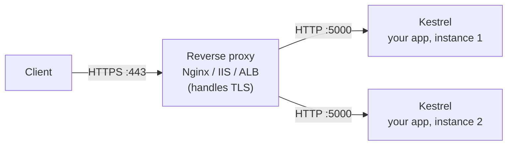
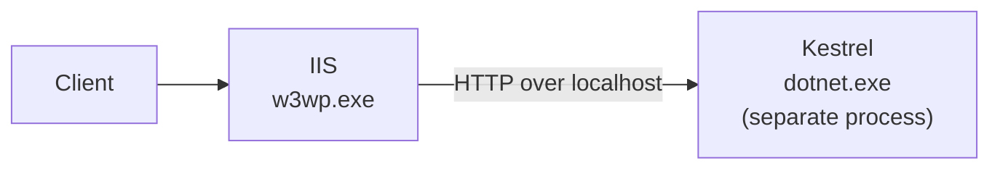
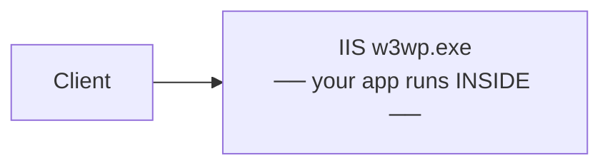

# 4.2 — Cross-Platform Hosting, Kestrel, and the Reverse-Proxy Model

> **[← Roadmap](../../ROADMAP.md)** · **Section:** [4. Fundamentals and Application Startup](../../ROADMAP.md#4-fundamentals-and-application-startup)
> **Prev:** [4.1 What ASP.NET Core is](4.01-what-is-aspnet-core.md) · **Next:** [4.3 Program.cs](4.03-program-cs-hosting.md)

**Markers:** ⭐ 🎯 · **Confidence:** 🔴 · **Last reviewed:** —

---

## TL;DR

**Kestrel** is the web server built into every ASP.NET Core app. Your application *is* the web
server — there is no separate IIS process required.

- A **reverse proxy** (IIS, Nginx, a cloud load balancer) usually sits in front of Kestrel and forwards requests to it.
- Kestrel is fast but deliberately minimal. The proxy handles TLS certificates, multiple sites on one machine, and slow-client protection.
- The proxy hides the real client IP, so you need **`UseForwardedHeaders`** to get it back.

---

## Definitions

| Term | What it is | What it means |
|---|---|---|
| **Web server** | *a program* | Listens on a TCP port, speaks HTTP, hands requests to your code. |
| **Kestrel** | *the built-in web server* | Cross-platform, fast, runs **inside** your application process. The default. |
| **Reverse proxy** | *a server in front of yours* | Receives requests from the internet and forwards them to your app. IIS, Nginx, Apache, YARP. |
| **Edge server** | *a role* | The server directly exposed to the internet. Either Kestrel alone, or the reverse proxy. |
| **IIS** | *Microsoft's web server* | Windows only. In ASP.NET Core it acts as a reverse proxy, not as the host. |
| **HTTP.sys** | *a Windows-only server* | An alternative to Kestrel. Supports Windows Authentication and port sharing. |
| **ANCM** | *an IIS module* | ASP.NET Core Module. The piece of IIS that launches and forwards to your app. |
| **In-process hosting** | *an IIS mode* | Your app runs **inside** the IIS worker process. The default on IIS, and faster. |
| **Out-of-process hosting** | *an IIS mode* | IIS runs your app as a **separate process** and proxies to it over HTTP. |
| **TLS termination** | *a responsibility* | Decrypting HTTPS. Usually done by the proxy, so traffic to Kestrel is plain HTTP. |
| **`UseForwardedHeaders`** | a **middleware method** | Reads `X-Forwarded-For` and `X-Forwarded-Proto` so your app sees the real client IP and scheme. |
| **`X-Forwarded-For`** | *an HTTP header* | Added by a proxy to record the original client IP. |

---

## The concept

### Your app is the web server

This is the biggest mental shift from classic ASP.NET.

In the old model, **IIS was the web server and your application was a plugin inside it.** IIS
listened on port 80, decided your app should handle the request, and loaded your code into its
worker process. You could not run the app without IIS.

In ASP.NET Core, **your application contains a web server.** Kestrel is a library your app
references. Run the app and it opens a socket and starts listening itself. No IIS required, no
Windows required.

That is why `dotnet run` just works, and why a container image can hold nothing but your app
and the .NET runtime.

### So why is there usually still a proxy?

Kestrel is deliberately narrow: it handles HTTP well and fast, and does little else. A
**reverse proxy** in front of it covers things Kestrel intentionally does not.

A picture: **Kestrel is the kitchen; the reverse proxy is the front of house.** The kitchen is
excellent at cooking and nothing else. The front of house handles the door, the queue,
difficult customers and directing people to the right table. You could serve straight from the
kitchen — but you would not want to at a busy restaurant.

What the proxy gives you:

- **TLS certificates** — issuing, renewing and terminating HTTPS in one place rather than per app.
- **Several apps on one machine** — routing `/api` to one app and `/admin` to another, both on port 443.
- **Slow-client protection** — an attacker sending a request one byte per second ties up the proxy, not your app.
- **Static files and caching**, often faster than doing it in your app.
- **Load balancing** across several instances of your app.



**Note the traffic between proxy and app is usually plain HTTP.** The proxy terminated TLS.
That is fine when both sit inside a private network, and it is why your app can be configured
without certificates.

---

## How it works

### The simple version — the three servers

| Server | Platform | Use it when |
|---|---|---|
| **Kestrel** | All | Always. The default, and the only cross-platform option. |
| **IIS** | Windows | Hosting on Windows Server. Acts as a reverse proxy in front of Kestrel. |
| **HTTP.sys** | Windows | You need Windows Authentication or port sharing. Rare. |

Kestrel is not optional in the way the others are — even behind IIS, Kestrel is what actually
runs your code in the common in-process case.

### How it actually works — IIS in-process vs out-of-process

On Windows this distinction gets asked about, so it is worth being precise.

**Out-of-process** (the original model):



IIS starts your app as a **separate process** and proxies each request to it over local HTTP.
That is two HTTP hops per request.

**In-process** (the default since .NET Core 3.0):



Your app runs **inside** the IIS worker process. No extra hop, no second process. Roughly
**2–3× more throughput**.

Set in the project file:

```xml
<AspNetCoreHostingModel>InProcess</AspNetCoreHostingModel>
```

**In-process is the default and almost always what you want.** The exceptions: you need a
different .NET version per app in the same IIS app pool, or you are running something that must
not share a process.

⚠️ **One in-process gotcha.** Because your app shares the IIS worker process, `Server` in the
response says `Microsoft-IIS`, and some IIS-level settings apply that would not otherwise. More
importantly, an unhandled crash can take down the app pool rather than just your process.

### Configuring Kestrel

Most apps never touch this, but it comes up:

```csharp
builder.WebHost.ConfigureKestrel(options =>
{
    // Refuse request bodies over 10 MB
    options.Limits.MaxRequestBodySize = 10 * 1024 * 1024;

    // Slow-client protection: minimum 100 bytes/sec after a 10s grace period
    options.Limits.MinRequestBodyDataRate =
        new MinDataRate(bytesPerSecond: 100, gracePeriod: TimeSpan.FromSeconds(10));

    options.Limits.MaxConcurrentConnections = 1000;
    options.Limits.KeepAliveTimeout = TimeSpan.FromMinutes(2);
});
```

Ports are usually set through configuration rather than code:

```bash
# Environment variable — the usual approach in containers
ASPNETCORE_URLS=http://+:8080

# Or on the command line
dotnet run --urls "http://localhost:5001;https://localhost:5002"
```

**`http://+:8080` means "listen on all network interfaces".** Using `localhost` inside a
container is a classic mistake — the app starts, appears healthy, and refuses every connection
from outside the container because it is only listening on the loopback interface.

### The deeper detail — ⚠️ forwarded headers

When a proxy forwards a request, **your app sees the proxy's IP address, not the client's**.
And if the proxy terminated TLS, your app sees `http` even though the client used `https`.

That breaks three things: IP-based rate limiting, audit logs, and any redirect your app
generates (it will produce `http://` links).

The proxy adds headers recording the originals:

```
X-Forwarded-For: 203.0.113.42        ← the real client IP
X-Forwarded-Proto: https             ← the original scheme
X-Forwarded-Host: api.example.com
```

Your app must be told to read them:

```csharp
app.UseForwardedHeaders(new ForwardedHeadersOptions
{
    ForwardedHeaders = ForwardedHeaders.XForwardedFor | ForwardedHeaders.XForwardedProto
});
```

⚠️ **This must be the first middleware in the pipeline**, before anything that reads the IP or
the scheme — including HTTPS redirection and authentication. Register it late and the earlier
middleware still sees the proxy's values.

⚠️ **And there is a security consideration.** These headers are just headers — a client can
send them. If your app trusts `X-Forwarded-For` blindly and it is reachable directly, an
attacker can spoof any IP they like and bypass IP-based rules. In production, restrict which
proxies are trusted:

```csharp
var options = new ForwardedHeadersOptions
{
    ForwardedHeaders = ForwardedHeaders.XForwardedFor | ForwardedHeaders.XForwardedProto
};
options.KnownProxies.Add(IPAddress.Parse("10.0.0.1"));   // only trust our proxy

app.UseForwardedHeaders(options);
```

By default only loopback is trusted, which is why this "just works" in a local IIS setup and
silently fails in Kubernetes — where the proxy is on a different pod IP. Clearing
`KnownProxies` and `KnownNetworks` makes it accept anything, which is convenient and only safe
if your app is genuinely unreachable except through the proxy.

See [24.13](../24-devops-hosting/24.13-forwarded-headers.md).

---

## Code

A typical container setup, where the pieces come together:

```csharp
var builder = WebApplication.CreateBuilder(args);

builder.Services.AddControllers();
builder.Services.AddHealthChecks();

var app = builder.Build();

// FIRST — so everything below sees the real client IP and scheme
app.UseForwardedHeaders(new ForwardedHeadersOptions
{
    ForwardedHeaders = ForwardedHeaders.XForwardedFor | ForwardedHeaders.XForwardedProto
});

// NOT UseHttpsRedirection here — the proxy already terminated TLS,
// and redirecting again would cause a loop.

app.UseAuthentication();
app.UseAuthorization();
app.MapControllers();
app.MapHealthChecks("/healthz");

app.Run();
```

```dockerfile
# The container listens on 8080, on ALL interfaces
ENV ASPNETCORE_URLS=http://+:8080
EXPOSE 8080
```

The two comments in that code are both real production mistakes:

- **Forwarded headers registered late** means your rate limiter blocks the proxy's IP and
  everyone shares one bucket.
- **`UseHttpsRedirection` behind a TLS-terminating proxy** causes an infinite redirect loop:
  the app sees `http`, redirects to `https`, the proxy terminates TLS and forwards `http`
  again, forever.

---

## Interview questions

**Q: What is Kestrel and how does it differ from IIS?**

Kestrel is the web server built into ASP.NET Core — it is a library your application
references, so the app hosts its own server and can run anywhere. IIS is Microsoft's Windows
web server, and in the classic ASP.NET model it *was* the host, loading your application as a
plugin. In ASP.NET Core that relationship is inverted: IIS becomes a reverse proxy sitting in
front of Kestrel, handling TLS and routing, while Kestrel actually runs your code. That
inversion is what makes cross-platform hosting and containers possible.

**Q: Why put a reverse proxy in front of Kestrel at all?**

Kestrel is deliberately minimal — very fast at HTTP, and not much else. A proxy adds things
Kestrel does not do: managing TLS certificates centrally, hosting several applications on one
machine and port, protecting against slow-client attacks, serving static files efficiently, and
load balancing across instances. Kestrel can be exposed directly and often is in Kubernetes,
where the ingress controller plays the proxy role, but you rarely want it as the raw
internet-facing server on a traditional host.

**Q: What is the difference between in-process and out-of-process hosting?**

Both apply to hosting on IIS. Out-of-process means IIS starts your application as a separate
process and proxies each request to it over local HTTP, so there are two HTTP hops. In-process
means your application runs inside the IIS worker process itself, removing that extra hop and
giving roughly two to three times the throughput. In-process has been the default since .NET
Core 3.0. You would choose out-of-process if you needed different .NET versions in the same
app pool, or wanted isolation from the IIS process.

**Q: Your app is behind a load balancer and every request looks like it comes from the same IP. Why?**

Because the app sees the proxy's address rather than the client's. The proxy records the
original in `X-Forwarded-For`, but ASP.NET Core does not read it unless you add
`UseForwardedHeaders`, and that has to be the first middleware so everything downstream sees
the corrected values. The subtlety is that by default only loopback proxies are trusted, which
is why it works locally behind IIS and silently fails in Kubernetes where the proxy is on a
different pod IP — you have to add the proxy to `KnownProxies` or `KnownNetworks`. And you
should restrict it rather than trusting everything, because those headers are client-supplied
and can be spoofed if the app is reachable directly.

---

## Traps ⚠️

- **`UseForwardedHeaders` registered too late.** Everything before it still sees the proxy's IP
  and scheme.
- **Only loopback proxies are trusted by default.** Works locally, silently fails in
  Kubernetes.
- **Trusting forwarded headers from anywhere is a spoofing risk** if the app is reachable
  directly.
- **`UseHttpsRedirection` behind a TLS-terminating proxy causes a redirect loop.**
- **Binding to `localhost` in a container** makes the app unreachable from outside. Use
  `http://+:8080`.
- **In-process hosting shares the IIS worker process**, so a crash can take down the app pool.
- **Kestrel's default limits are not tuned for your app.** Body size and data-rate limits exist
  for good reasons — raising them removes a protection.

---

## Related

- [4.1 What ASP.NET Core is](4.01-what-is-aspnet-core.md) — why the model changed
- [4.9 Kestrel vs IIS vs HTTP.sys](4.09-kestrel-iis-httpsys.md) — the server choice in depth
- [5.2 Middleware order](../05-middleware-pipeline/5.02-middleware-order.md) — why forwarded headers go first
- [17.5 HTTPS and TLS](../17-application-security/17.05-https-hsts-tls.md) — termination and HSTS
- [24.13 Forwarded headers](../24-devops-hosting/24.13-forwarded-headers.md) — the production detail
- [24.3 Dockerfile](../24-devops-hosting/24.03-dockerfile.md) — `ASPNETCORE_URLS` in containers

---

## Sources

- [Microsoft Learn — Kestrel web server](https://learn.microsoft.com/aspnet/core/fundamentals/servers/kestrel)
- [Microsoft Learn — Host and deploy behind a proxy](https://learn.microsoft.com/aspnet/core/host-and-deploy/proxy-load-balancer)
- [Microsoft Learn — ASP.NET Core Module](https://learn.microsoft.com/aspnet/core/host-and-deploy/aspnet-core-module)
