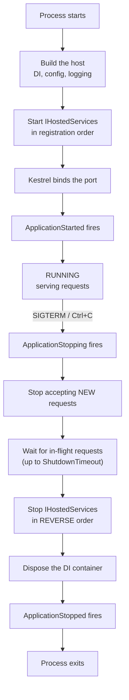

# 4.6 — Application Lifecycle: Start, Run, Graceful Shutdown

> **[← Roadmap](../../ROADMAP.md)** · **Section:** [4. Fundamentals and Application Startup](../../ROADMAP.md#4-fundamentals-and-application-startup)
> **Prev:** [4.5 Host interfaces](4.05-host-interfaces.md) · **Next:** [4.7 Environments](4.07-environments.md)

**Markers:** ⭐ 🎯 · **Confidence:** 🔴 · **Last reviewed:** —

---

## TL;DR

The **application lifecycle** is the sequence from process start, through serving requests, to
a clean stop. The part that matters in production is the **shutdown**.

- **Graceful shutdown** means: stop accepting new requests, let in-flight ones finish, then exit.
- You get **5 seconds by default** to do that. On a slow endpoint that is not enough, and requests get cut off.
- Every deployment triggers a shutdown, so getting this wrong means **dropped requests on every release**.

---

## Definitions

| Term | What it is | What it means |
|---|---|---|
| **Lifecycle** | *a sequence* | Start → run → stop. Each phase has defined steps. |
| **`app.Run()`** | a **method** | Starts the server and **blocks** the calling thread until shutdown is requested. |
| **`app.RunAsync()`** | a **method** | The same, awaitable. Used when you need to do something after startup. |
| **`app.StartAsync()`** | a **method** | Starts without blocking. You then control when to stop. Mostly used in tests. |
| **Graceful shutdown** | *a behaviour* | Refuse new requests, finish in-flight ones, release resources, then exit. |
| **`ShutdownTimeout`** | *a host setting* | How long the host waits for in-flight work. **Default 5 seconds.** |
| **SIGTERM** | *an OS signal* | "Please stop." Sent by Docker, Kubernetes and `systemd`. Triggers graceful shutdown. |
| **SIGKILL** | *an OS signal* | "Stop now." Cannot be caught or handled. The process dies immediately. |
| **`ApplicationStopping`** | *a `CancellationToken`* | Fires when shutdown begins, while requests are still finishing. |
| **`ApplicationStopped`** | *a `CancellationToken`* | Fires when everything has stopped. |
| **Drain** | *a phase* | The period where existing requests complete but no new ones are accepted. |
| **Readiness probe** | *a health check* | Tells the orchestrator whether to send traffic. Distinct from liveness. |
| **`terminationGracePeriodSeconds`** | *a Kubernetes setting* | How long Kubernetes waits after SIGTERM before sending SIGKILL. **Default 30s.** |

---

## The concept

### The three phases



Two details in that diagram are worth noticing.

**Hosted services stop in reverse order.** If service A depends on service B, registering A
after B means A stops first — so B is still available while A is shutting down. That is
deliberate, and it mirrors how nested `using` blocks dispose.

**There is a gap between "stop accepting new" and "process exits".** That gap is the drain
period, and it is where graceful shutdown either works or does not.

### Why shutdown matters more than startup

Startup problems are loud. The app fails to start, you see it immediately, you fix it.

Shutdown problems are silent and constant. Here is what happens on a badly-behaved deployment:

1. Kubernetes decides to replace your pod and sends **SIGTERM**.
2. Your app has 47 requests in flight, some of them long-running reports.
3. The host waits **5 seconds** — the default.
4. Requests still running are **cut off mid-response**.
5. Those users see a connection reset or a truncated response.
6. Multiply by however many pods you replace, on every single deployment.

Nobody files a bug for this, because it looks like a transient network error. But it is a real,
repeatable source of failed requests, and it is entirely avoidable.

A picture: **closing a shop.** Graceful shutdown is locking the door so nobody new comes in,
then serving the customers already inside before switching the lights off. The default
behaviour is announcing you are closing and pushing everyone out five seconds later, mid-purchase.

---

## How it works

### The simple version — starting

```csharp
var app = builder.Build();

app.Run();          // starts the server and BLOCKS here until shutdown
Console.WriteLine("this never runs until the app stops");
```

`Run()` blocks. Anything after it executes only during shutdown, which surprises people.

Three variants:

```csharp
app.Run();                    // blocks until shutdown
await app.RunAsync();         // same, but awaitable
await app.StartAsync();       // starts WITHOUT blocking — you control the rest
// ... do something ...
await app.StopAsync();
```

`StartAsync` is mainly for tests and for tools that need to do work while the app runs.

### How it actually works — the shutdown timeout

**The default is 5 seconds.** That is almost always too short.

```csharp
builder.Services.Configure<HostOptions>(options =>
{
    options.ShutdownTimeout = TimeSpan.FromSeconds(30);
});
```

How to choose a value: **it must be longer than your slowest normal request.** If a report
endpoint takes 20 seconds, a 5-second timeout guarantees those requests are killed on every
deployment.

⚠️ **And it must be shorter than your orchestrator's grace period.** In Kubernetes:

```yaml
spec:
  terminationGracePeriodSeconds: 60     # Kubernetes waits this long
```

```csharp
options.ShutdownTimeout = TimeSpan.FromSeconds(45);   // app finishes first
```

If the app's timeout is *longer* than Kubernetes', then Kubernetes sends **SIGKILL** while
your app is still draining — and SIGKILL cannot be caught. Everything in flight dies
instantly. So the ordering must be: **app timeout < orchestrator grace period.**

### Reacting to shutdown

Two ways, and they suit different situations.

**In a hosted service**, the `stoppingToken` is the signal:

```csharp
public class Worker(ILogger<Worker> logger) : BackgroundService
{
    protected override async Task ExecuteAsync(CancellationToken stoppingToken)
    {
        while (!stoppingToken.IsCancellationRequested)
        {
            await DoWorkAsync(stoppingToken);
            await Task.Delay(TimeSpan.FromSeconds(10), stoppingToken);
        }

        logger.LogInformation("Worker stopped cleanly");
    }
}
```

⚠️ **Ignoring `stoppingToken` is the classic mistake.** A loop that never checks it keeps
running until the timeout expires, then gets killed mid-work. See
[2.14](../02-collections-linq-async/2.14-cancellation.md).

**Anywhere else**, use `IHostApplicationLifetime`:

```csharp
public class ConnectionDrainer(IHostApplicationLifetime lifetime, IMessageBus bus)
{
    public void Setup()
    {
        lifetime.ApplicationStopping.Register(() =>
        {
            // Runs while in-flight requests are still finishing
            bus.StopConsuming();
        });
    }
}
```

### ⚠️ The Kubernetes race condition

This one catches almost everyone, and it is a genuinely good thing to be able to explain.

When Kubernetes terminates a pod, **two things happen at the same time**:

1. SIGTERM is sent to your container.
2. The pod is removed from the service endpoints, so the load balancer stops routing to it.

Those are **not synchronised**. Endpoint removal propagates through the cluster asynchronously
and takes a second or two. So there is a window where:

- Your app has received SIGTERM and stopped accepting new requests.
- The load balancer has **not yet** learned that, and is still sending traffic.
- Those requests are refused. Users see errors.

**The fix is counter-intuitive: wait before you start shutting down.**

```csharp
lifetime.ApplicationStopping.Register(() =>
{
    // Keep serving for a few seconds while endpoint removal propagates
    logger.LogInformation("SIGTERM received, draining for 5s before shutdown");
    Thread.Sleep(TimeSpan.FromSeconds(5));
});
```

Or better, fail the readiness probe first so traffic stops, then shut down:

```csharp
app.MapHealthChecks("/ready", new HealthCheckOptions
{
    Predicate = check => check.Tags.Contains("ready")
});
```

The sequence you want is: **SIGTERM → readiness fails → load balancer stops sending → drain →
exit.** See [24.6](../24-devops-hosting/24.06-probes-and-shutdown.md) and
[18.5](../18-logging-monitoring/18.05-health-checks.md).

### The deeper detail — what triggers shutdown

| Trigger | Signal | Graceful? |
|---|---|---|
| `Ctrl+C` in a terminal | SIGINT | ✅ Yes |
| `docker stop` | SIGTERM, then SIGKILL after 10s | ✅ Yes, if you finish in time |
| Kubernetes pod termination | SIGTERM, then SIGKILL after the grace period | ✅ Yes, if you finish in time |
| `docker kill` | SIGKILL | ❌ No — immediate death |
| `lifetime.StopApplication()` | — | ✅ Yes |
| Unhandled exception on a background thread | — | ❌ No — process crash |
| `Environment.Exit()` | — | ❌ **No** — skips all handlers |

**`Environment.Exit` is worth calling out.** It terminates immediately without running shutdown
handlers, disposing services or finishing requests. If you need to exit deliberately, use
`lifetime.StopApplication()`, which runs the proper sequence.

---

## Code

A complete, production-shaped shutdown configuration:

```csharp
var builder = WebApplication.CreateBuilder(args);

// Longer than our slowest endpoint, shorter than Kubernetes' 60s grace period
builder.Services.Configure<HostOptions>(options =>
{
    options.ShutdownTimeout = TimeSpan.FromSeconds(45);
});

builder.Services.AddHealthChecks()
    .AddCheck("ready", () => HealthCheckResult.Healthy(), tags: ["ready"]);

var app = builder.Build();

app.MapHealthChecks("/healthz");                          // liveness — am I alive?
app.MapHealthChecks("/ready", new HealthCheckOptions      // readiness — send me traffic?
{
    Predicate = c => c.Tags.Contains("ready")
});

var lifetime = app.Services.GetRequiredService<IHostApplicationLifetime>();
var logger   = app.Services.GetRequiredService<ILogger<Program>>();

lifetime.ApplicationStarted.Register(() =>
    logger.LogInformation("Started and accepting requests"));

lifetime.ApplicationStopping.Register(() =>
{
    logger.LogInformation("SIGTERM received — draining");
    // Give Kubernetes time to remove us from the load balancer
    Thread.Sleep(TimeSpan.FromSeconds(5));
});

lifetime.ApplicationStopped.Register(() =>
    logger.LogInformation("Shutdown complete"));

app.Run();
```

```yaml
# The matching Kubernetes side
spec:
  terminationGracePeriodSeconds: 60      # must exceed the app's 45s
  containers:
    - name: api
      lifecycle:
        preStop:
          exec:
            command: ["sleep", "5"]      # alternative to the Thread.Sleep above
```

**The numbers must be consistent:** app timeout (45s) < Kubernetes grace period (60s). Get
that backwards and Kubernetes SIGKILLs an app that was shutting down correctly.

---

## Interview questions

**Q: What happens when an ASP.NET Core application shuts down?**

The host receives a shutdown signal, usually SIGTERM. It fires the `ApplicationStopping` token,
stops accepting new requests, and waits for in-flight requests to complete — up to the shutdown
timeout, which defaults to five seconds. Then it stops the registered hosted services in
reverse registration order, disposes the dependency injection container, fires
`ApplicationStopped`, and the process exits. The key point is that in-flight requests get a
bounded window to finish, and anything still running when that window closes is cut off.

**Q: Why is the default shutdown timeout a problem?**

Five seconds is shorter than plenty of legitimate requests. If a report endpoint takes twenty
seconds, every deployment cuts those requests off mid-response, and the user sees a connection
reset rather than an error page. Since every deployment triggers a shutdown, it becomes a
constant low-level source of failed requests that nobody reports because it looks like a
transient network fault. The fix is to set `ShutdownTimeout` longer than your slowest normal
request — but still shorter than the orchestrator's grace period, or the orchestrator will
SIGKILL you mid-drain, which cannot be caught.

**Q: There's a race condition when Kubernetes terminates a pod. What is it?**

Kubernetes sends SIGTERM and removes the pod from the service endpoints at the same time, but
those are not synchronised — endpoint removal propagates asynchronously across the cluster and
takes a second or two. So there is a window where the app has stopped accepting new requests
but the load balancer is still routing to it, and those requests fail. The counter-intuitive
fix is to delay shutdown: on `ApplicationStopping`, keep serving for a few seconds while the
endpoint removal propagates, either with a sleep or a `preStop` hook. Better still, fail the
readiness probe first so traffic stops deliberately, then drain.

**Q: What is the difference between `app.Run()` and `app.StartAsync()`?**

`Run()` starts the server and blocks the calling thread until shutdown is requested, so
anything written after it does not execute until the app is stopping. `StartAsync()` starts the
server without blocking and returns, leaving you to decide when to call `StopAsync()`. That is
mainly useful in tests and in tools that need to do work while the application runs. There is
also `RunAsync()`, which is the awaitable equivalent of `Run()`.

---

## Traps ⚠️

- **The default shutdown timeout is 5 seconds.** Almost certainly too short.
- **The app's timeout must be shorter than the orchestrator's grace period**, or you get
  SIGKILLed mid-drain.
- **Ignoring `stoppingToken` in a background service** means it runs until killed, losing
  in-progress work.
- **The Kubernetes endpoint-removal race** drops requests unless you delay shutdown or use a
  readiness probe.
- **`Environment.Exit` skips all shutdown handlers.** Use `lifetime.StopApplication()`.
- **`app.Run()` blocks**, so code after it only runs during shutdown.
- **Hosted services stop in reverse registration order.** Register dependencies before their
  dependents.
- **SIGKILL cannot be caught.** Nothing you write helps if the orchestrator gives up waiting.

---

## Related

- [4.5 Host interfaces](4.05-host-interfaces.md) — `IHostApplicationLifetime`
- [4.3 Program.cs](4.03-program-cs-hosting.md) — where `Run()` is called
- [2.14 CancellationToken](../02-collections-linq-async/2.14-cancellation.md) — honouring `stoppingToken`
- [18.5 Health checks](../18-logging-monitoring/18.05-health-checks.md) — liveness vs readiness
- [21.1 Background services](../21-advanced-features/21.01-background-services.md) — shutting down cleanly
- [24.6 Probes and graceful shutdown](../24-devops-hosting/24.06-probes-and-shutdown.md) — the Kubernetes detail

---

## Sources

- [Microsoft Learn — .NET Generic Host lifetime](https://learn.microsoft.com/aspnet/core/fundamentals/host/generic-host#ihostapplicationlifetime)
- [Microsoft Learn — HostOptions.ShutdownTimeout](https://learn.microsoft.com/dotnet/api/microsoft.extensions.hosting.hostoptions.shutdowntimeout)
- [Kubernetes — Pod termination](https://kubernetes.io/docs/concepts/workloads/pods/pod-lifecycle/#pod-termination)
