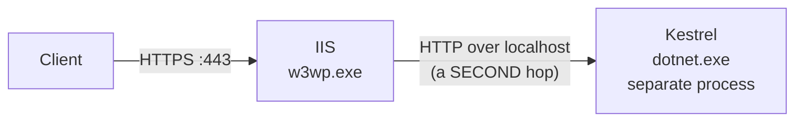
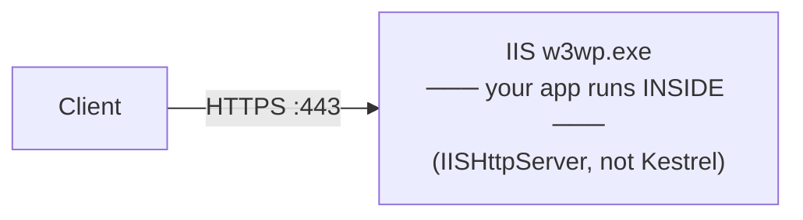

# 4.9 — Kestrel vs IIS vs HTTP.sys, In-Process vs Out-of-Process

> **[← Roadmap](../../ROADMAP.md)** · **Section:** [4. Fundamentals and Application Startup](../../ROADMAP.md#4-fundamentals-and-application-startup)
> **Prev:** [4.8 launchSettings.json](4.08-launchsettings.md) · **Next:** [4.10 Static files](4.10-static-files.md)

**Markers:** ⭐ 🎯 · **Confidence:** 🔴 · **Last reviewed:** —

---

## TL;DR

ASP.NET Core has **three** web servers, and you almost always use the first.

- **Kestrel** — cross-platform, fast, the default. Runs inside your app process.
- **IIS** — Windows only. In ASP.NET Core it acts as a **reverse proxy in front of Kestrel**, not as the host.
- **HTTP.sys** — Windows only. The one case for it is **Windows Authentication** or port sharing.

**In-process vs out-of-process** is an IIS-only choice. In-process runs your app inside the IIS
worker process and is roughly **2–3× faster**. It is the default.

---

## Definitions

| Term | What it is | What it means |
|---|---|---|
| **Kestrel** | *a web server library* | Built into ASP.NET Core, cross-platform. Runs **inside** your application process. |
| **IIS** | *Microsoft's Windows web server* | A separate Windows service. In ASP.NET Core it proxies to your app rather than hosting it. |
| **IIS Express** | *a dev-only version of IIS* | Lightweight, for local development only. Never production. |
| **HTTP.sys** | *a Windows kernel driver* | A server that uses the Windows kernel's HTTP stack directly. Alternative to Kestrel. |
| **ANCM** | *an IIS module* | ASP.NET Core Module. The IIS component that launches your app or forwards requests to it. |
| **In-process** | *an IIS hosting mode* | Your app runs **inside** the IIS worker process (`w3wp.exe`). Default, faster. |
| **Out-of-process** | *an IIS hosting mode* | IIS runs your app as a **separate process** and proxies over local HTTP. |
| **`w3wp.exe`** | *a Windows process* | The IIS worker process. Hosts your app in in-process mode. |
| **App pool** | *an IIS concept* | A worker process and its settings. Several sites can share one, or have their own. |
| **Windows Authentication** | *an auth scheme* | Kerberos/NTLM domain authentication. Needs IIS or HTTP.sys. |
| **Port sharing** | *an HTTP.sys feature* | Several processes listening on the same port. Kestrel cannot do this. |

---

## The concept

### Why there are three

They exist for different reasons, and only one of them is a real choice for most people.

**Kestrel is the actual server.** It is a library inside your application. Written for speed
and cross-platform support. It is what runs your code in almost every deployment, including
most IIS ones.

**IIS is a Windows product that predates ASP.NET Core by fifteen years.** Plenty of
organisations run Windows Server with IIS already managing certificates, sites and app pools.
Rather than force them to change, ASP.NET Core integrates with it.

**HTTP.sys exists for two specific Windows features** Kestrel cannot provide: Windows
Authentication and port sharing. Outside those, there is no reason to pick it.

A picture: **Kestrel is the engine. IIS is the garage it might be parked in.** The engine
still does the driving.

### The inversion from classic ASP.NET

This is the mental model shift worth being clear about.

**Classic ASP.NET:** IIS was the host. Your app was a plugin loaded into it. No IIS, no app.

**ASP.NET Core:** Your app is the host. Kestrel is inside it. IIS, if present, sits in front as
a proxy.

That inversion is what makes `dotnet run` work with no web server installed, and what makes
containers possible.

---

## How it works

### The simple version — choosing

| Situation | Use |
|---|---|
| Containers, Kubernetes, cloud | **Kestrel alone** — the ingress or load balancer is the proxy |
| Linux server | **Kestrel behind Nginx** |
| Windows Server, existing IIS estate | **Kestrel behind IIS**, in-process |
| Need Windows Authentication | **HTTP.sys**, or IIS |
| Need several processes on one port | **HTTP.sys** |
| Local development | **Kestrel** — closest to production |

**The honest default for anything new is Kestrel behind whatever your platform already
provides.** In Kubernetes that is the ingress controller; in Azure App Service it is handled
for you.

### How it actually works — in-process vs out-of-process

This is the part that gets asked about, so here it is precisely.

**Out-of-process** — the original model:



IIS starts your application as a **separate process** and forwards each request to it over
local HTTP. Two processes, two HTTP hops per request.

**In-process** — the default since .NET Core 3.0:



Your application runs **inside** the IIS worker process. No second process, no extra hop.
Roughly **2–3× the throughput**.

⚠️ **A detail worth knowing:** in-process does not actually use Kestrel. It uses a different
server implementation called `IISHttpServer` that talks to IIS directly. So "Kestrel behind
IIS" is accurate for out-of-process and slightly wrong for in-process — which is a nice detail
to have if an interviewer pushes.

Setting it:

```xml
<PropertyGroup>
  <AspNetCoreHostingModel>InProcess</AspNetCoreHostingModel>
</PropertyGroup>
```

| | In-process | Out-of-process |
|---|:--:|:--:|
| Extra HTTP hop | No | Yes |
| Throughput | **2–3× higher** | Lower |
| Processes | One | Two |
| Server used | `IISHttpServer` | Kestrel |
| .NET version per app pool | One shared | Independent |
| Crash isolation from IIS | **No** | Yes |

**Choose out-of-process when:** several apps in one app pool need different .NET versions, or
you want the app's crashes isolated from the IIS worker process.

**Otherwise in-process**, which is the default and almost always right.

### The deeper detail — what each server can and cannot do

| Feature | Kestrel | HTTP.sys | IIS (in-process) |
|---|:--:|:--:|:--:|
| Cross-platform | ✅ | ❌ Windows | ❌ Windows |
| HTTP/2 | ✅ | ✅ | ✅ |
| HTTP/3 | ✅ | ✅ | Partial |
| Windows Authentication | ❌ | ✅ | ✅ |
| Port sharing | ❌ | ✅ | ✅ |
| Direct internet exposure | ⚠️ possible | ✅ | ✅ |
| Kernel-mode caching | ❌ | ✅ | ✅ |

**Windows Authentication is the honest reason to pick HTTP.sys.** Kestrel cannot do
Kerberos/NTLM on its own — it needs a proxy that can. On Windows without IIS, HTTP.sys is the
answer:

```csharp
builder.WebHost.UseHttpSys(options =>
{
    options.Authentication.Schemes =
        AuthenticationSchemes.NTLM | AuthenticationSchemes.Negotiate;
    options.Authentication.AllowAnonymous = false;
    options.UrlPrefixes.Add("http://+:8080");
});
```

**Port sharing** is the other. HTTP.sys is a kernel driver, so several processes can register
for different URL paths on the same port. Kestrel opens a normal socket, so it owns the port
exclusively.

### Can Kestrel face the internet directly?

**Yes, and it commonly does** — every Kubernetes deployment does exactly this, with the
ingress controller as the proxy.

Microsoft's guidance used to be "never expose Kestrel directly", and that has softened. Kestrel
is a mature, security-reviewed server now.

What you still get from a proxy:

- **TLS certificate management** in one place rather than per app
- **Several apps on one port**, routed by path or hostname
- **Slow-client protection** absorbed by the proxy
- **Request buffering**, so slow clients do not occupy app threads
- **Static file serving**, usually faster

**On a single VM serving one app, Kestrel with a firewall is defensible.** On a shared host, or
anywhere you want centralised TLS, a proxy earns its place. See
[4.2](4.02-hosting-model.md).

---

## Code

Configuring each, for reference:

```csharp
// Kestrel — the default, so this is only needed to tune it
builder.WebHost.ConfigureKestrel(options =>
{
    options.Limits.MaxRequestBodySize = 10 * 1024 * 1024;
    options.Limits.MaxConcurrentConnections = 1000;
    options.Limits.KeepAliveTimeout = TimeSpan.FromMinutes(2);

    // Explicit endpoint with a certificate, if not terminating TLS at a proxy
    options.ListenAnyIP(5001, listen => listen.UseHttps("cert.pfx", "password"));
});
```

```csharp
// HTTP.sys — replaces Kestrel entirely
builder.WebHost.UseHttpSys(options =>
{
    options.Authentication.Schemes = AuthenticationSchemes.Negotiate;
    options.Authentication.AllowAnonymous = false;
    options.MaxConnections = 100;
    options.UrlPrefixes.Add("http://+:8080");
});
```

```xml
<!-- IIS hosting model, in the .csproj -->
<PropertyGroup>
  <AspNetCoreHostingModel>InProcess</AspNetCoreHostingModel>
</PropertyGroup>
```

```xml
<!-- web.config — generated on publish for IIS. You rarely edit it by hand. -->
<configuration>
  <system.webServer>
    <handlers>
      <add name="aspNetCore" path="*" verb="*"
           modules="AspNetCoreModuleV2" resourceType="Unspecified" />
    </handlers>
    <aspNetCore processPath="dotnet"
                arguments=".\MyApp.dll"
                hostingModel="inprocess"
                stdoutLogEnabled="false" />
  </system.webServer>
</configuration>
```

⚠️ **`stdoutLogEnabled="true"` is a common debugging step and a common production mistake.** It
writes every log line to disk with no rotation, and eventually fills the drive. Turn it on to
diagnose a startup failure, then turn it off.

---

## Interview questions

**Q: What is the relationship between Kestrel and IIS in ASP.NET Core?**

The relationship is inverted from classic ASP.NET. There, IIS was the host and your application
was a plugin loaded into it. In ASP.NET Core, Kestrel is a library inside your application, so
the app is self-hosting, and IIS — when present — acts as a reverse proxy in front of it,
handling TLS, site routing and process management. That inversion is what makes cross-platform
hosting and containers possible, because the app no longer needs IIS to exist at all.

**Q: What is the difference between in-process and out-of-process hosting?**

Both apply only when hosting on IIS. Out-of-process means IIS launches your application as a
separate process and proxies each request to it over local HTTP, which costs a second HTTP hop
per request. In-process means the application runs inside the IIS worker process itself,
removing that hop and roughly doubling to tripling throughput. In-process has been the default
since .NET Core 3.0. One detail worth knowing is that in-process does not use Kestrel at all —
it uses a separate `IISHttpServer` implementation that talks to IIS directly.

**Q: When would you choose HTTP.sys over Kestrel?**

Two cases, both Windows-only. Windows Authentication — Kerberos or NTLM — which Kestrel cannot
do on its own, so on Windows without IIS, HTTP.sys is the option. And port sharing, where
several processes need to listen on the same port for different URL paths; HTTP.sys can do
that because it is a kernel driver, whereas Kestrel opens a normal socket and owns the port
exclusively. Outside those two, there is no reason to prefer it.

**Q: Can you expose Kestrel directly to the internet?**

Yes, and it is common — every Kubernetes deployment does it, with the ingress controller acting
as the proxy. Microsoft's older guidance against it has softened as Kestrel matured. What a
proxy still gives you is centralised TLS certificate management, hosting several apps on one
port routed by hostname or path, absorbing slow-client attacks, and buffering requests so slow
clients do not tie up application threads. On a single VM serving one application behind a
firewall, Kestrel alone is defensible.

---

## Traps ⚠️

- **In-process does not use Kestrel.** It uses `IISHttpServer`, which is a different
  implementation.
- **In-process shares the IIS worker process**, so an unhandled crash can take down the app
  pool.
- **`stdoutLogEnabled="true"` has no log rotation** and will eventually fill the disk.
- **Kestrel cannot do Windows Authentication alone.** It needs IIS or HTTP.sys in front.
- **HTTP.sys is Windows-only**, so choosing it rules out Linux and containers permanently.
- **IIS Express is not IIS.** Local behaviour can differ from the deployed server.
- **The `web.config` for IIS is generated on publish.** Hand-edits to the one in your project
  can be overwritten.
- **Kestrel's default limits exist for protection.** Raising `MaxRequestBodySize` without
  thinking removes a denial-of-service guard.

---

## Related

- [4.2 Hosting model](4.02-hosting-model.md) — reverse proxies and forwarded headers
- [4.1 What ASP.NET Core is](4.01-what-is-aspnet-core.md) — why the model inverted
- [4.8 launchSettings.json](4.08-launchsettings.md) — the IIS Express profile
- [15.2 Authentication schemes](../15-authentication/15.02-schemes-and-claims.md) — Windows Authentication
- [24.2 Deployment targets](../24-devops-hosting/24.02-deployment-targets.md) — IIS and Nginx in practice
- [24.3 Dockerfile](../24-devops-hosting/24.03-dockerfile.md) — Kestrel in a container

---

## Sources

- [Microsoft Learn — Web server implementations](https://learn.microsoft.com/aspnet/core/fundamentals/servers/)
- [Microsoft Learn — Host on Windows with IIS](https://learn.microsoft.com/aspnet/core/host-and-deploy/iis/)
- [Microsoft Learn — HTTP.sys web server](https://learn.microsoft.com/aspnet/core/fundamentals/servers/httpsys)
