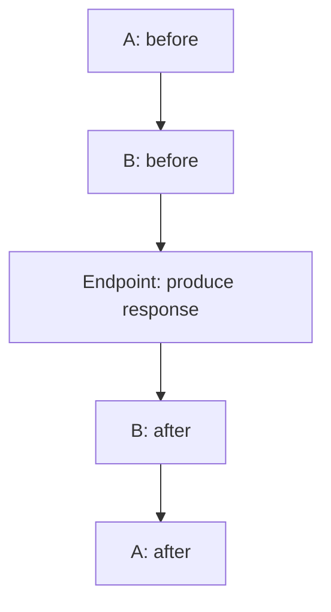

# 5.1 — What Middleware Is

> **[← Roadmap](../../ROADMAP.md)** · **Section:** [5. Middleware and the Request Pipeline](../../ROADMAP.md#5-middleware-and-the-request-pipeline)
> **Prev:** [4.11 Project structure](../04-fundamentals-startup/4.11-project-structure.md) · **Next:** [5.2 Middleware order](5.02-middleware-order.md)

**Markers:** 🔥 🎯 · **Confidence:** 🔴 · **Last reviewed:** —

---

## TL;DR

**Middleware** is a piece of code that sits in the path of every HTTP request. It receives the
request, can act on it, and then decides whether to pass it along to the next piece or stop and
answer immediately.

- The pieces form a **pipeline**, in the order you register them.
- Each one can run code **before** and **after** the rest of the pipeline, because it *calls* the next one and waits.
- That "before and after" shape makes the pipeline **nested**, not flat — which is why order matters so much.

---

## Definitions

| Term | What it is in ASP.NET Core | What it means |
|---|---|---|
| **Middleware** | *a component in the request path* | Code that receives a request, optionally acts on it, and chooses whether to call the next component. |
| **Pipeline** | *the assembled chain* | All your middleware, in registration order, nested inside each other. |
| **`RequestDelegate`** | a **delegate type** | `Task RequestDelegate(HttpContext)`. What every middleware reduces to. |
| **`next`** | *a `RequestDelegate` parameter* | The rest of the pipeline. Calling it hands the request onward. |
| **`HttpContext`** | a **class** | Everything about this request and response. See [5.8](5.08-httpcontext.md). |
| **`IApplicationBuilder`** | an **interface** | What you call `Use...` on to add middleware. `WebApplication` implements it. |
| **`app.Use(...)`** | a **method** | Adds middleware that *can* call `next`. |
| **`app.Run(...)`** | a **method** | Adds **terminal** middleware — it never calls `next`. See [5.3](5.03-use-run-map.md). |
| **Short-circuit** | *a behaviour* | Not calling `next`, so the pipeline stops and the response is sent from there. |
| **Terminal middleware** | *a role* | The last piece. Produces the response. Usually the endpoint. |
| **Endpoint** | *the final destination* | Your controller action or minimal API handler. |

---

## The concept

### The idea in one picture

Think of an **airport**. A passenger passes a series of desks: check-in, security, passport
control, the gate. Each desk does its job and passes them on. Any desk can stop them — security
finds something, and they never reach the gate.

Middleware works the same way. Each component:

1. Sees the request
2. Can do work **before** passing it on
3. Calls the next component — or refuses to
4. Can do work **after** the rest of the pipeline has finished

That fourth step is the part people miss, and it is what makes middleware powerful.

### Why "nested", not "a list"

Here is the shape of every middleware:

```csharp
async Task Middleware(HttpContext context, RequestDelegate next)
{
    // ── BEFORE: on the way in ──

    await next(context);          // run EVERYTHING below this point

    // ── AFTER: on the way back out ──
}
```

`await next(context)` does not mean "hand over and finish". It means **"run the entire rest of
the pipeline and wait for it"**. When it returns, something further down has already produced
the response, and you get a chance to look at it.

So three middleware are not three steps in a row. They are **three boxes inside each other**:



Run order: **A-before, B-before, endpoint, B-after, A-after.**

The first middleware registered is the **outermost** — first to see the request and **last** to
see the response.

### Proving it to yourself

```csharp
app.Use(async (context, next) =>
{
    Console.WriteLine("A: before");
    await next();
    Console.WriteLine("A: after");
});

app.Use(async (context, next) =>
{
    Console.WriteLine("B: before");
    await next();
    Console.WriteLine("B: after");
});

app.Run(async context =>
{
    Console.WriteLine("C: the endpoint");
    await context.Response.WriteAsync("Hello");
});
```

Output for one request:

```
A: before
B: before
C: the endpoint
B: after          ← unwinding
A: after          ← unwinding
```

**Note the symmetry.** It behaves exactly like nested try/finally blocks, which is why one
middleware near the top can catch exceptions thrown anywhere below it. That is how global
exception handling works — see [5.11](5.11-exception-middleware.md).

---

## How it works

### The simple version — what it replaced

In classic ASP.NET the equivalent was **HTTP modules and handlers**, registered in
`web.config`:

```xml
<httpModules>
  <add name="MyModule" type="MyApp.MyModule" />
</httpModules>
```

Three problems. The order came from config files including machine-level ones. You could not
see the pipeline by reading code. And modules hooked into a fixed set of lifecycle events
rather than simply wrapping the next thing.

Middleware fixed all three. **The pipeline is C# code, in one file, in explicit order:**

```csharp
app.UseExceptionHandler();
app.UseHttpsRedirection();
app.UseStaticFiles();
app.UseAuthentication();
app.UseAuthorization();
app.MapControllers();
```

Read it top to bottom and you know exactly what happens to a request.

### How it actually works — everything is a `RequestDelegate`

Underneath, middleware is one delegate type:

```csharp
public delegate Task RequestDelegate(HttpContext context);
```

"Take a context, do something, return a task." That is the whole contract.

The pipeline is built by **composing** these, from the last registered backwards to the first:

```csharp
// Conceptually, what Build() does:
RequestDelegate pipeline = endpointDelegate;              // innermost

pipeline = ctx => middleware2(ctx, pipeline);             // wrap it
pipeline = ctx => middleware1(ctx, pipeline);             // wrap again

// Serving a request is now just:
await pipeline(httpContext);
```

Each layer closes over the next one. That is why `next` is available inside your middleware —
it is a captured reference to the already-composed remainder
([1.13](../01-csharp-fundamentals/1.13-lambdas-closures.md)).

### The deeper detail — what middleware is good for

Middleware handles concerns that apply to **every request, regardless of endpoint**:

| Concern | Examples |
|---|---|
| Cross-cutting | Logging, correlation IDs, timing |
| Security | Authentication, HTTPS redirection, security headers |
| Protocol | CORS, compression, static files |
| Reliability | Global exception handling, rate limiting |

**What it is not good for: anything needing to know which action was selected.** Middleware
runs before model binding and before the action is invoked, so it has no idea about your
method's parameters or return type.

That is what **filters** are for — see [5.13](5.13-middleware-vs-filters.md).

---

## Code

The three ways to write middleware, in increasing formality:

```csharp
// 1. Inline — fine for something tiny
app.Use(async (context, next) =>
{
    context.Response.Headers["X-Request-Id"] = Guid.NewGuid().ToString();
    await next();
});
```

```csharp
// 2. A conventional class — the usual choice. See 5.5.
public class TimingMiddleware(RequestDelegate next, ILogger<TimingMiddleware> logger)
{
    public async Task InvokeAsync(HttpContext context)
    {
        var sw = Stopwatch.StartNew();

        await next(context);              // run everything below

        // Runs on the way back out, so the status code is known by now
        logger.LogInformation("{Method} {Path} → {Status} in {Ms}ms",
            context.Request.Method,
            context.Request.Path,
            context.Response.StatusCode,
            sw.ElapsedMilliseconds);
    }
}

app.UseMiddleware<TimingMiddleware>();
```

```csharp
// 3. An extension method, so Program.cs reads consistently
public static class TimingMiddlewareExtensions
{
    public static IApplicationBuilder UseTiming(this IApplicationBuilder app)
        => app.UseMiddleware<TimingMiddleware>();
}

app.UseTiming();
```

The third form is how every built-in middleware is exposed, and worth copying so your own reads
the same as `UseAuthentication()`.

---

## Interview questions

**Q: What is middleware in ASP.NET Core?**

It is a component sitting in the path of every HTTP request. Each piece receives the
`HttpContext`, can act on it, and decides whether to call the next component. Because it calls
the next one and awaits it, control comes back afterwards — so a single middleware can run code
before the rest of the pipeline and again after the response has been produced. The pipeline is
assembled in `Program.cs` in explicit order, which replaced the HTTP modules and handlers of
classic ASP.NET, where ordering came from config files and was effectively invisible.

**Q: Explain the shape of the pipeline.**

It is nested rather than flat. Each middleware wraps the rest, so registering A then B then the
endpoint produces A-before, B-before, endpoint, B-after, A-after. The first registered is the
outermost — first to see the request and last to see the response. Structurally it behaves like
nested try/finally blocks, which is exactly why one middleware at the top can catch exceptions
thrown anywhere below it, and how global exception handling is implemented.

**Q: What does `await next()` actually do?**

It runs the entire remaining pipeline and waits for completion. It is not "hand off and
return" — when that await finishes, something downstream has already produced a response and
your code gets a chance to inspect or add to it. That is why timing middleware works: capture
the time, call next, and by the time control returns you know the duration and the status code.

**Q: What is middleware not suitable for?**

Anything requiring knowledge of which endpoint or action was selected, or its parameters.
Middleware runs before model binding and before the action executes, so it sees a raw request
rather than a bound model. Validating a specific action's arguments, or caching based on an
action's return value, belongs in filters, which run inside MVC with the action context
available.

---

## Traps ⚠️

- **Order is registration order**, and it matters enormously. See
  [5.2](5.02-middleware-order.md).
- **Forgetting to call `next()`** silently ends the pipeline — the request never reaches your
  endpoint and the caller gets an empty 200.
- **Writing to the response after `await next()`** usually throws, because the response has
  already started. See [5.8](5.08-httpcontext.md).
- **Conventional middleware is a singleton.** Injecting a scoped service into its constructor is
  a captive dependency — see [5.6](5.06-imiddleware-factory.md).
- **Middleware cannot see the selected action.** Use a filter.
- **Exceptions propagate up the nesting**, so only middleware registered *above* the throwing
  code can catch them.

---

## Related

- [5.2 Middleware order](5.02-middleware-order.md) — the canonical ordering and why
- [5.3 Use, Run, Map](5.03-use-run-map.md) — the ways to add middleware
- [5.5 Conventional middleware](5.05-conventional-middleware.md) — the class form in detail
- [5.8 HttpContext](5.08-httpcontext.md) — what middleware works with
- [5.13 Middleware vs filters](5.13-middleware-vs-filters.md) — choosing between them
- [4.3 Program.cs](../04-fundamentals-startup/4.03-program-cs-hosting.md) — where the pipeline is built
- [1.13 Closures](../01-csharp-fundamentals/1.13-lambdas-closures.md) — how `next` is captured

---

## Sources

- [Microsoft Learn — ASP.NET Core Middleware](https://learn.microsoft.com/aspnet/core/fundamentals/middleware/)
- [Microsoft Learn — Write custom middleware](https://learn.microsoft.com/aspnet/core/fundamentals/middleware/write)
