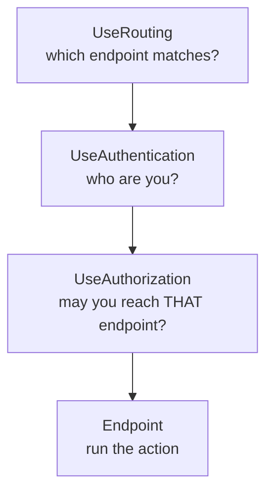

# 5.2 — Middleware Order

> **[← Roadmap](../../ROADMAP.md)** · **Section:** [5. Middleware and the Request Pipeline](../../ROADMAP.md#5-middleware-and-the-request-pipeline)
> **Prev:** [5.1 What middleware is](5.01-what-is-middleware.md) · **Next:** [5.3 Use, Run, Map](5.03-use-run-map.md)

**Markers:** 🔥 ⚠️ 🎯 · **Confidence:** 🔴 · **Last reviewed:** —

---

## TL;DR

Middleware runs in **the order you register it**, and getting that order wrong causes bugs that
produce no error message — just silently wrong behaviour.

- **Authentication must come before Authorization**, or `User` is empty when the decision is made.
- **Exception handling goes first**, so it wraps everything below it.
- **Static files go early**, before authentication, so image requests do not pay for auth they do not need.

---

## Definitions

| Term | What it is | What it means |
|---|---|---|
| **Registration order** | *the order of your `app.Use...` calls* | Determines pipeline position. The only thing that decides order. |
| **Upstream / downstream** | *relative positions* | Upstream = registered earlier = outer. Downstream = later = inner. |
| **`UseExceptionHandler`** | a **middleware method** | Catches exceptions from everything **below** it. Must be near the top. |
| **`UseHsts`** | a **middleware method** | Sends the `Strict-Transport-Security` header. Production only. |
| **`UseHttpsRedirection`** | a **middleware method** | Redirects HTTP requests to HTTPS. |
| **`UseStaticFiles`** | a **middleware method** | Serves `wwwroot`. Short-circuits on a match. |
| **`UseRouting`** | a **middleware method** | Works out **which endpoint** matches this request. Does not run it. |
| **`UseCors`** | a **middleware method** | Applies cross-origin policy. Must sit between routing and auth. |
| **`UseAuthentication`** | a **middleware method** | Works out **who you are** and populates `context.User`. |
| **`UseAuthorization`** | a **middleware method** | Decides **whether you may proceed**. Needs `User` already populated. |
| **`MapControllers`** | a **method** | Adds the endpoint execution step at the end. |
| **Auto-inserted middleware** | *a `WebApplication` behaviour* | Routing and endpoints are added automatically if you do not add them yourself. |

---

## The concept

### Why order is not a detail

Middleware is nested ([5.1](5.01-what-is-middleware.md)). Each one wraps everything registered
after it. So the order decides:

- **Who sees the request first**
- **Who can stop it**
- **Who can catch exceptions from whom**
- **What information is available when a decision is made**

That last one causes the classic bug. Consider:

```csharp
app.UseAuthorization();      // "is this user allowed?"
app.UseAuthentication();     // "who is this user?"
```

Authorization runs **first**, and asks whether the user is allowed. But authentication has not
run yet, so `context.User` is an empty, unauthenticated principal. Every `[Authorize]` endpoint
returns 401 regardless of how valid the token was.

**And there is no error.** No exception, no warning, no log entry saying "you have these the
wrong way round". Just an API that rejects everyone.

A picture: **airport security placed after the departure gate.** Every step still happens, in a
technically valid order — it just achieves nothing useful.

---

## How it works

### The canonical order 🎯

This is worth memorising. It is the order Microsoft documents and the order almost every real
application uses:

```csharp
var app = builder.Build();

// 1. Exception handling — FIRST, so it wraps everything below
if (app.Environment.IsDevelopment())
    app.UseDeveloperExceptionPage();
else
{
    app.UseExceptionHandler("/error");
    app.UseHsts();
}

// 2. Forwarded headers — before anything reads IP or scheme
app.UseForwardedHeaders();

// 3. HTTPS redirect
app.UseHttpsRedirection();

// 4. Static files — early, so assets skip everything below
app.UseStaticFiles();

// 5. Routing — decide WHICH endpoint matches
app.UseRouting();

// 6. CORS — after routing, before auth
app.UseCors();

// 7. Who are you?
app.UseAuthentication();

// 8. Are you allowed?
app.UseAuthorization();

// 9. Anything needing an authenticated user
app.UseSession();
app.UseResponseCaching();

// 10. Endpoints — run the selected action
app.MapControllers();

app.Run();
```

### The rules behind the order

You do not need to memorise the list if you understand the four rules that produce it.

**Rule 1 — Exception handling wraps what it protects.**
It can only catch exceptions from middleware registered *below* it. Put it at the bottom and it
protects nothing.

**Rule 2 — Authentication before Authorization.**
`UseAuthorization` reads `context.User`. `UseAuthentication` is what populates it. Reverse them
and the decision is made with no information.

**Rule 3 — Cheap short-circuits go early.**
`UseStaticFiles` returns immediately on a match ([5.7](5.07-short-circuiting.md)). Placed after
authentication, every image on your page runs JWT validation and a claims lookup first. Forty
assets means forty wasted authentication cycles per page load.

**Rule 4 — Anything reading request metadata goes before whoever reads it.**
`UseForwardedHeaders` rewrites the client IP and scheme, so it must precede rate limiting,
logging and HTTPS redirection — otherwise those see the proxy's values
([4.2](../04-fundamentals-startup/4.02-hosting-model.md)).

### How it actually works — routing sits in the middle

`UseRouting` and the endpoint execution step are separate, and authentication and authorization
sit **between** them.



The reason: authorization needs to know **which** endpoint was selected before it can check the
policy on it. Routing selects but does not execute; that gap is where the security decisions
happen with full information available.

In minimal hosting, `WebApplication` inserts `UseRouting` and the endpoint step automatically,
so you rarely write them. But if you call `UseRouting()` explicitly, it is placed where you put
it — which is how you get middleware to run before or after route matching deliberately.

See [8.2](../08-routing/8.02-userouting-useendpoints.md).

### The deeper detail — the bugs each mistake causes

| Wrong order | Symptom |
|---|---|
| `UseAuthorization` before `UseAuthentication` | Every authenticated endpoint returns **401**, tokens are ignored |
| `UseExceptionHandler` last | Unhandled exceptions produce a raw 500 with a **stack trace leaked** to the client |
| `UseStaticFiles` after `UseAuthentication` | Assets work but every one runs full auth — slow, and 401s if auth is required |
| `UseCors` after `UseAuthentication` | Preflight `OPTIONS` requests get rejected before CORS can answer them |
| `UseForwardedHeaders` late | Rate limiting and logs record the **proxy's IP** for every request |
| `UseRouting` after `UseAuthorization` | Throws at startup — authorization has no endpoint to check |
| `UseHttpsRedirection` behind a TLS proxy | **Infinite redirect loop** |

**The CORS one is subtle and worth knowing.** A browser preflight is an `OPTIONS` request with
no credentials. If authentication runs first, it rejects the request with 401 before CORS
middleware can reply with the allow headers — so the browser blocks the real request and you
see a CORS error that is actually an ordering bug. See
[10.10](../10-web-api-rest/10.10-cors.md).

---

## Code

The failure mode, side by side:

```csharp
// ✗ BROKEN — no error, just an API that rejects everyone
app.UseAuthorization();
app.UseAuthentication();
app.MapControllers();
```

```csharp
// ✓ CORRECT
app.UseAuthentication();     // populate context.User
app.UseAuthorization();      // now decide, with information
app.MapControllers();
```

And a realistic production pipeline with the reasoning inline:

```csharp
var app = builder.Build();

// Outermost — catches everything below, including its own downstream middleware
app.UseExceptionHandler();

// Must precede anything reading IP or scheme
app.UseForwardedHeaders(new ForwardedHeadersOptions
{
    ForwardedHeaders = ForwardedHeaders.XForwardedFor | ForwardedHeaders.XForwardedProto
});

if (!app.Environment.IsDevelopment())
    app.UseHsts();

// Assets short-circuit here and skip everything below
app.UseStaticFiles();

app.UseRouting();

app.UseCors("Default");          // before auth, so preflight is answered
app.UseRateLimiter();            // after forwarded headers, so it sees real IPs

app.UseAuthentication();
app.UseAuthorization();

app.MapControllers();
app.MapHealthChecks("/healthz");

app.Run();
```

Notice `UseRateLimiter` sits after `UseForwardedHeaders` and after `UseRouting`. After
forwarded headers so it rate-limits real clients rather than the proxy; after routing so
per-endpoint limits know which endpoint they apply to.

---

## Interview questions

**Q: Why does middleware order matter?**

Because the pipeline is nested — each middleware wraps everything registered after it. So the
order decides who sees the request first, who can stop it, who can catch exceptions from whom,
and crucially what information is available when a decision is made. The classic example is
authorization before authentication: authorization reads `context.User`, but authentication is
what populates it, so reversing them means every authenticated endpoint returns 401 with no
error message explaining why.

**Q: What is the canonical order and why?**

Exception handling first so it wraps everything, then forwarded headers before anything reads
the client IP or scheme, then HTTPS redirection, then static files, then routing, then CORS,
then authentication, then authorization, then endpoints. You can derive it from four rules
rather than memorising: exception handling only catches what is below it; authorization needs
the user that authentication populates; cheap short-circuits like static files go early so they
skip work; and anything rewriting request metadata must precede whoever reads it.

**Q: Why do authentication and authorization sit between routing and the endpoint?**

Because authorization needs to know which endpoint was selected before it can evaluate the
policy attached to it. `UseRouting` performs the match but does not execute anything, and the
endpoint step at the end runs it. That gap is deliberately where the security decisions happen,
with the routing result available. In minimal hosting `WebApplication` inserts both
automatically, so you normally just write authentication and authorization in the right order.

**Q: You get a CORS error in the browser but your CORS policy looks correct. What might be wrong?**

Very likely `UseCors` is registered after `UseAuthentication`. A browser preflight is an
`OPTIONS` request sent without credentials, so if authentication runs first it rejects that
preflight with 401 before CORS middleware ever gets to answer with the allow headers. The
browser then blocks the real request and reports it as a CORS failure, when the actual cause is
middleware ordering. Moving `UseCors` above the auth middleware fixes it.

---

## Traps ⚠️

- **`UseAuthorization` before `UseAuthentication`** produces 401 on everything, with no error.
- **`UseExceptionHandler` registered late** leaves everything above it unprotected and can leak
  stack traces.
- **`UseCors` after authentication** breaks preflight requests and looks like a CORS
  misconfiguration.
- **`UseStaticFiles` after authentication** runs full auth for every image, script and
  stylesheet.
- **`UseForwardedHeaders` late** means logs and rate limiting see the proxy IP.
- **`UseRouting` after `UseAuthorization`** throws at startup.
- **Service registration order does not matter.** Only pipeline order does — people confuse the
  two halves of `Program.cs`.
- **Middleware added inside `Map` branches has its own order**, independent of the main
  pipeline ([5.3](5.03-use-run-map.md)).

---

## Related

- [5.1 What middleware is](5.01-what-is-middleware.md) — why the pipeline is nested
- [5.3 Use, Run, Map](5.03-use-run-map.md) — branching and its own ordering
- [5.7 Short-circuiting](5.07-short-circuiting.md) — why early placement matters
- [5.11 Exception middleware](5.11-exception-middleware.md) — why it goes first
- [8.2 UseRouting and UseEndpoints](../08-routing/8.02-userouting-useendpoints.md) — the gap in the middle
- [10.10 CORS](../10-web-api-rest/10.10-cors.md) — the preflight ordering trap
- [4.2 Hosting model](../04-fundamentals-startup/4.02-hosting-model.md) — forwarded headers

---

## Sources

- [Microsoft Learn — Middleware order](https://learn.microsoft.com/aspnet/core/fundamentals/middleware/#middleware-order)
- [Microsoft Learn — ASP.NET Core Middleware](https://learn.microsoft.com/aspnet/core/fundamentals/middleware/)
