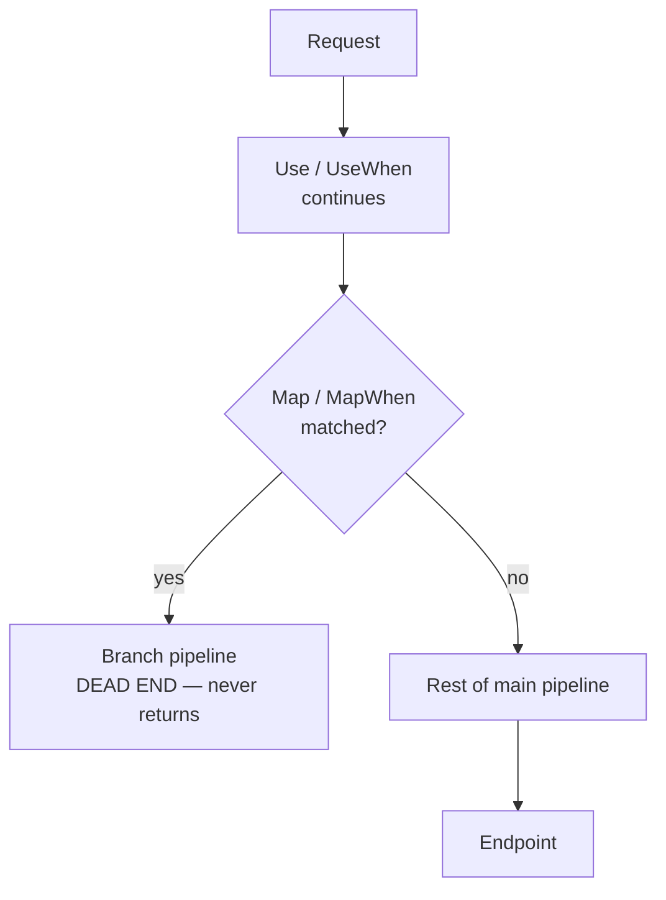

# 5.3 — Use vs Run vs Map vs MapWhen vs UseWhen

> **[← Roadmap](../../ROADMAP.md)** · **Section:** [5. Middleware and the Request Pipeline](../../ROADMAP.md#5-middleware-and-the-request-pipeline)
> **Prev:** [5.2 Middleware order](5.02-middleware-order.md) · **Next:** [5.4 Inline middleware](5.04-inline-middleware.md)

**Markers:** 🔥 💻 · **Confidence:** 🔴 · **Last reviewed:** —

---

## TL;DR

Five methods for adding middleware, and they differ in **whether the pipeline continues** and
**whether it rejoins**.

- **`Use`** — can call `next`. The normal one.
- **`Run`** — terminal. Never calls `next`. The pipeline ends here.
- **`Map`** / **`MapWhen`** — branch off permanently. The branch **never rejoins** the main pipeline.
- **`UseWhen`** — branch conditionally, and **rejoin** the main pipeline afterwards.

The `Map` versus `UseWhen` distinction is the one that gets asked about.

---

## Definitions

| Term | What it is | What it means |
|---|---|---|
| **`Use`** | an **extension method** | Adds middleware that receives `next` and may call it. The default. |
| **`Run`** | an **extension method** | Adds **terminal** middleware. Receives no `next`, so nothing after it runs. |
| **`Map`** | an **extension method** | Branches on a **URL path prefix**. The branch does not rejoin. |
| **`MapWhen`** | an **extension method** | Branches on **any predicate** over `HttpContext`. Does not rejoin. |
| **`UseWhen`** | an **extension method** | Runs extra middleware when a predicate matches, then **rejoins** the main pipeline. |
| **Branch** | *a separate sub-pipeline* | Its own chain of middleware, with its own order. |
| **Rejoin** | *a behaviour* | Whether control returns to the main pipeline after the branch. |
| **`PathString`** | a **struct** | Typed URL path. `Map` matches against it and strips the prefix. |
| **`PathBase`** | *a property on the request* | Where `Map` moves the matched prefix to. |
| **Terminal** | *a role* | Middleware that produces the response and does not delegate onward. |

---

## The concept

### The one distinction that matters

All five add middleware. They differ on two questions:

1. **Does it call `next`?** — `Use` can, `Run` cannot.
2. **Does the branch rejoin?** — `UseWhen` rejoins, `Map` and `MapWhen` do not.

A picture: **a road with a fork.**

- `Use` is a checkpoint on the road. Everyone passes through and continues.
- `Run` is the destination. The road ends.
- `Map` is a **permanent turn-off**. Once you take it, you are on a different road and never
  come back.
- `UseWhen` is a **detour** — a loop that rejoins the main road further along.

That difference decides whether the rest of your pipeline — authentication, authorization, your
endpoints — still runs.

---

## How it works

### `Use` — the normal one

```csharp
app.Use(async (context, next) =>
{
    // before
    await next();          // continue down the pipeline
    // after
});
```

Skipping `next()` short-circuits the pipeline, which is sometimes exactly what you want —
see [5.7](5.07-short-circuiting.md).

⚠️ **There are two overloads and one is a performance trap:**

```csharp
// Older: next is a Func<Task>. Allocates a closure per request.
app.Use(async (context, next) => { await next(); });

// Newer (.NET 7+): next is a RequestDelegate. No per-request allocation.
app.Use(async (HttpContext context, RequestDelegate next) => { await next(context); });
```

The second form is preferred in hot paths. Note it takes `next(context)` rather than `next()`.

### `Run` — terminal

```csharp
app.Run(async context =>
{
    await context.Response.WriteAsync("This is the end of the line");
});
```

No `next` parameter at all — the signature makes it impossible to continue. Anything registered
after it **never runs**.

⚠️ **`app.Run(handler)` and `app.Run()` are completely different things.** The one with no
arguments starts the web server and blocks
([4.3](../04-fundamentals-startup/4.03-program-cs-hosting.md)). The overload taking a delegate
adds terminal middleware. Same name, unrelated jobs, and it confuses people constantly.

### `Map` — branch on a path prefix

```csharp
app.Map("/admin", adminApp =>
{
    adminApp.Use(async (context, next) =>
    {
        Console.WriteLine("Only admin requests reach here");
        await next();
    });

    adminApp.Run(async context =>
        await context.Response.WriteAsync("Admin area"));
});

// Main pipeline continues for everything that is NOT /admin
app.UseAuthentication();
app.MapControllers();
```

Two things happen that surprise people:

**The branch does not rejoin.** A request to `/admin/users` enters the branch and never comes
back — so `UseAuthentication` and `MapControllers` below **do not run for it**. If the branch
does not produce a response, the request ends with a 404.

**The matched prefix is stripped.** Inside the branch, `/admin/users` has
`Request.Path == "/users"` and `Request.PathBase == "/admin"`. That is deliberate — it lets you
mount a self-contained sub-application at a path — but it breaks link generation if you are not
expecting it.

### `MapWhen` — branch on any condition

```csharp
app.MapWhen(
    context => context.Request.Query.ContainsKey("debug"),
    debugApp =>
    {
        debugApp.Run(async context =>
            await context.Response.WriteAsync("Debug mode"));
    });
```

Same non-rejoining behaviour as `Map`, but the predicate can inspect anything on the context —
headers, query string, method, host. The path is **not** stripped.

### `UseWhen` — branch and rejoin ⭐

This is the one people reach for when they mistakenly use `Map`:

```csharp
app.UseWhen(
    context => context.Request.Path.StartsWithSegments("/api"),
    apiApp =>
    {
        apiApp.UseMiddleware<ApiKeyValidationMiddleware>();
    });

// This DOES run for /api requests — the branch rejoined
app.UseAuthentication();
app.UseAuthorization();
app.MapControllers();
```

An `/api` request runs the API-key middleware **and then continues** through authentication,
authorization and on to its endpoint.

**That is almost always what you actually want**: "run this extra middleware for some requests"
rather than "send some requests somewhere else entirely".

### Side by side

| Method | Condition | Calls `next`? | Rejoins? | Strips path? |
|---|---|:--:|:--:|:--:|
| `Use` | always | optional | n/a | no |
| `Run` | always | **never** | n/a | no |
| `Map` | path prefix | branch decides | **no** | **yes** |
| `MapWhen` | any predicate | branch decides | **no** | no |
| `UseWhen` | any predicate | branch decides | **yes** | no |



---

## Code

The mistake and the fix. Requiring an API key on `/api` routes only:

```csharp
// ✗ WRONG — Map does not rejoin.
// /api requests never reach authentication or the controllers below.
app.Map("/api", apiApp =>
{
    apiApp.UseMiddleware<ApiKeyMiddleware>();
});

app.UseAuthentication();
app.UseAuthorization();
app.MapControllers();      // /api requests NEVER GET HERE → 404
```

The symptom is baffling: your API returns 404 for every route, while the routes clearly exist
and non-API routes work fine.

```csharp
// ✓ CORRECT — UseWhen rejoins
app.UseWhen(
    context => context.Request.Path.StartsWithSegments("/api"),
    apiApp => apiApp.UseMiddleware<ApiKeyMiddleware>());

app.UseAuthentication();
app.UseAuthorization();
app.MapControllers();      // /api requests DO get here
```

### A legitimate use of `Map`

`Map` is right when the branch really is a separate application that produces its own response:

```csharp
// A completely self-contained health/metrics endpoint
app.Map("/internal", internalApp =>
{
    internalApp.UseMiddleware<InternalNetworkOnlyMiddleware>();

    internalApp.Run(async context =>
    {
        context.Response.ContentType = "application/json";
        await context.Response.WriteAsJsonAsync(new
        {
            status  = "ok",
            version = typeof(Program).Assembly.GetName().Version?.ToString(),
            uptime  = Environment.TickCount64 / 1000
        });
    });
});
```

Here not rejoining is correct — these requests should never touch your application's
authentication or controllers.

---

## Interview questions

**Q: What is the difference between `Use` and `Run`?**

`Use` adds middleware that receives a `next` delegate and can choose to call it, continuing down
the pipeline. `Run` adds terminal middleware — its signature has no `next` at all, so nothing
registered after it can execute. You use `Run` for the final component that produces a
response. Worth noting that `app.Run(handler)` with a delegate is entirely different from
`app.Run()` with no arguments, which starts the server and blocks; the shared name confuses
people regularly.

**Q: What is the difference between `Map` and `UseWhen`?**

Both create a branch, but `Map` is a dead end and `UseWhen` rejoins. With `Map`, once a request
matches the path prefix it enters the branch and never returns to the main pipeline — so
anything registered afterwards, including authentication and your endpoint mapping, does not run
for it. `UseWhen` runs the extra middleware when its predicate matches and then continues down
the main pipeline. In practice `UseWhen` is what people usually want, because the intent is
normally "apply this extra middleware to some requests" rather than "route these requests to a
different application".

**Q: You add `app.Map("/api", ...)` with some middleware and now every API route returns 404. Why?**

Because `Map` branches permanently. Requests to `/api` enter that branch and never rejoin the
main pipeline, so `MapControllers` further down never runs for them — nothing matches, and the
result is a 404. The routes exist and non-API routes work fine, which makes it confusing. The
fix is `UseWhen`, which applies the middleware and then lets the request carry on to routing and
endpoints as normal.

**Q: What does `Map` do to the request path?**

It strips the matched prefix. Inside a `Map("/admin", ...)` branch, a request to `/admin/users`
has `Request.Path` of `/users` and `Request.PathBase` of `/admin`. That is deliberate — it lets
you mount a self-contained sub-application at a path without it needing to know where it is
mounted — but it surprises people, and it affects link generation if code inside the branch
builds URLs from `Request.Path`.

---

## Traps ⚠️

- **`Map` and `MapWhen` never rejoin.** Everything registered after them is skipped for matched
  requests.
- **`Map` strips the matched prefix** from `Request.Path` and moves it to `PathBase`.
- **`app.Run(handler)` versus `app.Run()`** are unrelated despite the shared name.
- **Forgetting `next()` in a `Use`** silently ends the pipeline with an empty 200.
- **The older `Use` overload allocates a closure per request.** Prefer the `RequestDelegate`
  form in hot paths.
- **A `Map` branch that produces no response returns 404**, because the request cannot continue.
- **Branches have their own middleware order**, independent of the main pipeline.
- **`Map` matches whole segments only.** `Map("/api")` matches `/api/users` but not `/apixyz`.

---

## Related

- [5.1 What middleware is](5.01-what-is-middleware.md) — the pipeline model
- [5.2 Middleware order](5.02-middleware-order.md) — where branches fit
- [5.4 Inline middleware](5.04-inline-middleware.md) — writing `Use` delegates
- [5.7 Short-circuiting](5.07-short-circuiting.md) — deliberately not calling `next`
- [8.9 Route groups](../08-routing/8.09-route-groups.md) — the endpoint-level equivalent
- [4.3 Program.cs](../04-fundamentals-startup/4.03-program-cs-hosting.md) — `app.Run()` the other one

---

## Sources

- [Microsoft Learn — Middleware: Use, Run, Map](https://learn.microsoft.com/aspnet/core/fundamentals/middleware/#branch-the-middleware-pipeline)
- [Microsoft Learn — IApplicationBuilder](https://learn.microsoft.com/dotnet/api/microsoft.aspnetcore.builder.iapplicationbuilder)
