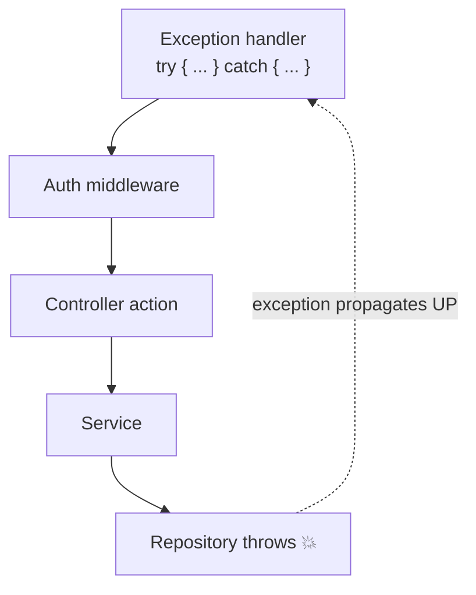

# 5.11 — Global Exception-Handling Middleware

> **[← Roadmap](../../ROADMAP.md)** · **Section:** [5. Middleware and the Request Pipeline](../../ROADMAP.md#5-middleware-and-the-request-pipeline)
> **Prev:** [5.10 Built-in middleware](5.10-builtin-middleware.md) · **Next:** [5.12 IExceptionHandler](5.12-iexceptionhandler.md)

**Markers:** 🔥 💻 · **Confidence:** 🔴 · **Last reviewed:** —

---

## TL;DR

**Global exception handling** means catching unhandled exceptions in **one place** — the
outermost middleware — instead of wrapping every controller action in try/catch.

- It works because the pipeline is **nested**: middleware at the top wraps everything below it, exactly like a try/catch around the rest.
- It must be registered **first**, or it only protects what comes after it.
- **Never send exception details to the client.** Log the detail; return something generic.

---

## Definitions

| Term | What it is | What it means |
|---|---|---|
| **Global exception handling** | *a pattern* | One place catching unhandled exceptions from the whole application. |
| **`UseExceptionHandler`** | a **middleware method** | The built-in handler. Catches exceptions from below and produces a response. |
| **`UseDeveloperExceptionPage`** | a **middleware method** | Full stack trace in the browser. **Development only.** |
| **`ProblemDetails`** | a **class** | The RFC 7807 standard error shape for HTTP APIs. See [10.8](../10-web-api-rest/10.08-problem-details.md). |
| **`AddProblemDetails()`** | a **registration method** | Makes the framework produce `ProblemDetails` bodies automatically. |
| **`IExceptionHandlerFeature`** | an **interface** | How the error handler retrieves the exception that occurred. |
| **`UseStatusCodePages`** | a **middleware method** | Adds a body to bare status-code responses like a 404 with no content. |
| **Re-execute pipeline** | *a behaviour* | `UseExceptionHandler("/error")` re-runs the pipeline against that path. |
| **`IExceptionHandler`** | an **interface** (.NET 8+) | The modern, typed way to handle exceptions. See [5.12](5.12-iexceptionhandler.md). |
| **Information disclosure** | *a vulnerability class* | Leaking internal detail — stack traces, table names, file paths — to a caller. |

---

## The concept

### Why one place, not many

Without global handling, every action needs its own try/catch:

```csharp
[HttpGet("{id}")]
public async Task<IActionResult> Get(Guid id)
{
    try
    {
        return Ok(await _service.GetAsync(id));
    }
    catch (NotFoundException)
    {
        return NotFound();
    }
    catch (Exception ex)
    {
        _logger.LogError(ex, "Failed");
        return StatusCode(500);
    }
}
```

Repeated across forty actions, that is forty chances to format an error differently, forty
chances to forget logging, and a lot of noise around three lines of actual work.

**Global handling collapses it to one place**, and the actions get to be honest about what they
do:

```csharp
[HttpGet("{id}")]
public async Task<IActionResult> Get(Guid id)
    => Ok(await _service.GetAsync(id));      // exceptions handled elsewhere
```

### Why it works — the nesting

From [5.1](5.01-what-is-middleware.md): each middleware wraps everything below it, structurally
identical to nested try/finally blocks.

So a middleware near the top that wraps `await next()` in a try/catch catches exceptions thrown
**anywhere downstream** — in another middleware, in a filter, in a controller, in a repository,
in EF Core.



**This is also why registration order is not optional.** An exception handler registered last
sits below everything, so nothing above it is protected.

A picture: **a safety net under a trapeze.** It has to be under the whole act, not under the
last three metres.

---

## How it works

### The simple version — the built-in handler

```csharp
var app = builder.Build();

if (app.Environment.IsDevelopment())
{
    app.UseDeveloperExceptionPage();     // full detail, locally only
}
else
{
    app.UseExceptionHandler("/error");   // generic response
    app.UseHsts();
}
```

`UseExceptionHandler("/error")` catches the exception, then **re-executes the pipeline** against
`/error`, so an endpoint at that path produces the response:

```csharp
app.Map("/error", (HttpContext context) =>
{
    var feature = context.Features.Get<IExceptionHandlerFeature>();
    var exception = feature?.Error;

    // Log the detail — this goes to YOUR logs, not the client
    // ...

    return Results.Problem(
        title: "An unexpected error occurred",
        statusCode: StatusCodes.Status500InternalServerError);
        // deliberately NO detail, NO stack trace
});
```

Since .NET 8 there is a simpler form that produces `ProblemDetails` automatically:

```csharp
builder.Services.AddProblemDetails();
// ...
app.UseExceptionHandler();      // no path needed
```

### ⚠️ The developer exception page is a production hazard

```csharp
app.UseDeveloperExceptionPage();
```

It renders the stack trace, source snippets, request headers, **and all environment variables**
into the browser. Environment variables routinely hold connection strings and API keys.

So if anything accidentally sets `ASPNETCORE_ENVIRONMENT=Development` on a deployed system, any
error hands an attacker your secrets. That happens through copied Dockerfiles and unset Helm
values more often than people expect —
[4.7](../04-fundamentals-startup/4.07-environments.md).

### Writing your own

The built-in handler covers most cases. A custom one is worth it when you need to map specific
exception types to specific status codes:

```csharp
internal class ExceptionHandlingMiddleware(
    RequestDelegate next,
    ILogger<ExceptionHandlingMiddleware> logger,
    IHostEnvironment env)
{
    public async Task InvokeAsync(HttpContext context)
    {
        try
        {
            await next(context);
        }
        catch (OperationCanceledException) when (context.RequestAborted.IsCancellationRequested)
        {
            // The client went away. Normal traffic, not an error.
            logger.LogInformation("Request cancelled by client: {Path}", context.Request.Path);
            // No response — nobody is listening
        }
        catch (Exception ex)
        {
            await HandleAsync(context, ex);
        }
    }

    private async Task HandleAsync(HttpContext context, Exception ex)
    {
        // ⚠️ If the response already started we cannot change it
        if (context.Response.HasStarted)
        {
            logger.LogError(ex, "Exception after response started — cannot format it");
            throw ex;          // let the server abort the connection
        }

        var (status, title) = ex switch
        {
            NotFoundException            => (StatusCodes.Status404NotFound, "Resource not found"),
            ValidationException          => (StatusCodes.Status400BadRequest, "Validation failed"),
            UnauthorizedAccessException  => (StatusCodes.Status403Forbidden, "Forbidden"),
            ConcurrencyException         => (StatusCodes.Status409Conflict, "Conflict"),
            _                            => (StatusCodes.Status500InternalServerError,
                                             "An unexpected error occurred")
        };

        // Log at the right level — 4xx is client error, 5xx is ours
        if (status >= 500)
            logger.LogError(ex, "Unhandled exception on {Path}", context.Request.Path);
        else
            logger.LogWarning(ex, "Handled {Type} on {Path}",
                ex.GetType().Name, context.Request.Path);

        var problem = new ProblemDetails
        {
            Status   = status,
            Title    = title,
            Instance = context.Request.Path,
            // Only include real detail outside production
            Detail   = env.IsDevelopment() ? ex.ToString() : null
        };

        // Always give the client something to quote in a support ticket
        problem.Extensions["traceId"] = Activity.Current?.Id ?? context.TraceIdentifier;

        context.Response.Clear();
        context.Response.StatusCode = status;
        context.Response.ContentType = "application/problem+json";

        await context.Response.WriteAsJsonAsync(problem, context.RequestAborted);
    }
}
```

Five decisions in that code worth explaining in an interview:

**Cancellation is handled separately.** A user closing a tab produces
`OperationCanceledException`. Logging that at error level fills your dashboards with noise that
hides real failures ([2.14](../02-collections-linq-async/2.14-cancellation.md)).

**`HasStarted` is checked.** If bytes have already gone out, the status code and headers are on
the wire and cannot be changed ([5.8](5.08-httpcontext.md)). The honest response is to let the
connection abort rather than produce a corrupted body.

**Log level depends on status.** A 404 is the client asking for something that does not exist —
a warning at most. A 500 is your bug and belongs at error level.

**`Detail` is environment-gated.** Stack traces never reach a production client.

**A trace ID is always included.** The client cannot see what went wrong, but they can quote an
ID that lets you find it in your logs immediately. That single field turns "the site is broken"
into a searchable incident.

### The deeper detail — what it cannot catch

Middleware only catches exceptions from **inside the pipeline**. Not:

| Where | Why not | What to do |
|---|---|---|
| **Startup**, before `app.Run()` | The pipeline does not exist yet | try/catch in `Program.cs`; log and exit |
| **Background services** | Separate execution path | try/catch inside `ExecuteAsync` ([21.1](../21-advanced-features/21.01-background-services.md)) |
| **Fire-and-forget tasks** | Nobody awaits them | Do not use them ([2.15](../02-collections-linq-async/2.15-async-void.md)) |
| **Middleware registered above it** | Not wrapped by it | Register the handler first |
| **After the response started** | Cannot change what is sent | Check `HasStarted` |

For startup:

```csharp
try
{
    var app = builder.Build();
    // ... pipeline ...
    app.Run();
}
catch (Exception ex)
{
    Log.Fatal(ex, "Application failed to start");
    throw;
}
finally
{
    Log.CloseAndFlush();      // ensure buffered logs are written before exit
}
```

That `CloseAndFlush` matters with Serilog and similar — a crash during startup otherwise loses
the log entry explaining why.

### Do not forget `UseStatusCodePages`

Exception handling covers thrown exceptions. It does **not** cover a bare 404 from routing, which
has an **empty body**:

```csharp
app.UseStatusCodePages();      // gives 404s and 401s a body
```

Without it, an API client requesting a non-existent route gets a 404 with nothing in it, which
breaks clients expecting JSON.

---

## Code

The complete production setup:

```csharp
var builder = WebApplication.CreateBuilder(args);

builder.Services.AddProblemDetails();      // standard error shape everywhere
builder.Services.AddControllers();

var app = builder.Build();

// FIRST — wraps everything below
if (app.Environment.IsDevelopment())
{
    app.UseDeveloperExceptionPage();
}
else
{
    app.UseMiddleware<ExceptionHandlingMiddleware>();
    app.UseHsts();
}

app.UseStatusCodePages();                  // bodies for bare 404s
app.UseHttpsRedirection();
app.UseAuthentication();
app.UseAuthorization();
app.MapControllers();

app.Run();
```

Controllers can now be honest:

```csharp
[HttpGet("{id:guid}")]
public async Task<ActionResult<OrderDto>> Get(Guid id, CancellationToken ct)
{
    // Throws NotFoundException if missing. The middleware turns it into a 404.
    var order = await _orders.GetAsync(id, ct);
    return Ok(order);
}
```

No try/catch, no repeated error formatting, and every error in the application comes out the
same shape.

---

## Interview questions

**Q: How do you handle exceptions globally in ASP.NET Core?**

With middleware registered at the top of the pipeline that wraps `await next()` in a try/catch.
Because the pipeline is nested — each middleware wraps everything below it — a handler at the
top catches exceptions thrown anywhere downstream, in other middleware, filters, controllers or
data access. You either use the built-in `UseExceptionHandler`, or write your own when you need
to map specific exception types to specific status codes. The critical part is that it must be
registered first, since it can only protect what comes after it.

**Q: What should the response contain?**

Nothing internal. Stack traces, exception messages, table names and file paths all help an
attacker and mean nothing to a legitimate client. I log the full detail server-side and return a
generic `ProblemDetails` body with a status code and a title. The one thing I always include is
a trace identifier, so a user reporting a problem can quote an ID that lets me find the exact
request in the logs — that turns "the site is broken" into something searchable. In development
I include the full detail, gated on the environment check.

**Q: What can global exception middleware not catch?**

Anything outside the request pipeline. Exceptions during startup, before `app.Run()`, because the
pipeline does not exist yet — those need a try/catch in `Program.cs` with a flush of the logger
before exit. Exceptions in background services, which run on a separate path and need their own
handling inside `ExecuteAsync`. Fire-and-forget tasks, since nobody observes them. And anything
thrown by middleware registered above the handler. There is also the case where the response has
already started, at which point the status code is on the wire and cannot be changed.

**Q: Why treat `OperationCanceledException` specially?**

Because it usually is not an error. When a user navigates away or closes a tab, the request is
cancelled and that exception propagates. Logging it at error level fills your dashboards with
noise that hides real failures, and there is no point writing a response because nobody is
listening. I catch it separately, with a filter checking that the request was actually aborted,
and log it at information level — while letting cancellations from our own internal timeouts
still surface as genuine problems.

---

## Traps ⚠️

- **Registering the handler late** leaves everything above it unprotected.
- **The developer exception page in production** leaks environment variables including secrets.
- **Returning `ex.Message` to the client** discloses internals — messages often contain table
  names and file paths.
- **Not checking `HasStarted`** produces a second exception while handling the first.
- **Logging `OperationCanceledException` as an error** buries real failures in noise.
- **Exception middleware does not cover startup or background services.**
- **A bare 404 has an empty body** without `UseStatusCodePages`.
- **Logging everything at error level** makes the level meaningless — 4xx is usually a warning.
- **Not flushing the logger on startup failure** loses the entry explaining the crash.

---

## Related

- [5.12 IExceptionHandler](5.12-iexceptionhandler.md) — the modern .NET 8+ approach
- [5.1 What middleware is](5.01-what-is-middleware.md) — why nesting makes this work
- [5.2 Middleware order](5.02-middleware-order.md) — why it goes first
- [5.8 HttpContext](5.08-httpcontext.md) — `HasStarted`
- [10.8 ProblemDetails](../10-web-api-rest/10.08-problem-details.md) — the standard error shape
- [12.5 Exception filters](../12-filters/12.05-exception-filters.md) — the MVC-level alternative
- [2.14 CancellationToken](../02-collections-linq-async/2.14-cancellation.md) — why cancellation is not an error
- [1.20 Exceptions](../01-csharp-fundamentals/1.20-exceptions.md) — the C# fundamentals

---

## Sources

- [Microsoft Learn — Handle errors in ASP.NET Core](https://learn.microsoft.com/aspnet/core/fundamentals/error-handling)
- [Microsoft Learn — UseExceptionHandler](https://learn.microsoft.com/dotnet/api/microsoft.aspnetcore.builder.exceptionhandlerextensions)
