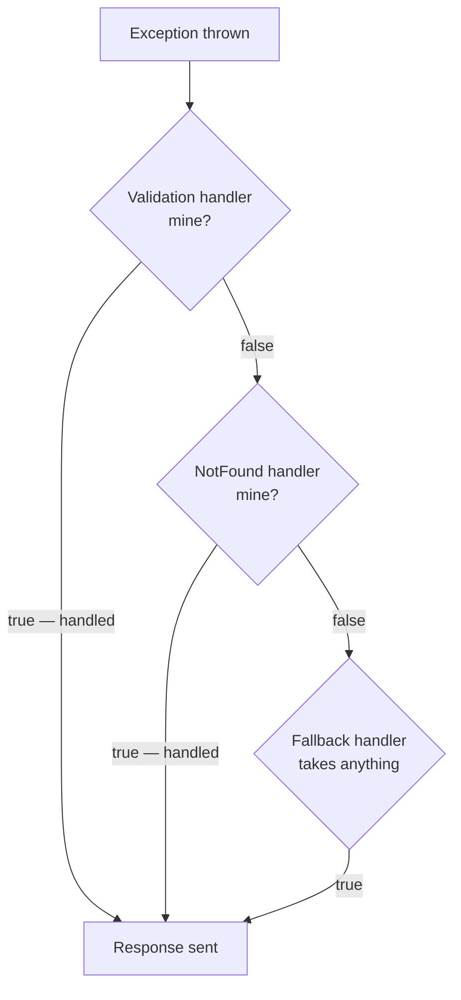

# 5.12 — IExceptionHandler and the Developer Exception Page

> **[← Roadmap](../../ROADMAP.md)** · **Section:** [5. Middleware and the Request Pipeline](../../ROADMAP.md#5-middleware-and-the-request-pipeline)
> **Prev:** [5.11 Exception middleware](5.11-exception-middleware.md) · **Next:** [5.13 Middleware vs filters](5.13-middleware-vs-filters.md)

**Markers:** ⭐ 💻 · **Confidence:** 🔴 · **Last reviewed:** —

---

## TL;DR

**`IExceptionHandler`** (.NET 8+) is the modern way to handle exceptions — a typed interface you
implement and register in DI, instead of writing raw middleware.

- You can register **several handlers**. They run **in registration order** until one returns `true`.
- Returning **`true`** means "I handled it, stop". Returning **`false`** means "not mine, try the next one".
- It plugs into `UseExceptionHandler()`, so ordering rules from [5.11](5.11-exception-middleware.md) still apply.

---

## Definitions

| Term | What it is | What it means |
|---|---|---|
| **`IExceptionHandler`** | an **interface** (.NET 8+) | One method: `TryHandleAsync(HttpContext, Exception, CancellationToken)` returning `ValueTask<bool>`. |
| **`TryHandleAsync`** | a **method** | Where you handle the exception. Returns whether you handled it. |
| **`true` / `false`** | *the return value* | `true` = handled, stop. `false` = pass to the next handler. |
| **`AddExceptionHandler<T>()`** | a **registration method** | Registers a handler. Call order determines execution order. |
| **`UseExceptionHandler()`** | a **middleware method** | Runs the registered handlers. Still required. |
| **`AddProblemDetails()`** | a **registration method** | Provides the default `ProblemDetails` fallback when no handler claims the exception. |
| **`IProblemDetailsService`** | an **interface** | Writes a `ProblemDetails` response with the configured conventions. |
| **Chain of responsibility** | *a design pattern* | Several handlers offered the same item until one takes it. See [22.5](../22-architecture-patterns/22.05-behavioural-patterns.md). |
| **Developer exception page** | *middleware* | Full diagnostics in the browser. Development only. |

---

## The concept

### Why it was added

Custom exception middleware ([5.11](5.11-exception-middleware.md)) works, but it has drawbacks:

- One class ends up handling **every** exception type, so it grows into a large switch.
- It is raw middleware, so it does not participate in DI as a normal service.
- Everyone writes their own slightly differently.

`IExceptionHandler` makes it a **first-class, typed concept**. You implement an interface,
register it, and can split handling across several small classes — one per concern.

A picture: **a lost-property desk with several specialists.** The first asks "is it a phone?"
and takes it if so. Otherwise it passes down the line. The last one accepts anything so nothing
is left unhandled.

That is the **chain of responsibility** pattern, and it is exactly how the handler list works.

---

## How it works

### The simple version

```csharp
internal sealed class NotFoundExceptionHandler(ILogger<NotFoundExceptionHandler> logger)
    : IExceptionHandler
{
    public async ValueTask<bool> TryHandleAsync(
        HttpContext context,
        Exception exception,
        CancellationToken ct)
    {
        // Not my type — let someone else deal with it
        if (exception is not NotFoundException notFound)
            return false;

        logger.LogWarning("Not found: {Message}", notFound.Message);

        context.Response.StatusCode = StatusCodes.Status404NotFound;
        await context.Response.WriteAsJsonAsync(new ProblemDetails
        {
            Status = StatusCodes.Status404NotFound,
            Title  = "Resource not found",
            Detail = notFound.Message          // safe — this message is ours
        }, ct);

        return true;                            // handled — stop here
    }
}
```

Registration takes **two** calls, and both are required:

```csharp
builder.Services.AddExceptionHandler<NotFoundExceptionHandler>();
builder.Services.AddProblemDetails();          // the fallback

var app = builder.Build();

app.UseExceptionHandler();                     // still needed — runs the handlers
```

⚠️ **Forgetting `app.UseExceptionHandler()` is the classic mistake.** Registering handlers in DI
does nothing on its own — the middleware is what invokes them. There is no warning; exceptions
simply go unhandled.

### How it actually works — the chain

Register several and they run in order:

```csharp
builder.Services.AddExceptionHandler<ValidationExceptionHandler>();   // 1st
builder.Services.AddExceptionHandler<NotFoundExceptionHandler>();     // 2nd
builder.Services.AddExceptionHandler<ConcurrencyExceptionHandler>();  // 3rd
builder.Services.AddExceptionHandler<FallbackExceptionHandler>();     // last
builder.Services.AddProblemDetails();
```



**Order matters, and specific must come before general.** A fallback handler that returns `true`
for everything must be registered **last**, or nothing after it ever runs.

If every handler returns `false`, `AddProblemDetails()` provides a default `ProblemDetails`
response — which is why registering it is worth doing even with a fallback handler of your own.

### `IExceptionHandler` vs custom middleware

| | Custom middleware | `IExceptionHandler` |
|---|---|---|
| Shape | try/catch around `next` | Implement an interface |
| Typed | No | **Yes** |
| Several handlers | One class, big switch | **Several small classes** |
| Registered in DI | No | **Yes** — constructor injection works |
| Testable in isolation | Yes | **Yes**, more easily |
| Available since | Always | **.NET 8** |

**For a new .NET 8+ application, `IExceptionHandler` is the better default.** Custom middleware
remains correct for older versions and for cases needing control over the whole pipeline rather
than just the exception.

### ⚠️ The developer exception page

The other half of this topic, and the security-critical half.

```csharp
if (app.Environment.IsDevelopment())
    app.UseDeveloperExceptionPage();
```

It renders into the browser:

- The full stack trace with source code snippets
- Every request header, including `Authorization`
- Query string and route values
- **Every environment variable**

That last one is the problem. Environment variables in a deployed app hold connection strings,
API keys and signing secrets — so any error on a system accidentally running as Development
hands them to whoever triggered it.

That happens more often than people expect: a copied Dockerfile, a Helm value never overridden,
a base image with the variable baked in
([4.7](../04-fundamentals-startup/4.07-environments.md)).

**Defence in depth** — make production refuse to start if it detects the wrong environment:

```csharp
if (app.Environment.IsDevelopment() &&
    builder.Configuration["DeploymentRing"] is "production")
{
    throw new InvalidOperationException(
        "Development environment detected on a production deployment. Refusing to start.");
}
```

Failing loudly at startup beats running with full diagnostics exposed.

### The deeper detail — what `IExceptionHandler` does not do

**It does not run for non-exception errors.** A bare 404 from routing throws nothing, so no
handler runs. You still need `UseStatusCodePages()`
([5.11](5.11-exception-middleware.md)).

**It cannot help once the response has started.** If bytes are already on the wire the status
code is fixed. Check `HasStarted` in your handler and return `false` so the framework aborts the
connection rather than producing a corrupted body.

**It does not catch exceptions outside the pipeline** — startup, background services,
fire-and-forget. Same limits as any exception middleware.

**Cancellation still needs care.** `OperationCanceledException` from a client disconnect will
reach your handlers. Handle it explicitly and log at information level, or your dashboards fill
with false errors ([2.14](../02-collections-linq-async/2.14-cancellation.md)).

---

## Code

A complete, production-shaped setup.

**A specific handler:**

```csharp
internal sealed class ValidationExceptionHandler(
    ILogger<ValidationExceptionHandler> logger) : IExceptionHandler
{
    public async ValueTask<bool> TryHandleAsync(
        HttpContext context, Exception exception, CancellationToken ct)
    {
        if (exception is not ValidationException validation)
            return false;

        logger.LogInformation("Validation failed on {Path}", context.Request.Path);

        var problem = new ValidationProblemDetails(validation.Errors)
        {
            Status = StatusCodes.Status400BadRequest,
            Title  = "One or more validation errors occurred",
            Instance = context.Request.Path
        };

        context.Response.StatusCode = StatusCodes.Status400BadRequest;
        await context.Response.WriteAsJsonAsync(problem, ct);
        return true;
    }
}
```

**The fallback, registered last:**

```csharp
internal sealed class FallbackExceptionHandler(
    ILogger<FallbackExceptionHandler> logger,
    IProblemDetailsService problemDetails,
    IHostEnvironment env) : IExceptionHandler
{
    public async ValueTask<bool> TryHandleAsync(
        HttpContext context, Exception exception, CancellationToken ct)
    {
        // Client went away — normal, and nobody is listening for a response
        if (exception is OperationCanceledException &&
            context.RequestAborted.IsCancellationRequested)
        {
            logger.LogInformation("Request cancelled: {Path}", context.Request.Path);
            return true;
        }

        // Too late to change the response
        if (context.Response.HasStarted)
        {
            logger.LogError(exception, "Exception after response started");
            return false;                     // let the connection abort
        }

        logger.LogError(exception, "Unhandled exception on {Path}", context.Request.Path);

        context.Response.StatusCode = StatusCodes.Status500InternalServerError;

        return await problemDetails.TryWriteAsync(new ProblemDetailsContext
        {
            HttpContext = context,
            Exception = exception,
            ProblemDetails =
            {
                Status = StatusCodes.Status500InternalServerError,
                Title  = "An unexpected error occurred",
                Detail = env.IsDevelopment() ? exception.ToString() : null
            }
        });
    }
}
```

**Wiring it up:**

```csharp
builder.Services.AddProblemDetails(options =>
{
    // Add a trace id to EVERY problem response, however it was produced
    options.CustomizeProblemDetails = ctx =>
    {
        ctx.ProblemDetails.Extensions["traceId"] =
            Activity.Current?.Id ?? ctx.HttpContext.TraceIdentifier;
    };
});

// Order matters — specific first, fallback last
builder.Services.AddExceptionHandler<ValidationExceptionHandler>();
builder.Services.AddExceptionHandler<NotFoundExceptionHandler>();
builder.Services.AddExceptionHandler<FallbackExceptionHandler>();

var app = builder.Build();

if (app.Environment.IsDevelopment())
    app.UseDeveloperExceptionPage();
else
    app.UseExceptionHandler();        // ← without this, none of the above runs

app.UseStatusCodePages();
app.MapControllers();
app.Run();
```

That `CustomizeProblemDetails` callback is worth knowing. It applies to **every** problem
response — including automatic 400s from model validation — so every error your API produces
carries a trace ID with no per-handler code.

---

## Interview questions

**Q: What is `IExceptionHandler` and how does it differ from custom exception middleware?**

It is an interface added in .NET 8 with a single `TryHandleAsync` method that returns a bool
saying whether it handled the exception. You implement it, register it with
`AddExceptionHandler`, and `UseExceptionHandler()` invokes the registered handlers in order
until one returns true. The advantages over raw middleware are that it is typed rather than a
try/catch you write yourself, it is a normal DI service so constructor injection works, and you
can split handling across several small classes — one per exception category — instead of one
class with a growing switch statement.

**Q: How does the chain work?**

Handlers run in registration order. Each is offered the exception and returns true if it handled
it, which stops the chain, or false to pass it along. It is the chain of responsibility pattern.
The important consequence is that specific handlers must be registered before general ones — a
fallback that returns true for everything has to be last, or nothing after it ever executes. If
every handler returns false, `AddProblemDetails` supplies a default response, which is why
registering it is worthwhile even when you have your own fallback.

**Q: What is the most common mistake when using it?**

Registering the handlers but forgetting `app.UseExceptionHandler()`. The handlers exist in the
container and are never invoked, because that middleware is what runs them, and there is no
warning — exceptions simply go unhandled and you get raw 500s. The second most common is getting
the registration order wrong, putting a catch-all handler before the specific ones.

**Q: Why is the developer exception page dangerous?**

Because it renders far more than a stack trace — it includes every request header including
`Authorization`, and every environment variable. In a deployed application those variables hold
connection strings, API keys and signing secrets, so any error on a system accidentally running
as Development hands them to whoever triggered it. That misconfiguration happens through copied
Dockerfiles and unset Helm values more often than people expect, so beyond gating it on the
environment check I would have production refuse to start if it detects a Development
environment name.

---

## Traps ⚠️

- **Forgetting `app.UseExceptionHandler()`.** Handlers registered in DI do nothing without it.
- **Registering a catch-all handler before specific ones** makes the specific ones unreachable.
- **Returning `true` without writing a response** produces an empty 200.
- **The developer exception page leaks environment variables**, which contain secrets.
- **It does not run for non-exception errors** like a bare 404. Add `UseStatusCodePages`.
- **It cannot help after the response has started.** Check `HasStarted` and return `false`.
- **Cancellation reaches your handlers** and will be logged as an error unless you handle it.
- **`.NET 8+ only.** Older projects need custom middleware ([5.11](5.11-exception-middleware.md)).

---

## Related

- [5.11 Exception middleware](5.11-exception-middleware.md) — the pre-.NET 8 approach and the ordering rules
- [5.8 HttpContext](5.08-httpcontext.md) — `HasStarted`
- [10.8 ProblemDetails](../10-web-api-rest/10.08-problem-details.md) — the response shape
- [12.5 Exception filters](../12-filters/12.05-exception-filters.md) — the MVC-level alternative
- [4.7 Environments](../04-fundamentals-startup/4.07-environments.md) — the developer page hazard
- [22.5 Chain of responsibility](../22-architecture-patterns/22.05-behavioural-patterns.md) — the pattern behind the handler list
- [2.14 CancellationToken](../02-collections-linq-async/2.14-cancellation.md) — handling client disconnects

---

## Sources

- [Microsoft Learn — Handle errors: IExceptionHandler](https://learn.microsoft.com/aspnet/core/fundamentals/error-handling#iexceptionhandler)
- [Microsoft Learn — ProblemDetails service](https://learn.microsoft.com/aspnet/core/web-api/handle-errors#problem-details-service)
