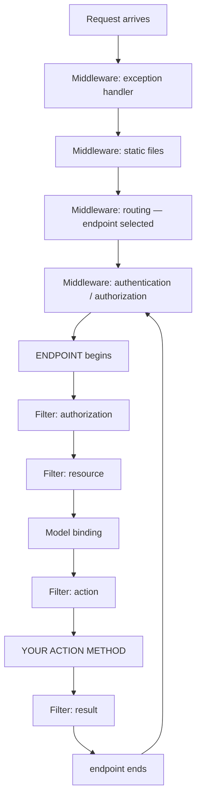

# 5.13 — Middleware vs Filters

> **[← Roadmap](../../ROADMAP.md)** · **Section:** [5. Middleware and the Request Pipeline](../../ROADMAP.md#5-middleware-and-the-request-pipeline)
> **Prev:** [5.12 IExceptionHandler](5.12-iexceptionhandler.md) · **Next:** [5.14 Logging middleware](5.14-logging-middleware.md)

**Markers:** 🔥 🎯 · **Confidence:** 🔴 · **Last reviewed:** —

---

## TL;DR

Both wrap a request and both can run code before and after. The difference is **where they sit**
and **what they know**.

- **Middleware** runs for **every request**, including static files and 404s. It knows nothing about which action was selected.
- **Filters** run **inside MVC**, only for matched actions. They know the action, its arguments and its return value.
- **The rule: if you need to know which action ran, use a filter. Otherwise use middleware.**

---

## Definitions

| Term | What it is | What it means |
|---|---|---|
| **Middleware** | *a pipeline component* | Runs for every request that reaches it. See [5.1](5.01-what-is-middleware.md). |
| **Filter** | *an MVC component* | Runs inside the endpoint, around action execution. See [12.1](../12-filters/12.01-filter-pipeline.md). |
| **Filter pipeline** | *a nested pipeline* | Authorization → Resource → Action → Result filters, inside the endpoint. |
| **`ActionExecutingContext`** | a **class** | Given to action filters. Exposes the **bound arguments** and the controller. |
| **`ActionExecutedContext`** | a **class** | Exposes the **result** the action returned, and any exception. |
| **Model binding** | *a framework step* | Converts the raw request into typed action parameters. Happens **after** middleware. |
| **Endpoint** | *the matched handler* | The controller action or minimal API delegate selected by routing. |
| **Endpoint filter** | *a minimal API concept* (.NET 7+) | The minimal API equivalent of an action filter. See [12.7](../12-filters/12.07-endpoint-filters.md). |
| **Cross-cutting concern** | *a design term* | Something needed across many places — logging, auth, caching. |

---

## The concept

### Where each one sits



**Filters live inside the endpoint step of the middleware pipeline.** So the entire filter
pipeline is nested inside the last middleware.

That single fact explains every difference between them.

### What each one knows

| | Middleware | Filters |
|---|---|---|
| Runs for static files | ✅ | ❌ |
| Runs for a 404 (no route matched) | ✅ | ❌ |
| Runs for **every** request | ✅ | Only matched actions |
| Knows the selected action | ❌ | ✅ |
| Sees **bound** arguments | ❌ | ✅ |
| Sees the action's return value | ❌ | ✅ |
| Can apply per-controller or per-action | ❌ (only by path) | ✅ **by attribute** |
| Works with minimal APIs | ✅ | Endpoint filters instead |
| Works outside MVC | ✅ | ❌ |

The two that matter most in practice: **middleware runs for everything but knows nothing about
your action**, and **filters know everything about your action but only run when one matched**.

A picture: **middleware is building security at the front door.** Everyone entering passes
through, and they have no idea which office you are visiting. **Filters are the receptionist on
your specific floor** — they know exactly who you came to see, what appointment you have, and
what you left with.

---

## How it works

### The simple version — the decision

Ask one question: **do I need to know which action was selected, or see its arguments or
result?**

**Yes → filter:**

- Validating an action's bound model
- Caching based on the action's return value
- Auditing which action a user invoked, with parameters
- Applying behaviour to some controllers but not others
- Wrapping the action in a database transaction

**No → middleware:**

- Logging every request, including static files and 404s
- Global exception handling
- Security headers
- Correlation IDs
- Compression, CORS, HTTPS redirection
- Rate limiting by IP

### The most common wrong choice

**Trying to validate a model in middleware.** It cannot be done properly, because model binding
has not happened yet:

```csharp
// ✗ Middleware — the model does not exist yet
app.Use(async (context, next) =>
{
    // You would have to read and parse the raw body yourself,
    // which also breaks model binding downstream — see 5.9
    await next();
});
```

```csharp
// ✓ Filter — the model is already bound and validated
public class ValidationFilter : IActionFilter
{
    public void OnActionExecuting(ActionExecutingContext context)
    {
        if (!context.ModelState.IsValid)
        {
            context.Result = new BadRequestObjectResult(context.ModelState);
            // Setting Result short-circuits — the action never runs
        }
    }

    public void OnActionExecuted(ActionExecutedContext context) { }
}
```

`context.ActionArguments` gives you the bound parameters by name. Nothing in middleware can do
that.

### The other common wrong choice

**Putting request logging in a filter**, then wondering why 404s and static files never appear.

A filter only runs when routing matched an action. A request to a non-existent URL never reaches
one, so a filter-based logger silently misses exactly the requests you most want to see when
debugging.

**Request logging belongs in middleware** —
[5.14](5.14-logging-middleware.md).

### How it actually works — the ordering consequence

Because filters are nested inside middleware, the unwinding order is strict:

```
Middleware A: before
  Middleware B: before
    Filter X: before
      ACTION
    Filter X: after
  Middleware B: after
Middleware A: after
```

Two consequences worth knowing:

**Middleware always sees the final response.** Even if a filter short-circuits by setting
`context.Result`, middleware above still runs its "after" half and sees what was produced.

**Filters can catch exceptions middleware never sees** — an exception filter can handle an error
and set a result, so the exception never propagates up to your global handler. That is why an
exception filter and global exception middleware can conflict: whichever is *innermost* wins.
See [12.5](../12-filters/12.05-exception-filters.md).

### The deeper detail — minimal APIs

Minimal APIs have no MVC filter pipeline. The equivalent is **endpoint filters** (.NET 7+):

```csharp
app.MapPost("/orders", CreateOrder)
   .AddEndpointFilter<ValidationFilter>();
```

```csharp
public class ValidationFilter : IEndpointFilter
{
    public async ValueTask<object?> InvokeAsync(
        EndpointFilterInvocationContext context,
        EndpointFilterDelegate next)
    {
        // context.Arguments holds the bound parameters
        var request = context.GetArgument<CreateOrderRequest>(0);

        if (string.IsNullOrWhiteSpace(request.CustomerName))
            return Results.BadRequest("Customer name is required");

        return await next(context);
    }
}
```

Same idea, different API: they run after binding and know the arguments, but they are attached
per-endpoint or per-route-group rather than by attribute.

So the full decision becomes:

| Need | Controllers | Minimal APIs |
|---|---|---|
| Every request, no action knowledge | Middleware | Middleware |
| Action-aware, per-endpoint | **Filter** | **Endpoint filter** |

---

## Code

The same concern — auditing — done both ways, showing what each can and cannot see.

**Middleware version** — every request, but only raw data:

```csharp
internal class AuditMiddleware(RequestDelegate next)
{
    public async Task InvokeAsync(HttpContext context, IAuditLog audit)
    {
        await next(context);

        // We know the path, method and status. That is all.
        await audit.RecordAsync(new AuditEntry
        {
            Path   = context.Request.Path,
            Method = context.Request.Method,
            Status = context.Response.StatusCode,
            User   = context.User.Identity?.Name
            // ✗ Cannot record WHICH action ran, or with what arguments
        });
    }
}
```

**Filter version** — only matched actions, but full detail:

```csharp
public class AuditFilter(IAuditLog audit) : IAsyncActionFilter
{
    public async Task OnActionExecutingAsync(
        ActionExecutingContext context, ActionExecutionDelegate next)
    {
        var descriptor = (ControllerActionDescriptor)context.ActionDescriptor;

        var executed = await next();      // run the action

        await audit.RecordAsync(new AuditEntry
        {
            Controller = descriptor.ControllerName,
            Action     = descriptor.ActionName,           // ✓ we know the action
            Arguments  = context.ActionArguments,         // ✓ and its bound arguments
            Succeeded  = executed.Exception is null,
            User       = context.HttpContext.User.Identity?.Name
        });
    }
}
```

```csharp
// Applied selectively — impossible with middleware
[Audit]
[HttpPost("transfer")]
public async Task<IActionResult> Transfer(TransferRequest request) { }
```

**That selectivity is the other big difference.** Middleware applies to a path prefix at best;
a filter is an attribute you put exactly where you want it.

---

## Interview questions

**Q: What is the difference between middleware and filters?**

Position and knowledge. Middleware sits in the request pipeline and runs for every request that
reaches it — including static files, 404s and anything that never matched a route — but it runs
before model binding, so it knows nothing about which action was selected or what its arguments
are. Filters run inside MVC, around action execution, so they only execute when routing matched
an action, but they have full access to the action descriptor, the bound arguments and the
return value. Structurally the entire filter pipeline is nested inside the endpoint step of the
middleware pipeline, and that nesting explains every other difference.

**Q: How do you decide which to use?**

One question: do I need to know which action was selected, or see its bound arguments or result?
If yes, it has to be a filter — model validation, caching on the return value, auditing which
action ran with what parameters, or applying behaviour to specific controllers by attribute. If
no, middleware is the right place and usually the better one, because it also covers requests
that never reach an action. Global exception handling, correlation IDs, security headers and
request logging all belong in middleware.

**Q: What goes wrong if you put request logging in a filter?**

You silently miss the requests you most want to see. Filters only run when routing matched an
action, so a request to a URL that does not exist never reaches one — meaning your logs contain
no 404s. The same applies to static file requests and to anything rejected by middleware higher
up, like a rate-limited request or a failed authentication. Request logging belongs in
middleware, registered early enough to see everything.

**Q: How does this work with minimal APIs?**

Minimal APIs have no MVC filter pipeline, so the equivalent is endpoint filters, added in .NET 7.
You implement `IEndpointFilter` and attach it with `AddEndpointFilter` on an endpoint or a route
group. They serve the same purpose — they run after model binding and can see the bound
arguments through the invocation context — but they are attached per endpoint or group rather
than by attribute on a controller.

---

## Traps ⚠️

- **Trying to validate a bound model in middleware.** Binding has not happened yet; reading the
  body yourself also breaks binding downstream.
- **Request logging in a filter** misses 404s, static files and anything rejected upstream.
- **Assuming filters run for every request.** They only run for matched actions.
- **An exception filter can swallow an exception** before global exception middleware sees it —
  whichever is innermost wins.
- **Middleware cannot be applied per-controller.** Path-based branching is the closest, via
  `UseWhen` ([5.3](5.03-use-run-map.md)).
- **Filters do not exist for minimal APIs.** Use endpoint filters.
- **Filters cannot run before routing**, so they cannot influence which endpoint is chosen.

---

## Related

- [5.1 What middleware is](5.01-what-is-middleware.md) — the outer pipeline
- [5.2 Middleware order](5.02-middleware-order.md) — where the endpoint sits
- [5.14 Logging middleware](5.14-logging-middleware.md) — why logging is middleware
- [12.1 The filter pipeline](../12-filters/12.01-filter-pipeline.md) — filters in depth
- [12.5 Exception filters](../12-filters/12.05-exception-filters.md) — the overlap with 5.11
- [12.7 Endpoint filters](../12-filters/12.07-endpoint-filters.md) — the minimal API equivalent
- [11.5 ModelState](../11-model-binding-validation/11.05-modelstate.md) — what a validation filter reads

---

## Sources

- [Microsoft Learn — Filters in ASP.NET Core](https://learn.microsoft.com/aspnet/core/mvc/controllers/filters)
- [Microsoft Learn — ASP.NET Core Middleware](https://learn.microsoft.com/aspnet/core/fundamentals/middleware/)
