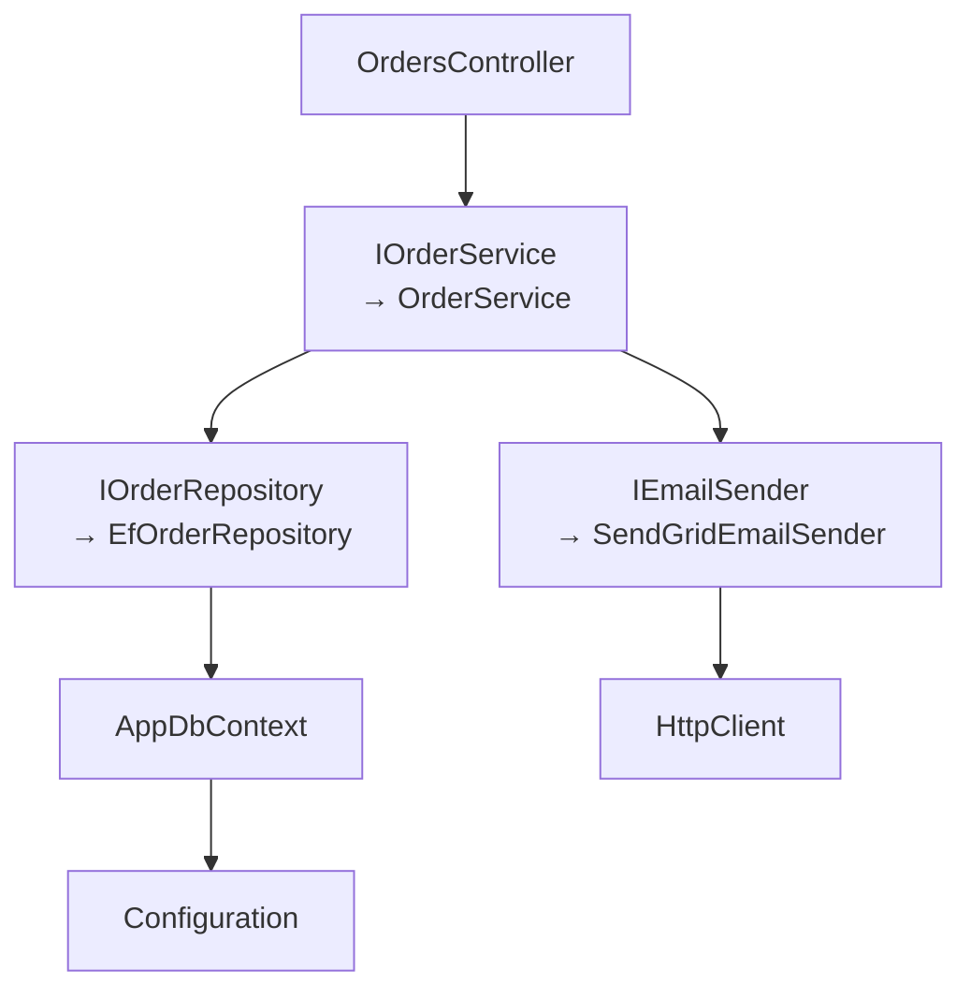

# 6.1 — Inversion of Control and Dependency Injection

> **[← Roadmap](../../ROADMAP.md)** · **Section:** [6. Dependency Injection](../../ROADMAP.md#6-dependency-injection)
> **Prev:** [5.14 Logging middleware](../05-middleware-pipeline/5.14-logging-middleware.md) · **Next:** [6.2 The built-in container](6.02-builtin-container.md)

**Markers:** 🔥 🎯 · **Confidence:** 🔴 · **Last reviewed:** —

---

## TL;DR

**Dependency Injection** means a class does not create the things it needs — it **asks for
them** in its constructor, and someone else supplies them.

- The problem it solves: a class that uses `new` to build its dependencies is **welded to them** and cannot be tested or changed.
- **Inversion of Control** is the general principle; DI is the specific technique.
- In ASP.NET Core it is **built into the framework**, not a library you add.

---

## Definitions

| Term | What it is | What it means |
|---|---|---|
| **Dependency** | *a thing a class needs* | Any other object your class uses to do its job — a repository, a logger, an HTTP client. |
| **Dependency Injection (DI)** | *a technique* | Supplying a class's dependencies from outside rather than letting it create them. |
| **Inversion of Control (IoC)** | *a principle* | The framework calls your code, rather than your code calling the framework. DI is one form of it. |
| **IoC container** | *an object* | The thing that knows how to build your objects and their dependencies. Also called a DI container. |
| **Constructor injection** | *the main style* | Dependencies arrive as constructor parameters. The default in ASP.NET Core. |
| **Registration** | *a setup step* | Telling the container "when someone asks for `IFoo`, give them `Foo`". |
| **Resolution** | *a runtime step* | The container building an object and everything it needs. |
| **Composition root** | *a place in your app* | The single spot where everything is wired together. In ASP.NET Core that is `Program.cs`. |
| **Tight coupling** | *a design problem* | A class that cannot work without one specific other class. |
| **Dependency Inversion Principle** | *the "D" in SOLID* | Depend on abstractions, not concrete types. Related but not the same as DI. |
| **Service** | *DI terminology* | Anything registered in the container. Not necessarily a "service class". |

---

## The concept

### The problem: `new` is glue

Consider a class that creates what it needs:

```csharp
public class OrderService
{
    private readonly SqlOrderRepository _repo = new SqlOrderRepository();
    private readonly SmtpEmailSender _email = new SmtpEmailSender();

    public async Task CompleteAsync(Guid id)
    {
        var order = await _repo.GetAsync(id);
        order.Complete();
        await _repo.SaveAsync(order);
        await _email.SendAsync(order.CustomerEmail, "Order complete");
    }
}
```

This looks fine and is genuinely difficult to work with. Four problems:

**You cannot test it.** Creating an `OrderService` creates a real SQL connection and a real SMTP
client. A unit test would hit your database and send actual emails.

**You cannot change it.** Switching from SMTP to SendGrid means editing this class — and every
other class that does the same thing.

**You cannot configure it.** The connection string is buried inside `SqlOrderRepository`'s
constructor, wherever that is.

**It hides its dependencies.** Reading the constructor tells you nothing. You have to read the
whole class to discover it sends email.

### The fix: ask, do not create

```csharp
public class OrderService(IOrderRepository repo, IEmailSender email)
{
    public async Task CompleteAsync(Guid id, CancellationToken ct)
    {
        var order = await repo.GetAsync(id, ct);
        order.Complete();
        await repo.SaveAsync(order, ct);
        await email.SendAsync(order.CustomerEmail, "Order complete", ct);
    }
}
```

The class now **declares what it needs** and lets someone else provide it. All four problems
disappear:

- **Testable** — pass in fakes, and the test touches no database and sends no email.
- **Changeable** — swap the registration in one place; this class never changes.
- **Configurable** — whoever builds the repository supplies the connection string.
- **Honest** — the constructor is a complete list of what this class depends on.

A picture: **a chef who buys their own ingredients versus one who is handed them.**

The first has to go shopping mid-service, always uses the same supplier, and you cannot test the
recipe without a real trip to the market. The second declares "I need two eggs and flour", and
you can hand over real ingredients or plastic ones for a photo shoot. The recipe does not change
either way.

### IoC versus DI

These get used interchangeably. They are not the same.

**Inversion of Control** is the broad principle: **the framework calls you, you do not call the
framework.** You do not write a loop that accepts TCP connections — ASP.NET Core does that and
calls your controller. Event handlers, template methods and middleware are all IoC.

**Dependency Injection** is one specific application of it: inverting control over **object
creation**. Instead of your class deciding what to construct, something else decides and hands
it over.

So: **all DI is IoC. Not all IoC is DI.**

⚠️ **And a third thing that sounds the same:** the **Dependency Inversion Principle** — the "D"
in SOLID — says depend on abstractions rather than concrete types. That is about *what* you
depend on. DI is about *how* you get it. You can do DI badly by injecting concrete classes, and
you can follow dependency inversion without a container at all.

Being able to separate those three cleanly is a good senior-level signal —
[22.1](../22-architecture-patterns/22.01-solid.md).

---

## How it works

### The simple version — three steps

**1. Depend on an interface:**

```csharp
public interface IEmailSender
{
    Task SendAsync(string to, string subject, string body, CancellationToken ct);
}
```

**2. Ask for it in the constructor:**

```csharp
public class OrderService(IEmailSender email)
{
    // 'email' is usable anywhere in this class
}
```

**3. Register the real implementation once, in `Program.cs`:**

```csharp
builder.Services.AddScoped<IEmailSender, SendGridEmailSender>();
builder.Services.AddScoped<OrderService>();
```

That is the whole pattern. ASP.NET Core does the rest.

### How it actually works — the container builds the graph

When something needs an `OrderService`, the container:

1. Looks at its constructor and sees it needs `IOrderRepository` and `IEmailSender`
2. Looks up what is registered for each
3. Builds those — **recursively**, since they have their own dependencies
4. Constructs the `OrderService` with them



You wrote none of that wiring. You declared what each class needs, and the container worked out
the order.

**That graph is the real payoff.** Adding a dependency to a class three levels down requires no
change to anything above it.

### The composition root

All registration happens in **one place** — `Program.cs`
([4.3](../04-fundamentals-startup/4.03-program-cs-hosting.md)). That is the **composition
root**: the single spot where the application decides which concrete types to use.

Why it matters: everywhere else in your codebase depends only on interfaces. Change the
implementation and exactly one line changes.

```csharp
// The only place SendGrid is mentioned
builder.Services.AddScoped<IEmailSender, SendGridEmailSender>();

// Swapping providers is one line. No other file changes.
builder.Services.AddScoped<IEmailSender, PostmarkEmailSender>();
```

### The deeper detail — what DI is not for

DI is a genuinely good default, and it is possible to overuse it.

⚠️ **Not every class needs an interface.** An interface with exactly one implementation, no test
double and no plans for a second is ceremony without benefit:

```csharp
// Probably unnecessary
public interface IOrderMapper { OrderDto Map(Order order); }
public class OrderMapper : IOrderMapper { }
```

If it is a pure function with no dependencies, a static method or a plain class is clearer. Add
the interface when you actually need to substitute it.

⚠️ **Do not inject value types or configuration primitives.** Use the options pattern instead:

```csharp
// ✗ awkward
public class Service(string connectionString) { }

// ✓ typed, validated, reloadable — see 7.6
public class Service(IOptions<DatabaseOptions> options) { }
```

⚠️ **Too many constructor parameters is a design smell, not a DI problem.** A class needing eight
dependencies is doing eight things. The fix is splitting the class, not hiding the parameters
behind a service locator ([6.9](6.09-injection-styles.md)).

---

## Code

The full picture, and why it pays off.

**Production wiring:**

```csharp
builder.Services.AddScoped<IOrderRepository, EfOrderRepository>();
builder.Services.AddScoped<IEmailSender, SendGridEmailSender>();
builder.Services.AddScoped<IOrderService, OrderService>();
```

**The same class in a test, with no database and no email:**

```csharp
[Fact]
public async Task CompleteAsync_sends_confirmation_email()
{
    var repo  = Substitute.For<IOrderRepository>();
    var email = Substitute.For<IEmailSender>();

    var order = new Order(Guid.NewGuid()) { CustomerEmail = "a@b.com" };
    repo.GetAsync(order.Id, Arg.Any<CancellationToken>()).Returns(order);

    var service = new OrderService(repo, email);

    await service.CompleteAsync(order.Id, CancellationToken.None);

    await email.Received(1).SendAsync("a@b.com", "Order complete",
        Arg.Any<string>(), Arg.Any<CancellationToken>());
}
```

**That test runs in milliseconds and touches nothing external.** With the `new`-everything
version it would be impossible — you would need a real database and a real mail server, and the
test would send an actual email every run.

That is the practical argument for DI, and the one worth giving in an interview.

**And swapping an implementation for one environment:**

```csharp
if (builder.Environment.IsDevelopment())
    builder.Services.AddScoped<IEmailSender, ConsoleEmailSender>();   // just logs
else
    builder.Services.AddScoped<IEmailSender, SendGridEmailSender>();
```

No application code changes. `OrderService` has no idea which one it got.

---

## Interview questions

**Q: What is dependency injection and what problem does it solve?**

It means a class declares what it needs in its constructor rather than creating it with `new`,
and something else supplies those dependencies. The problem it solves is coupling. A class that
constructs its own dependencies is welded to those specific implementations — you cannot unit
test it without hitting a real database, you cannot swap an implementation without editing the
class, and its constructor tells you nothing about what it actually uses. With injection the
constructor becomes an honest list of requirements, and the decision about concrete types moves
to one place.

**Q: What is the difference between IoC and DI?**

Inversion of Control is the broad principle that the framework calls your code rather than the
other way round — middleware, event handlers and template methods are all examples. Dependency
Injection is one specific application of it, where the thing being inverted is control over
object creation. So all DI is IoC, but not all IoC is DI. Worth separating out a third term that
sounds similar: the Dependency Inversion Principle from SOLID says depend on abstractions rather
than concrete types, which is about *what* you depend on, whereas DI is about *how* you receive
it.

**Q: How does the container know how to build a class with several dependencies?**

It inspects the constructor, sees the parameter types, looks up what is registered for each, and
builds them recursively — so a controller needing a service that needs a repository that needs a
`DbContext` is resolved as a whole graph. You never write that wiring; you declare each class's
requirements and register the implementations once in `Program.cs`. The practical benefit is that
adding a dependency to a class deep in the graph requires no change to anything above it.

**Q: Does every class need an interface?**

No, and adding one reflexively is a common overcorrection. An interface with a single
implementation, no test double and no realistic second implementation is ceremony that adds a
file and an indirection without buying anything. I add one when I actually need to substitute it
in tests, when there genuinely are multiple implementations, or when I want a compiler-enforced
boundary between layers. A pure mapping function with no dependencies is usually clearer as a
plain class or a static method.

---

## Traps ⚠️

- **Confusing DI with the Dependency Inversion Principle.** One is a technique, the other is a
  design rule about what you depend on.
- **Creating an interface for every class.** One implementation and no test double means no
  benefit.
- **Injecting concrete classes** technically works but loses most of the value.
- **Eight constructor parameters is a design smell**, not a reason to switch to a service
  locator.
- **Injecting configuration as strings.** Use `IOptions<T>` ([7.6](../07-configuration-options/7.06-options-pattern.md)).
- **Registration must happen before `builder.Build()`** ([4.3](../04-fundamentals-startup/4.03-program-cs-hosting.md)).
- **DI does not make code good on its own.** A badly designed class injected properly is still
  badly designed.

---

## Related

- [6.2 The built-in container](6.02-builtin-container.md) — how to register and resolve
- [6.3 Service lifetimes](6.03-service-lifetimes.md) — transient, scoped, singleton
- [6.9 Injection styles](6.09-injection-styles.md) — constructor vs service locator
- [6.12 DI and testability](6.12-di-and-testability.md) — the payoff in detail
- [1.8 Interfaces](../01-csharp-fundamentals/1.08-interfaces.md) — the contracts you inject
- [4.3 Program.cs](../04-fundamentals-startup/4.03-program-cs-hosting.md) — the composition root
- [22.1 SOLID](../22-architecture-patterns/22.01-solid.md) — dependency inversion

---

## Sources

- [Microsoft Learn — Dependency injection in ASP.NET Core](https://learn.microsoft.com/aspnet/core/fundamentals/dependency-injection)
- [Microsoft Learn — Dependency injection guidelines](https://learn.microsoft.com/dotnet/core/extensions/dependency-injection-guidelines)
