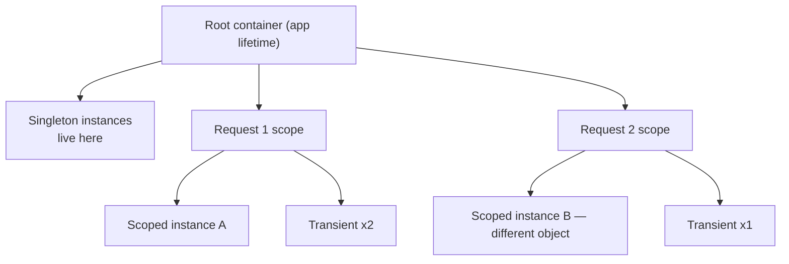

# 6.3 — Service Lifetimes: Transient, Scoped, Singleton

> **[← Roadmap](../../ROADMAP.md)** · **Section:** [6. Dependency Injection](../../ROADMAP.md#6-dependency-injection)
> **Prev:** [6.2 The built-in container](6.02-builtin-container.md) · **Next:** [6.4 Captive dependencies](6.04-captive-dependency.md)

**Markers:** 🔥 ⚠️ 🎯 · **Confidence:** 🔴 · **Last reviewed:** —

---

## TL;DR

A **lifetime** answers one question: when someone asks for this service, does the container build
a new one or hand back one it made earlier?

- **Transient** — a new instance **every time** it is injected.
- **Scoped** — **one per scope**, which in a web app means one per HTTP request.
- **Singleton** — **one for the entire application**, shared by every request.

The rule that catches people: **the consumer's lifetime wins.** A transient injected into a
singleton lives as long as the singleton.

---

## Definitions

| Term | What it is | What it means |
|---|---|---|
| **Lifetime** | *a registration setting* | How long an instance lives and how often a new one is made. |
| **Transient** | *a lifetime* | A new instance for every injection. Never reused. |
| **Scoped** | *a lifetime* | One instance per scope. In ASP.NET Core, one per HTTP request. |
| **Singleton** | *a lifetime* | One instance for the whole application, created on first use. |
| **Scope** | an **`IServiceScope`** | A bounded container that disposes what it created when it ends. See [6.5](6.05-scopes.md). |
| **Root scope** | *the application-level scope* | `app.Services`. Lives for the whole app. Singletons live here. |
| **`AddTransient<T>`** | a **method** | Register with transient lifetime. |
| **`AddScoped<T>`** | a **method** | Register with scoped lifetime. |
| **`AddSingleton<T>`** | a **method** | Register with singleton lifetime. |
| **Captive dependency** | *a bug* | A shorter-lived service captured by a longer-lived one. See [6.4](6.04-captive-dependency.md). |
| **`ValidateScopes`** | *a container option* | Detects captive dependencies. **Development-only by default.** |

---

## The concept

### The one question a lifetime answers

Every registration has to answer: **when someone asks for this, do I build a fresh one or reuse
one I already have?**

That is the whole idea. The three lifetimes are three answers.

A picture: **three ways a restaurant handles items.**

- **Transient is a paper napkin.** Everyone gets a fresh one, every time. Cheap, disposable, no
  sharing.
- **Scoped is the bill for a table.** One per table, shared by everyone sitting at it, closed
  when they leave. Two tables never share a bill.
- **Singleton is the espresso machine.** One for the whole restaurant, used by everyone all day.
  It had better be able to handle several orders at once.

That last point is the crux of singleton — shared means concurrent.

### Why choosing wrong is dangerous

The reason interviewers ask is that **the wrong lifetime produces bugs that do not appear in
development**.

With one developer clicking through the app, requests happen one at a time. A `DbContext`
registered as a singleton looks fine — there is never a second concurrent request to expose the
problem.

Under production load, fifty requests hit that shared `DbContext` simultaneously. It is not
thread-safe, so its internal state corrupts, and its change tracker accumulates every entity it
has ever seen ([3.5](../03-dotnet-runtime/3.05-memory-leaks.md)).

**The bug is invisible until the exact conditions you cannot easily reproduce.**

---

## How it works

### The simple version

```csharp
builder.Services.AddTransient<IEmailFormatter, EmailFormatter>();
builder.Services.AddScoped<IOrderRepository, OrderRepository>();
builder.Services.AddSingleton<IPriceCache, PriceCache>();
```

| Lifetime | New instance when | Disposed when | Needs thread safety? |
|---|---|---|---|
| **Transient** | Every injection | The owning scope ends | Usually not |
| **Scoped** | Once per scope / request | The request ends | Not usually |
| **Singleton** | Once, on first use | App shuts down | **Yes** |

### Seeing the difference

```csharp
public class LifetimeDemo(
    ITransientService a, ITransientService b,
    IScopedService    c, IScopedService    d,
    ISingletonService e, ISingletonService f)
{
    // Within ONE request:
    //   a.Id != b.Id   — two separate instances
    //   c.Id == d.Id   — same instance
    //   e.Id == f.Id   — same instance
    //
    // On the NEXT request:
    //   c.Id is DIFFERENT — new scope, new instance
    //   e.Id is THE SAME  — singletons survive
}
```

That table is the whole behaviour. Everything else is consequences of it.

### ⚠️ The rule people get wrong: the consumer's lifetime wins

This is the part that separates a memorised answer from an understood one.

**Lifetime describes how often the container *creates* an instance — not how long the result
survives.** Survival is decided by whoever holds the reference.

```csharp
builder.Services.AddTransient<IReportBuilder, ReportBuilder>();   // "transient"
builder.Services.AddSingleton<ReportCache>();                     // holds one
```

```csharp
public class ReportCache(IReportBuilder builder)     // singleton constructor
{
    // 'builder' is resolved ONCE, when the singleton is created.
    // It now lives for the life of the application.
    // "Transient" described how it was created, not how long it lasts.
}
```

So a transient inside a singleton **is effectively a singleton**. The word describes the
container's creation policy, not a guarantee about lifespan.

This is the mechanism behind the captive dependency problem, which is important enough to have
its own note — [6.4](6.04-captive-dependency.md).

### How it actually works — what a scope is in a web app

A **scope** is a bounded sub-container that disposes everything it created when it ends
([6.5](6.05-scopes.md)).

ASP.NET Core creates one scope **per HTTP request** and disposes it when the response completes.
That is why "scoped" and "per request" are used interchangeably — but they are not the same
thing, and the difference matters:



**Outside an HTTP request there is no ambient scope.** A `BackgroundService`, a hosted service,
or startup code in `Program.cs` has none — so resolving a scoped service directly throws, and you
must create a scope yourself.

### The deeper detail — choosing

**Singleton** when the service is stateless, or holds state that is genuinely meant to be shared
and is thread-safe:

```csharp
builder.Services.AddSingleton<IPriceCalculator, PriceCalculator>();     // stateless
builder.Services.AddSingleton<IMemoryCache, MemoryCache>();             // designed for sharing
```

**Scoped** for anything representing work on behalf of one request — a unit of work, the current
user's context, a `DbContext`:

```csharp
builder.Services.AddScoped<IOrderRepository, OrderRepository>();
builder.Services.AddDbContext<AppDbContext>(...);      // registers as SCOPED automatically
```

**Transient** for cheap, stateless helpers where sharing buys nothing:

```csharp
builder.Services.AddTransient<IEmailFormatter, EmailFormatter>();
```

⚠️ **Scoped is the right default in a web application.** It matches the natural unit of work,
avoids thread-safety questions entirely, and cleans up automatically. Reach for singleton when
you can justify it and transient when the object is genuinely trivial.

⚠️ **Transient is not free.** Every injection allocates. A transient injected into ten services
in one request is ten objects. For a class with no state that is fine; for anything holding a
buffer or a connection it is waste.

⚠️ **And a subtlety about transient disposal:** a transient implementing `IDisposable` is tracked
by the scope that created it and disposed when that scope ends — **not** when you finish using
it. In a long-lived scope, transient disposables accumulate
([6.10](6.10-disposal.md)).

---

## Code

The realistic registration set for an API:

```csharp
// SINGLETON — stateless or genuinely shared, and thread-safe
builder.Services.AddSingleton<IClock, SystemClock>();
builder.Services.AddSingleton<IPriceCalculator, PriceCalculator>();
builder.Services.AddMemoryCache();

// SCOPED — per-request work. The default for most application services.
builder.Services.AddDbContext<AppDbContext>(o =>
    o.UseSqlServer(builder.Configuration.GetConnectionString("Default")));
builder.Services.AddScoped<IOrderRepository, EfOrderRepository>();
builder.Services.AddScoped<IOrderService, OrderService>();
builder.Services.AddScoped<ICurrentUser, HttpCurrentUser>();

// TRANSIENT — cheap, stateless helpers
builder.Services.AddTransient<IEmailFormatter, EmailFormatter>();
```

### The background service case

A `BackgroundService` is a singleton with no ambient scope, so this is the one place you create
scopes by hand:

```csharp
public class OrderCleanupService(
    IServiceScopeFactory scopeFactory,
    ILogger<OrderCleanupService> logger) : BackgroundService
{
    protected override async Task ExecuteAsync(CancellationToken stoppingToken)
    {
        while (!stoppingToken.IsCancellationRequested)
        {
            // A FRESH scope per iteration — see the warning below
            using (var scope = scopeFactory.CreateScope())
            {
                var db = scope.ServiceProvider.GetRequiredService<AppDbContext>();

                await db.Orders
                    .Where(o => o.ExpiresAt < DateTimeOffset.UtcNow)
                    .ExecuteDeleteAsync(stoppingToken);
            }
            // scope disposed here — DbContext released

            await Task.Delay(TimeSpan.FromMinutes(5), stoppingToken);
        }
    }
}
```

⚠️ **The scope must be inside the loop.** Creating it outside gives you one `DbContext` for the
service's entire lifetime — which is a singleton `DbContext` wearing a disguise, with the change
tracker growing on every iteration. See [21.2](../21-advanced-features/21.02-scoped-in-background.md).

---

## Interview questions

**Q: Explain the three service lifetimes.**

Transient gives you a new instance every time it is injected, so it suits cheap stateless
helpers. Scoped gives you one instance per scope, and in a web application the framework creates
a scope per HTTP request — so it is one per request, which is what you want for a `DbContext` or
anything representing a unit of work. Singleton gives you one instance for the whole application,
which is right for caches and stateless calculators, but it means the instance is shared across
concurrent requests, so any mutable state has to be thread-safe.

**Q: Is a transient service ever effectively a singleton?**

Yes, and this is the part people miss. Lifetime is a property of the object graph, not just the
registration. If a singleton takes a transient in its constructor, that transient is resolved
once when the singleton is created and lives as long as it does. So "transient" describes how
often the container *creates* an instance, not how long the result survives — survival is decided
by whoever holds the reference. That is exactly the mechanism behind captive dependencies.

**Q: Why is `DbContext` scoped rather than transient or singleton?**

Because it represents a unit of work. Scoped means every repository and service handling one
request shares the same context, so change tracking and `SaveChanges` cover the whole operation
as one transaction. Transient would give each consumer its own context and its own separate
transaction, defeating the purpose. Singleton would be worse — `DbContext` is not thread-safe, so
concurrent requests would corrupt its internal state, and its change tracker would accumulate
every entity it had ever loaded, which is a memory leak.

**Q: What should you use as the default in a web application?**

Scoped, for most application services. It matches the natural unit of work — one request — so
thread safety stops being a question, and everything is cleaned up when the request ends. I would
use singleton when the service is genuinely stateless or is designed for sharing and is
thread-safe, and transient for trivial helpers where sharing buys nothing. Worth remembering that
transient is not free either — each injection allocates, so a transient consumed by ten services
in a request is ten objects.

---

## Traps ⚠️

- **"Scoped means one per class."** It means one per **scope**. In a web request that is per
  request; outside one there is no ambient scope at all.
- **The consumer's lifetime wins.** A transient inside a singleton lives as long as the
  singleton.
- **Injecting a scoped service into a singleton** captures it forever
  ([6.4](6.04-captive-dependency.md)).
- **`ValidateScopes` is Development-only by default**, so the app can start cleanly in production
  and fail under load.
- **Singletons are shared across concurrent requests**, so mutable state needs thread safety
  ([2.18](../02-collections-linq-async/2.18-thread-safety.md)).
- **Transient disposables are held until the scope ends**, not when you stop using them.
- **Creating a scope outside a background loop** turns a scoped service into an application-lifetime
  one.
- **`AddDbContext` registers as scoped** — you do not pick the lifetime, and overriding it is a
  mistake.

---

## Related

- [6.4 Captive dependencies](6.04-captive-dependency.md) — what goes wrong, in detail
- [6.5 Scopes](6.05-scopes.md) — creating them manually
- [6.10 Disposal](6.10-disposal.md) — who disposes what, and when
- [6.13 DI traps](6.13-di-traps.md) — the interview classics
- [13.2 DbContext](../13-entity-framework-core/13.02-dbcontext.md) — the canonical scoped service
- [21.2 Scoped services in background services](../21-advanced-features/21.02-scoped-in-background.md) — the common real case
- [2.18 Thread safety](../02-collections-linq-async/2.18-thread-safety.md) — why singletons need it

---

## Sources

- [Microsoft Learn — Service lifetimes](https://learn.microsoft.com/aspnet/core/fundamentals/dependency-injection#service-lifetimes)
- [Microsoft Learn — Dependency injection guidelines](https://learn.microsoft.com/dotnet/core/extensions/dependency-injection-guidelines)
