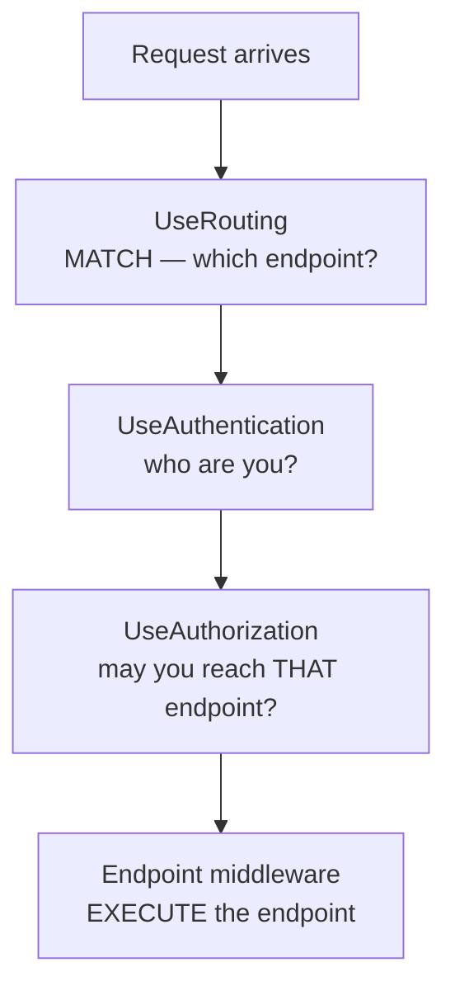

# 8.1 — Endpoint Routing Fundamentals

> **[← Roadmap](../../ROADMAP.md)** · **Section:** [8. Routing](../../ROADMAP.md#8-routing)
> **Prev:** [7.11 Feature flags](../07-configuration-options/7.11-feature-flags.md) · **Next:** [8.2 UseRouting and UseEndpoints](8.02-userouting-useendpoints.md)

**Markers:** 🔥 🎯 · **Confidence:** 🔴 · **Last reviewed:** —

---

## TL;DR

**Routing** is the process of deciding which piece of your code handles an incoming URL.

- ASP.NET Core uses **endpoint routing**: matching happens **early**, in middleware, and the chosen endpoint is executed **later**.
- That gap between "matched" and "executed" is what lets **authorization** know which endpoint it is protecting.
- An **endpoint** is a URL pattern plus a handler plus its metadata — attributes, policies, filters.

---

## Definitions

| Term | What it is | What it means |
|---|---|---|
| **Routing** | *a process* | Working out which handler should serve a request URL. |
| **Endpoint** | an **`Endpoint`** object | A matched destination: a request delegate, a route pattern and metadata. |
| **Endpoint routing** | *the current model* | Match early in middleware, execute at the end. Since ASP.NET Core 2.2. |
| **Route template** | *a pattern string* | `"orders/{id:guid}"`. Describes URLs this endpoint matches. |
| **Route parameter** | *a `{placeholder}`* | A segment captured from the URL and passed to the handler. |
| **Route values** | *a dictionary* | The captured parameter values for this request. |
| **Metadata** | *data attached to an endpoint* | Attributes, authorization policies, CORS policy, filters, endpoint name. |
| **`UseRouting`** | *middleware* | Performs the match and sets the selected endpoint. Does **not** run it. |
| **Endpoint middleware** | *the terminal step* | Executes the selected endpoint. Added by `MapControllers` and friends. |
| **`EndpointDataSource`** | a **class** | Where the framework keeps every registered endpoint. |
| **`HttpContext.GetEndpoint()`** | a **method** | Returns the endpoint selected for this request, or null. |

---

## The concept

### The problem routing solves

A request arrives with a method and a path:

```
GET /api/orders/7f9a2c1e-4b3d-4e2f-9a1b-8c7d6e5f4a3b
```

Something has to decide that this means `OrdersController.Get(Guid id)`, and that the GUID in the
URL is the `id` argument.

That is routing. Two halves: **matching** the URL to a handler, and **extracting** values from it.

### ⚠️ The key idea: match early, execute late

This is what makes ASP.NET Core's routing different from what came before, and it is the thing
worth understanding.

Routing does **not** immediately run your controller. It happens in two separate places in the
pipeline ([5.2](../05-middleware-pipeline/5.02-middleware-order.md)):



**Between the match and the execution sits a gap**, and that gap is deliberate. Authorization
needs to know *which* endpoint was selected before it can check the policy attached to it. If
routing executed immediately, authorization would have to run before matching — and would have
nothing to decide against.

A picture: **an airport check-in versus the gate.** Check-in determines which flight you are on
and prints it on your boarding pass. Security then inspects the pass and decides whether to let
you through — they need to know your destination. You do not board until much later.

### What an endpoint actually is

An endpoint is not just a handler. It bundles three things:

1. **A request delegate** — the code that runs
2. **A route pattern** — the URLs it matches
3. **Metadata** — everything else attached to it

Metadata is where the design pays off. `[Authorize]`, `[HttpGet]`, CORS policies, rate-limit
policies, filters and the endpoint name are all metadata on the endpoint object. So middleware
can inspect the selected endpoint and act on it:

```csharp
app.Use(async (context, next) =>
{
    var endpoint = context.GetEndpoint();          // null before UseRouting

    if (endpoint?.Metadata.GetMetadata<IAuthorizeData>() is not null)
        logger.LogDebug("{Endpoint} requires authorization", endpoint.DisplayName);

    await next();
});
```

**That is the whole reason endpoint routing exists.** Before it, only MVC knew what a route was,
so middleware could not reason about it.

---

## How it works

### The simple version — two ways to define endpoints

**Controllers**, where routes come from attributes
([8.3](8.03-conventional-vs-attribute.md)):

```csharp
[ApiController]
[Route("api/[controller]")]
public class OrdersController : ControllerBase
{
    [HttpGet("{id:guid}")]                 // GET /api/orders/{id}
    public async Task<IActionResult> Get(Guid id, CancellationToken ct) { }
}
```

```csharp
app.MapControllers();                      // discovers them all and registers endpoints
```

**Minimal APIs**, where the route is at the registration:

```csharp
app.MapGet("/api/orders/{id:guid}", async (Guid id, IOrderService orders, CancellationToken ct)
    => await orders.GetAsync(id, ct) is { } order ? Results.Ok(order) : Results.NotFound());
```

Both produce the same thing — an `Endpoint` in the same table, matched by the same routing
middleware. **The difference is only how you declare them.**

### Route values

Captured segments land in `RouteValues`:

```csharp
app.MapGet("/orders/{id}/lines/{lineNumber:int}", (string id, int lineNumber) =>
{
    // The framework bound these from the route automatically
});
```

You can also read them from the context, which middleware sometimes needs:

```csharp
var id = context.Request.RouteValues["id"];        // available AFTER UseRouting
```

⚠️ **`RouteValues` is empty before `UseRouting` runs.** Middleware registered above it sees
nothing, which is a common source of confusion when writing logging or tenant-resolution
middleware.

### How it actually works — the endpoint table

At startup, every `Map...` call registers endpoints into an `EndpointDataSource`. By the time the
application starts, there is a complete table of every route the app can serve.

That has two useful consequences.

**Routing knows about all endpoints up front**, so it can build an efficient matching structure —
a tree, not a linear scan. Adding a hundred routes does not make matching a hundred times slower.

**You can inspect the table**, which is genuinely useful when a route is not matching:

```csharp
app.MapGet("/debug/routes", (IEnumerable<EndpointDataSource> sources) =>
    sources.SelectMany(s => s.Endpoints)
           .OfType<RouteEndpoint>()
           .Select(e => new
           {
               Pattern = e.RoutePattern.RawText,
               Methods = e.Metadata.GetMetadata<HttpMethodMetadata>()?.HttpMethods,
               Name    = e.DisplayName
           }));
```

⚠️ **Do not expose that in production.** It publishes your entire API surface, including
endpoints you did not intend to advertise. Gate it behind a Development check
([4.7](../04-fundamentals-startup/4.07-environments.md)).

### The deeper detail — what came before

⚠️ Worth knowing because older codebases still show it, and interviewers sometimes ask.

**In ASP.NET Core 1.x and 2.0**, routing was part of MVC. `UseMvc()` did the matching and the
execution together, at the end of the pipeline. That meant:

- Middleware could not know which action would handle a request
- Authorization had to be an MVC filter, not middleware
- Non-MVC endpoints — health checks, SignalR — had their own separate routing

**ASP.NET Core 2.2 introduced endpoint routing**, splitting match from execute and lifting routing
out of MVC into the pipeline. That is why `UseAuthorization` is middleware today rather than only
a filter, and why health checks, gRPC, SignalR and controllers all share one routing system.

**In .NET 6+ minimal hosting**, `WebApplication` inserts `UseRouting` at the start and the
endpoint middleware at the end automatically, so you rarely write either
([8.2](8.02-userouting-useendpoints.md)).

---

## Code

A realistic set of endpoints showing the range:

```csharp
var app = builder.Build();

app.UseAuthentication();
app.UseAuthorization();

// Controllers — routes come from attributes
app.MapControllers();

// Minimal API endpoints
app.MapGet("/health", () => Results.Ok(new { status = "healthy" }))
   .AllowAnonymous()
   .WithName("HealthCheck");

// Framework-provided endpoints, all in the same table
app.MapHealthChecks("/healthz");
app.MapHub<NotificationHub>("/hubs/notifications");
app.MapGrpcService<OrderGrpcService>();

app.Run();
```

**Every one of those is an endpoint in the same routing table**, matched by the same middleware.
Health checks, SignalR hubs, gRPC services and controllers are not special cases — that
uniformity is the point of the design.

### Inspecting the selected endpoint

A realistic use — logging which endpoint handled each request
([5.14](../05-middleware-pipeline/5.14-logging-middleware.md)):

```csharp
app.UseRouting();          // explicit, so our middleware can sit AFTER it

app.Use(async (context, next) =>
{
    var endpoint = context.GetEndpoint();

    // Now we know the ROUTE PATTERN, not just the URL — so /orders/1 and
    // /orders/2 group together as "orders/{id}" in metrics
    var pattern = (endpoint as RouteEndpoint)?.RoutePattern.RawText ?? "unmatched";

    using (logger.BeginScope(new Dictionary<string, object> { ["Route"] = pattern }))
    {
        await next();
    }
});

app.UseAuthentication();
app.UseAuthorization();
app.MapControllers();
```

**Logging the route pattern rather than the raw path is a genuinely useful technique.** Grouping
by `orders/{id}` gives you one metric per endpoint instead of one per distinct ID — which is the
difference between a usable dashboard and a million unique labels.

---

## Interview questions

**Q: What is endpoint routing and how does it differ from what came before?**

Endpoint routing splits matching from execution. `UseRouting` runs early in the pipeline and
works out which endpoint should handle the request, storing it on the `HttpContext`, and the
endpoint is only executed at the end of the pipeline. Before ASP.NET Core 2.2, routing lived
inside MVC and did both at once, which meant middleware had no way to know which action would
handle a request. The split is what allows authorization to be middleware that knows which
endpoint it is protecting, and it is why health checks, SignalR, gRPC and controllers all share
one routing system now.

**Q: What is an endpoint?**

It is a matched destination bundling three things: a request delegate that runs, a route pattern
describing which URLs it matches, and metadata. The metadata part is what makes the design
useful — `[Authorize]`, HTTP method constraints, CORS and rate-limit policies, filters and the
endpoint name are all attached to the endpoint object, so middleware can inspect the selected
endpoint and behave accordingly. That was impossible when only MVC knew what a route was.

**Q: Why does authorization sit between routing and endpoint execution?**

Because it needs to know which endpoint was selected before it can evaluate the policy attached to
it. `UseRouting` performs the match and stores the result without running anything, then
authentication establishes who the caller is, then authorization checks the endpoint's metadata
against that identity, and only then does the endpoint middleware execute the handler. If routing
executed immediately there would be no gap for those decisions to happen in with full
information.

**Q: How would you find out which endpoint handled a request, in middleware?**

`context.GetEndpoint()`, which returns the selected endpoint or null if nothing matched. Casting
it to `RouteEndpoint` gives you the route pattern, which is more useful than the raw path for
logging and metrics — grouping by `orders/{id}` gives you one series per endpoint rather than one
per distinct ID. The important caveat is that it returns null before `UseRouting` has run, so the
middleware has to be registered after it.

---

## Traps ⚠️

- **`GetEndpoint()` returns null before `UseRouting`.** Middleware above it sees nothing.
- **`RouteValues` is empty before `UseRouting` too.**
- **Matching does not mean executing.** An endpoint can be selected and then rejected by
  authorization.
- **Logging the raw path rather than the route pattern** produces one metric series per unique
  ID.
- **Exposing the endpoint table publicly** advertises your entire API surface.
- **`UseMvc()` is the old model** and is not compatible with endpoint routing. Older code using
  it behaves differently.
- **An endpoint with no match still runs the pipeline** — you get a 404 with an empty body unless
  you add `UseStatusCodePages` ([5.11](../05-middleware-pipeline/5.11-exception-middleware.md)).

---

## Related

- [8.2 UseRouting and UseEndpoints](8.02-userouting-useendpoints.md) — the two halves in detail
- [8.3 Conventional vs attribute routing](8.03-conventional-vs-attribute.md) — how routes are declared
- [8.7 Endpoint precedence](8.07-endpoint-precedence.md) — how ties are broken
- [5.2 Middleware order](../05-middleware-pipeline/5.02-middleware-order.md) — where routing sits
- [5.13 Middleware vs filters](../05-middleware-pipeline/5.13-middleware-vs-filters.md) — what runs inside the endpoint
- [16.1 Authorize](../16-authorization/16.01-authorize-attribute.md) — the metadata authorization reads
- [5.14 Logging middleware](../05-middleware-pipeline/5.14-logging-middleware.md) — logging the route pattern

---

## Sources

- [Microsoft Learn — Routing in ASP.NET Core](https://learn.microsoft.com/aspnet/core/fundamentals/routing)
- [Microsoft Learn — Endpoint routing](https://learn.microsoft.com/aspnet/core/fundamentals/routing#endpoint-routing-differences-from-earlier-versions-of-routing)
