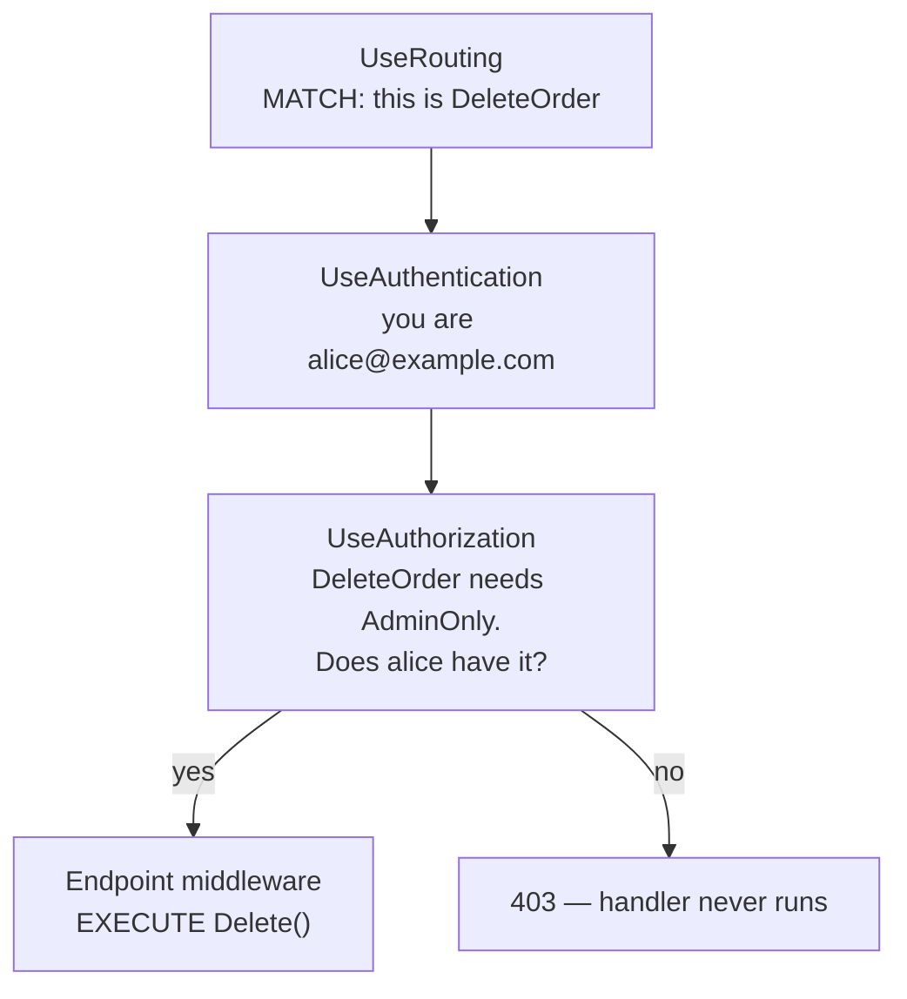

# 8.2 — UseRouting and UseEndpoints

> **[← Roadmap](../../ROADMAP.md)** · **Section:** [8. Routing](../../ROADMAP.md#8-routing)
> **Prev:** [8.1 Endpoint routing](8.01-endpoint-routing.md) · **Next:** [8.3 Conventional vs attribute routing](8.03-conventional-vs-attribute.md)

**Markers:** 🔥 ⚠️ · **Confidence:** 🔴 · **Last reviewed:** —

---

## TL;DR

Routing is **two separate middleware**, and what sits between them matters.

- **`UseRouting`** decides which endpoint matches. It does **not** run it.
- **The endpoint middleware** executes it. In minimal hosting, `MapControllers` puts it at the end automatically.
- **Authentication and authorization go in the gap**, because they need to know which endpoint was selected.

⚠️ In .NET 6+ you rarely write either — `WebApplication` inserts them. You only add them explicitly to control where middleware sits **relative to routing**.

---

## Definitions

| Term | What it is | What it means |
|---|---|---|
| **`UseRouting`** | *middleware* | Matches the request to an endpoint and stores it on `HttpContext`. Executes nothing. |
| **`UseEndpoints`** | *middleware* (older style) | Executes the selected endpoint. Took a lambda registering routes. |
| **Endpoint middleware** | *the terminal step* | What `UseEndpoints` added. In .NET 6+ it is added automatically. |
| **`MapControllers`** | a **method** | Registers controller endpoints. Callable directly on `WebApplication`. |
| **The gap** | *the pipeline segment* | Everything between `UseRouting` and endpoint execution. Where auth lives. |
| **Auto-insertion** | *a `WebApplication` behaviour* | Routing is added at the start and endpoints at the end, if you do not add them. |
| **`GetEndpoint()`** | a **method** | The selected endpoint. Null before `UseRouting`. |
| **Terminal middleware** | *a role* | Produces the response and does not call `next`. The endpoint middleware is one. |

---

## The concept

### Why two, not one

Matching a URL to a handler and running that handler are naturally one operation. ASP.NET Core
splits them on purpose.

The reason is a single question: **how does authorization know what it is protecting?**

```csharp
[Authorize(Policy = "AdminOnly")]
[HttpDelete("orders/{id}")]
public IActionResult Delete(Guid id) { }
```

The `AdminOnly` policy is metadata on that endpoint
([8.1](8.01-endpoint-routing.md)). For authorization middleware to enforce it, it must already
know which endpoint was chosen — but it must also run **before** the handler executes.

That is only possible if matching and execution are separate steps with a gap between them:



A picture: **a boarding pass.** Check-in decides your flight and prints it. Security reads the
pass and decides whether to let you through — they need to know your destination but must stop
you before you board. Two steps with a checkpoint between them.

---

## How it works

### The simple version — you usually write neither

In .NET 6+ minimal hosting, `WebApplication` inserts both automatically:

```csharp
var app = builder.Build();

app.UseAuthentication();
app.UseAuthorization();
app.MapControllers();          // ← routing and endpoints added around this for you

app.Run();
```

Behind the scenes that becomes:

```csharp
app.UseRouting();              // ← auto-inserted at the START
app.UseAuthentication();
app.UseAuthorization();
app.UseEndpoints(e => e.MapControllers());   // ← auto-inserted at the END
```

**So the canonical order works without you thinking about it**
([5.2](../05-middleware-pipeline/5.02-middleware-order.md)).

### The older explicit form

Pre-.NET 6 code, and anything using `Startup.cs`
([4.4](../04-fundamentals-startup/4.04-startup-cs-legacy.md)), writes it out:

```csharp
public void Configure(IApplicationBuilder app, IWebHostEnvironment env)
{
    app.UseRouting();                          // match

    app.UseAuthentication();
    app.UseAuthorization();                    // the gap

    app.UseEndpoints(endpoints =>              // execute
    {
        endpoints.MapControllers();
        endpoints.MapHealthChecks("/healthz");
    });
}
```

Same three phases, spelled out. **Recognising this form matters** because most existing codebases
still use it.

### ⚠️ When you DO need to write `UseRouting` explicitly

Auto-insertion puts routing at the **very start**. If you need middleware to run **after** the
match but before authorization, you must place routing yourself:

```csharp
app.UseRouting();          // ← explicit, so the next middleware sits AFTER it

app.Use(async (context, next) =>
{
    // We can only see the endpoint because we are AFTER UseRouting
    var endpoint = context.GetEndpoint();
    var pattern = (endpoint as RouteEndpoint)?.RoutePattern.RawText;

    logger.LogDebug("Matched route {Pattern}", pattern);
    await next();
});

app.UseAuthentication();
app.UseAuthorization();
app.MapControllers();
```

Without the explicit call, that middleware would be registered **before** the auto-inserted
`UseRouting`, and `GetEndpoint()` would return null.

**This is the main practical reason to write it by hand**, and it is the answer to "why would I
ever call `UseRouting` explicitly?"

⚠️ **Calling `UseRouting` explicitly disables the auto-insertion**, so if you add it you are now
responsible for its position relative to everything else.

### How it actually works — the ordering rules

Two hard rules that produce startup exceptions if broken.

**`UseAuthorization` must come after `UseRouting`:**

```csharp
// ✗ Throws at startup
app.UseAuthorization();
app.UseRouting();
```

> `InvalidOperationException: Endpoint routing does not support 'UseAuthorization' ... configure
> it after 'UseRouting'.`

Authorization has nothing to check against without a selected endpoint. **This one at least fails
loudly.**

**`UseCors` must be between routing and authorization:**

```csharp
app.UseRouting();
app.UseCors();               // ← here
app.UseAuthentication();
app.UseAuthorization();
```

⚠️ **This one fails silently.** Put `UseCors` after `UseAuthentication` and browser preflight
requests — unauthenticated `OPTIONS` calls — get a 401 before CORS can answer them. The browser
reports a CORS error, and you spend an afternoon checking a policy that was correct all along
([10.10](../10-web-api-rest/10.10-cors.md)).

### The deeper detail — what happens when nothing matches

If no endpoint matches, `UseRouting` sets **no endpoint** and the request continues down the
pipeline. The endpoint middleware finds nothing to execute, and the response falls through as a
**404 with an empty body**.

That empty body surprises API clients expecting JSON:

```csharp
app.UseStatusCodePages();     // gives bare 404s and 401s a body
```

Or, for a consistent `ProblemDetails` shape everywhere
([10.8](../10-web-api-rest/10.08-problem-details.md)):

```csharp
builder.Services.AddProblemDetails();
app.UseStatusCodePages();
```

⚠️ **Middleware between routing and the endpoint still runs for unmatched requests.**
`GetEndpoint()` returns null, so any middleware reading it must handle that:

```csharp
var endpoint = context.GetEndpoint();
if (endpoint is null)
{
    await next();          // nothing matched — do not assume there is one
    return;
}
```

Forgetting that null check is a common cause of a `NullReferenceException` that only fires when
someone requests a URL that does not exist — which in production is constantly, from scanners.

---

## Code

The two forms side by side, so you recognise both:

```csharp
// ── Modern: .NET 6+ minimal hosting ──
var app = builder.Build();

app.UseExceptionHandler();
app.UseHttpsRedirection();
app.UseStaticFiles();
// UseRouting auto-inserted here
app.UseCors();
app.UseAuthentication();
app.UseAuthorization();
app.MapControllers();            // UseEndpoints auto-inserted around this
app.MapHealthChecks("/healthz");

app.Run();
```

```csharp
// ── Legacy: Startup.cs, still very common ──
public void Configure(IApplicationBuilder app, IWebHostEnvironment env)
{
    app.UseExceptionHandler("/error");
    app.UseHttpsRedirection();
    app.UseStaticFiles();

    app.UseRouting();                       // explicit

    app.UseCors();
    app.UseAuthentication();
    app.UseAuthorization();

    app.UseEndpoints(endpoints =>           // explicit
    {
        endpoints.MapControllers();
        endpoints.MapHealthChecks("/healthz");
    });
}
```

### The realistic reason to be explicit

Tenant resolution from the route — needs the match, must precede authorization:

```csharp
app.UseRouting();          // explicit, so what follows can read the endpoint

app.Use(async (context, next) =>
{
    var endpoint = context.GetEndpoint();

    if (endpoint is null)
    {
        await next();                       // ⚠️ nothing matched — do not assume
        return;
    }

    // The tenant is a route parameter: /t/{tenant}/orders/{id}
    if (context.Request.RouteValues.TryGetValue("tenant", out var tenant))
    {
        var tenantContext = context.RequestServices.GetRequiredService<ITenantContext>();
        tenantContext.Current = tenant?.ToString();
    }

    await next();
});

app.UseAuthentication();
app.UseAuthorization();     // authorization policies can now use the tenant
app.MapControllers();
```

Two details that matter here: **route values only exist after `UseRouting`**, and **the tenant
must be resolved before authorization** so a policy can check the user belongs to that tenant.

---

## Interview questions

**Q: Why are `UseRouting` and `UseEndpoints` separate?**

So that middleware can run between the match and the execution. Authorization is the reason:
policies are metadata attached to an endpoint, so authorization has to know which endpoint was
selected — but it must still run before the handler executes. That is only possible if matching
and executing are separate steps with a gap between them. `UseRouting` performs the match and
stores the endpoint on the context without running anything; the endpoint middleware at the end
executes it.

**Q: Do you need to write them in modern ASP.NET Core?**

Usually not. `WebApplication` inserts `UseRouting` at the start of the pipeline and the endpoint
middleware at the end if you have not added them, so writing authentication, authorization and
`MapControllers` in the right order is enough. You add them explicitly when you need middleware
to sit at a specific position relative to the match — typically something that reads the selected
endpoint or a route value, which returns null or empty before `UseRouting` has run.

**Q: What ordering mistakes are possible here?**

Two. Putting `UseAuthorization` before `UseRouting` throws at startup with a clear message,
because authorization has no endpoint to evaluate — that one is at least loud. The dangerous one
is `UseCors` after `UseAuthentication`: a browser preflight is an unauthenticated `OPTIONS`
request, so authentication rejects it with a 401 before CORS middleware can answer with the allow
headers. The browser reports a CORS failure, so you go looking at the policy, which was correct
all along. `UseCors` belongs between routing and authentication.

**Q: What happens if no endpoint matches?**

`UseRouting` sets no endpoint and the request continues down the pipeline. The endpoint middleware
finds nothing to run and the response ends as a 404 with an empty body, which surprises API
clients expecting JSON — adding `UseStatusCodePages` gives it a body. Worth knowing that
middleware between routing and the endpoint still runs for unmatched requests, so anything
calling `GetEndpoint()` must handle null. Forgetting that produces a null reference that only
fires on URLs that do not exist, which in production means constantly, from scanners.

---

## Traps ⚠️

- **`UseAuthorization` before `UseRouting` throws** at startup.
- **`UseCors` after `UseAuthentication` breaks preflight** silently, and looks like a CORS
  misconfiguration.
- **Calling `UseRouting` explicitly disables auto-insertion**, so you now own its position.
- **`GetEndpoint()` and `RouteValues` are empty before `UseRouting`.**
- **`GetEndpoint()` returns null for unmatched requests**, and that middleware still runs.
- **A bare 404 has an empty body** without `UseStatusCodePages`.
- **`UseEndpoints` without `UseRouting` before it throws** in the explicit form.
- **`UseMvc()` is the pre-2.2 model** and does not participate in endpoint routing at all.

---

## Related

- [8.1 Endpoint routing](8.01-endpoint-routing.md) — what an endpoint is
- [8.7 Endpoint precedence](8.07-endpoint-precedence.md) — how the match is decided
- [5.2 Middleware order](../05-middleware-pipeline/5.02-middleware-order.md) — the canonical order
- [4.4 Startup.cs](../04-fundamentals-startup/4.04-startup-cs-legacy.md) — where the explicit form appears
- [10.10 CORS](../10-web-api-rest/10.10-cors.md) — the silent ordering trap
- [16.4 Policy-based authorization](../16-authorization/16.04-policy-based.md) — the metadata being checked
- [5.11 Exception middleware](../05-middleware-pipeline/5.11-exception-middleware.md) — `UseStatusCodePages`

---

## Sources

- [Microsoft Learn — Routing in ASP.NET Core](https://learn.microsoft.com/aspnet/core/fundamentals/routing)
- [Microsoft Learn — Middleware order](https://learn.microsoft.com/aspnet/core/fundamentals/middleware/#middleware-order)
