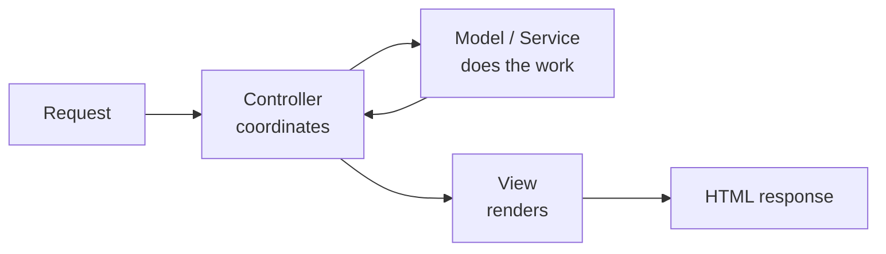
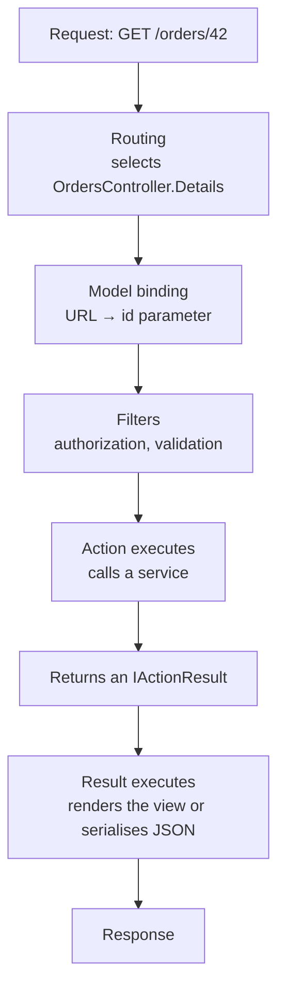

# 9.1 — The MVC Pattern in ASP.NET Core

> **[← Roadmap](../../ROADMAP.md)** · **Section:** [9. MVC, Razor Pages and Views](../../ROADMAP.md#9-mvc-razor-pages-and-views)
> **Prev:** [8.10 Catch-all routes and slugs](../08-routing/8.10-catchall-and-slugs.md) · **Next:** [9.2 Controllers](9.02-controllers.md)

**Markers:** 🔥 🎯 · **Confidence:** 🔴 · **Last reviewed:** —

---

## TL;DR

**MVC** splits a web request into three responsibilities: the **Model** holds the data and rules,
the **View** renders the output, and the **Controller** coordinates between them.

- The point is **separation of concerns** — you can change how something looks without touching how it works.
- In ASP.NET Core, MVC is **one framework** that also powers Web APIs, where there is no View at all.
- ⚠️ The most common mistake is a **fat controller** — business logic in the controller instead of the model or a service.

---

## Definitions

| Term | What it is | What it means |
|---|---|---|
| **MVC** | *an architectural pattern* | Model-View-Controller. Splits presentation from logic from data. |
| **Model** | *the data and rules* | Your domain objects and business logic. Knows nothing about HTTP. |
| **View** | *a template* | A `.cshtml` file that renders HTML. Knows nothing about the database. |
| **Controller** | *a class* | Receives the request, calls a service, chooses a result. The coordinator. |
| **Action** | *a public method on a controller* | Handles one request. Returns an `IActionResult` or a value. |
| **ViewModel** | *a class shaped for one view* | What the view actually needs, distinct from your domain entity. See [9.8](9.08-viewmodels.md). |
| **Separation of concerns** | *a design principle* | Each part has one reason to change. |
| **Fat controller** | *an anti-pattern* | Business logic in the controller, making it untestable and unreusable. |
| **`AddControllersWithViews`** | a **method** | Registers MVC with view support. |
| **`AddControllers`** | a **method** | Registers MVC **without** views — for APIs. |
| **Razor Pages** | *an alternative* | Page-focused rather than controller-focused. See [9.7](9.07-razor-pages.md). |

---

## The concept

### The three parts

**Model** — the data and the rules that govern it. An `Order` class, the logic that decides
whether it can be cancelled, the repository that loads it. **It knows nothing about the web.**

**View** — a template that turns data into HTML. **It knows nothing about where the data came
from.**

**Controller** — the coordinator. It receives the request, asks a service for what it needs,
and decides what to return.



A picture: **a restaurant.** The **waiter** (controller) takes your order and carries it between
you and the kitchen — they do not cook. The **kitchen** (model) prepares the food and knows
nothing about which table it goes to. The **plate** (view) presents it. Change the plating without
changing the recipe; change the recipe without retraining the waiter.

### What the separation actually buys you

The abstract answer is "separation of concerns", which is true and unhelpful. The concrete
benefits:

**You can test the logic without the web.** If order-cancellation rules live in a service, a unit
test constructs it with fakes and runs in milliseconds
([6.12](../06-dependency-injection/6.12-di-and-testability.md)). If they live in a controller, the
test needs an `HttpContext`.

**You can reuse the logic.** The same service serves a controller, a background job and a gRPC
endpoint. Logic inside a controller action serves exactly one URL.

**You can change presentation independently.** Swapping an HTML view for a JSON response should
not touch the business rules — and in ASP.NET Core that is literally the difference between an MVC
app and an API.

### ⚠️ The mistake everyone makes

```csharp
// ✗ A fat controller — logic that does not belong here
[HttpPost("{id:guid}/cancel")]
public async Task<IActionResult> Cancel(Guid id, CancellationToken ct)
{
    var order = await _db.Orders.Include(o => o.Lines)
                    .FirstOrDefaultAsync(o => o.Id == id, ct);
    if (order is null) return NotFound();

    if (order.Status == OrderStatus.Shipped)
        return BadRequest("Cannot cancel a shipped order");

    if (order.CreatedAt < DateTimeOffset.UtcNow.AddDays(-30))
        return BadRequest("Orders older than 30 days cannot be cancelled");

    order.Status = OrderStatus.Cancelled;
    order.CancelledAt = DateTimeOffset.UtcNow;

    foreach (var line in order.Lines)
        await _inventory.ReturnStockAsync(line.ProductId, line.Quantity, ct);

    await _db.SaveChangesAsync(ct);
    await _email.SendAsync(order.CustomerEmail, "Order cancelled", "...", ct);

    return NoContent();
}
```

Every business rule about cancellation lives in an HTTP handler. To test "can a 40-day-old order
be cancelled?", you have to construct a controller and an `HttpContext`. To cancel an order from a
background job, you copy the logic.

```csharp
// ✓ Thin controller — translate, delegate, translate back
[HttpPost("{id:guid}/cancel")]
public async Task<IActionResult> Cancel(Guid id, CancellationToken ct)
{
    var result = await _orders.CancelAsync(id, ct);

    return result.Status switch
    {
        CancelStatus.Success  => NoContent(),
        CancelStatus.NotFound => NotFound(),
        _                     => BadRequest(result.Reason)
    };
}
```

**The controller's job is translation** — HTTP in, HTTP out. Everything between belongs elsewhere.

---

## How it works

### The simple version — the request flow



Two things worth noticing.

**The action does not write the response.** It returns a *description* of what should happen —
`View(model)` or `Ok(dto)` — and the framework executes that afterwards. That is what makes
actions testable: you assert on the returned result object without any HTTP involved
([9.3](9.03-action-results.md)).

**Filters run around the action**, inside the endpoint. They are MVC's extension point, distinct
from middleware ([5.13](../05-middleware-pipeline/5.13-middleware-vs-filters.md)).

### Registering it

```csharp
// Full MVC — controllers plus views
builder.Services.AddControllersWithViews();

// API only — no view engine, no Razor
builder.Services.AddControllers();

// Razor Pages — see 9.7
builder.Services.AddRazorPages();
```

⚠️ **`AddControllers` versus `AddControllersWithViews` matters.** For an API, the first avoids
registering the entire Razor view engine — less startup work and a smaller surface. Calling
`View(...)` from a controller registered with `AddControllers` throws at runtime because there is
no view engine to find the template.

### ⚠️ MVC is also how Web APIs work

This confuses people coming from other frameworks: **an ASP.NET Core Web API is MVC with the V
left out.**

```csharp
// Same framework, same controller base, same filters, same model binding
[ApiController]
public class OrdersController : ControllerBase
{
    [HttpGet("{id:guid}")]
    public async Task<ActionResult<OrderDto>> Get(Guid id) { }
}
```

Routing, model binding, filters and action results are all shared. The only difference is that
instead of returning a rendered view, the result is serialised to JSON by a formatter
([10.5](../10-web-api-rest/10.05-content-negotiation-json.md)).

So learning MVC's mechanics is not wasted effort on an API project — it *is* the API's mechanics.

### The deeper detail — where the "M" actually lives

⚠️ **"Model" is the vaguest of the three letters**, and the confusion is real.

In practice a modern ASP.NET Core application has several things people call a model:

| Thing | Purpose |
|---|---|
| **Domain entity** | `Order` — the business object, with rules |
| **EF entity** | Often the same class, mapped to a table ([13.4](../13-entity-framework-core/13.04-entity-configuration.md)) |
| **ViewModel** | Shaped for one view — what the page needs ([9.8](9.08-viewmodels.md)) |
| **DTO** | Shaped for the API contract ([10.11](../10-web-api-rest/10.11-dtos-and-mapping.md)) |
| **Request model** | What model binding populates from the request |

**Classic MVC assumed one "Model".** Real applications separate them, because a class shaped for
the database is rarely shaped for a web page or an API response.

⚠️ **Passing an EF entity straight to a view or an API response is the common shortcut**, and it
causes three problems: it leaks your schema, it enables over-posting
([11.10](../11-model-binding-validation/11.10-over-posting.md)), and lazy-loaded navigation
properties can trigger queries during serialization
([13.8](../13-entity-framework-core/13.08-loading-strategies.md)).

### MVC versus the alternatives

| | Suits |
|---|---|
| **MVC** | Server-rendered sites with several actions per resource; Web APIs |
| **Razor Pages** | Server-rendered pages where each URL is one page ([9.7](9.07-razor-pages.md)) |
| **Minimal APIs** | Small services, AOT, fewer ceremony layers ([10.12](../10-web-api-rest/10.12-minimal-apis.md)) |
| **Blazor** | Interactive UI in C# ([9.9](9.09-blazor-overview.md)) |

**They coexist.** One application can serve Razor Pages for the site, MVC controllers for admin,
and minimal APIs for its JSON endpoints — all sharing the same host, DI and middleware.

---

## Code

A properly layered slice:

```csharp
// ── MODEL: the domain object owns its own rules ──
public class Order
{
    public Guid Id { get; init; }
    public OrderStatus Status { get; private set; }
    public DateTimeOffset CreatedAt { get; init; }
    public List<OrderLine> Lines { get; init; } = [];

    // The rule lives WITH the data it governs — see 22.14 on anemic models
    public bool CanBeCancelled(DateTimeOffset now) =>
        Status is OrderStatus.Pending or OrderStatus.Confirmed &&
        CreatedAt > now.AddDays(-30);

    public void Cancel(DateTimeOffset now)
    {
        if (!CanBeCancelled(now))
            throw new InvalidOperationException("This order cannot be cancelled.");

        Status = OrderStatus.Cancelled;
    }
}
```

```csharp
// ── SERVICE: orchestrates, but still knows nothing about HTTP ──
public class OrderService(
    IOrderRepository repo,
    IInventoryService inventory,
    TimeProvider time) : IOrderService
{
    public async Task<CancelResult> CancelAsync(Guid id, CancellationToken ct)
    {
        var order = await repo.GetAsync(id, ct);
        if (order is null) return CancelResult.NotFound();

        if (!order.CanBeCancelled(time.GetUtcNow()))
            return CancelResult.Rejected("This order can no longer be cancelled.");

        order.Cancel(time.GetUtcNow());
        await repo.SaveAsync(order, ct);

        foreach (var line in order.Lines)
            await inventory.ReturnStockAsync(line.ProductId, line.Quantity, ct);

        return CancelResult.Success();
    }
}
```

```csharp
// ── CONTROLLER: translation only ──
[Route("orders")]
public class OrdersController(IOrderService orders) : Controller
{
    [HttpGet("{id:guid}")]
    public async Task<IActionResult> Details(Guid id, CancellationToken ct)
    {
        var order = await orders.GetAsync(id, ct);
        if (order is null) return NotFound();

        // Map to a ViewModel — the view gets what it needs, not the entity
        return View(OrderDetailsViewModel.From(order));
    }

    [HttpPost("{id:guid}/cancel")]
    [ValidateAntiForgeryToken]
    public async Task<IActionResult> Cancel(Guid id, CancellationToken ct)
    {
        var result = await orders.CancelAsync(id, ct);

        if (result.IsNotFound) return NotFound();

        if (!result.IsSuccess)
        {
            TempData["Error"] = result.Reason;          // see 9.6
            return RedirectToAction(nameof(Details), new { id });
        }

        return RedirectToAction(nameof(Details), new { id });
    }
}
```

```html
@* ── VIEW: rendering only ── *@
@model OrderDetailsViewModel

<h1>Order @Model.Reference</h1>
<p>Placed @Model.CreatedAt.ToString("d MMMM yyyy")</p>

@if (Model.CanCancel)
{
    <form asp-action="Cancel" asp-route-id="@Model.Id" method="post">
        <button type="submit">Cancel this order</button>
    </form>
}
```

**Notice `Model.CanCancel` is a property on the ViewModel**, not a rule evaluated in the view. The
view asks a question; it does not decide the answer. That is the line that keeps views simple and
logic testable.

---

## Interview questions

**Q: Explain the MVC pattern.**

It splits a request into three responsibilities. The Model holds the data and the business rules
and knows nothing about HTTP. The View is a template that renders output and knows nothing about
where the data came from. The Controller coordinates — it receives the request, calls a service,
and returns a result describing what should happen. The value is that each part has one reason to
change: you can alter how something is presented without touching the rules, and test the rules
without standing up the web stack.

**Q: What is the most common mistake with MVC?**

Fat controllers — putting business logic in the action instead of in the model or a service. It
feels natural because the controller is where the request arrives, but it makes the logic
untestable without an `HttpContext` and unusable from anywhere else, so the same rules get copied
into a background job. The controller's job is translation: turn an HTTP request into a service
call, and turn the result back into an HTTP response. Everything between belongs elsewhere.

**Q: How does MVC relate to Web APIs in ASP.NET Core?**

A Web API is MVC without the View. It is the same framework — the same routing, model binding,
filters, controller base and action results. The only difference is that instead of rendering a
Razor template, the result is serialised by an output formatter, usually to JSON. That is why
`AddControllers` and `AddControllersWithViews` differ only in whether the view engine is
registered. So understanding MVC's mechanics is not wasted on an API project; it is the API's
mechanics.

**Q: What does "Model" actually mean in a modern application?**

It is the vaguest of the three letters, because classic MVC assumed one model and real
applications have several. There is the domain entity with its rules, often also the EF entity
mapped to a table, a ViewModel shaped for a particular page, and a DTO shaped for the API
contract. Keeping them separate matters — passing an EF entity straight to a view or an API
response leaks your schema, enables over-posting, and can trigger lazy-loading queries during
serialization.

---

## Traps ⚠️

- **Business logic in controllers** makes it untestable and unreusable. Push it into services or
  the domain.
- **Passing EF entities to views or API responses** leaks the schema and enables over-posting.
- **`AddControllers` has no view engine.** Calling `View(...)` then throws at runtime.
- **Logic in views** — `@if (order.Status == ... && order.CreatedAt > ...)` — is untestable. Put
  it on the ViewModel.
- **"Model" is ambiguous.** Be specific about which one you mean.
- **The action does not write the response**, it returns a description of one. That is what makes
  it testable.
- **An anemic model** — entities with only properties, all logic in services — is a recognised
  anti-pattern ([22.14](../22-architecture-patterns/22.14-anti-patterns.md)).

---

## Related

- [9.2 Controllers](9.02-controllers.md) — `Controller` versus `ControllerBase`
- [9.3 Action results](9.03-action-results.md) — what an action returns
- [9.8 ViewModels](9.08-viewmodels.md) — keeping entities out of views
- [9.7 Razor Pages](9.07-razor-pages.md) — the page-focused alternative
- [5.13 Middleware vs filters](../05-middleware-pipeline/5.13-middleware-vs-filters.md) — where filters sit
- [10.11 DTOs](../10-web-api-rest/10.11-dtos-and-mapping.md) — the API equivalent of a ViewModel
- [22.14 Anti-patterns](../22-architecture-patterns/22.14-anti-patterns.md) — fat controllers and anemic models
- [6.12 DI and testability](../06-dependency-injection/6.12-di-and-testability.md) — why thin controllers test better

---

## Sources

- [Microsoft Learn — Overview of ASP.NET Core MVC](https://learn.microsoft.com/aspnet/core/mvc/overview)
- [Microsoft Learn — Common web application architectures](https://learn.microsoft.com/dotnet/architecture/modern-web-apps-azure/common-web-application-architectures)
