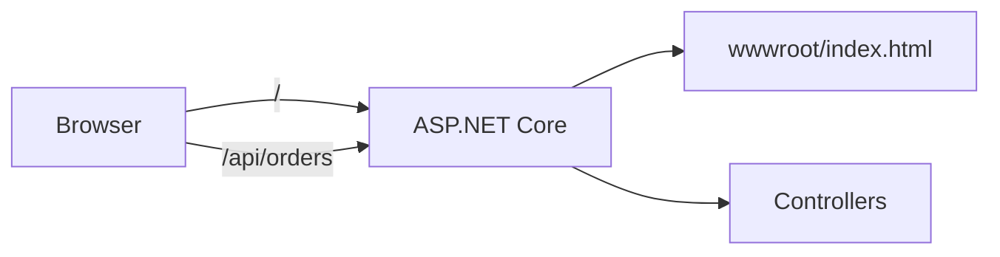

# 9.10 — Front-end Integration: Static Files, Bundling and SPAs

> **[← Roadmap](../../ROADMAP.md)** · **Section:** [9. MVC, Razor Pages and Views](../../ROADMAP.md#9-mvc-razor-pages-and-views)
> **Prev:** [9.9 Blazor overview](9.09-blazor-overview.md) · **Next:** [10.1 REST principles](../10-web-api-rest/10.01-rest-principles.md)

**Markers:** ⭐ 💻 · **Confidence:** 🔴 · **Last reviewed:** —

---

## TL;DR

**Front-end integration** is how ASP.NET Core serves CSS, JavaScript and images, and how it
coexists with a JavaScript framework like React or Angular.

- `UseStaticFiles()` serves files from **`wwwroot`** — and **nothing outside it**.
- **Cache busting** matters: browsers cache aggressively, so a changed file needs a changed URL. `asp-append-version="true"` does this automatically.
- Two hosting models: **same-origin** (SPA served by ASP.NET Core, no CORS) or **separate deployments** (SPA on a CDN, API separate, CORS required).

---

## Definitions

| Term | What it is | What it means |
|---|---|---|
| **Static file** | *a file served as-is* | CSS, JS, images — no processing, no controller. |
| **`wwwroot`** | *a folder* | The web root. The only folder static files are served from by default. |
| **`UseStaticFiles()`** | *a middleware registration* | Enables serving files from the web root. |
| **`UseDefaultFiles()`** | *a middleware registration* | Serves `index.html` when a directory is requested. |
| **Cache busting** | *a technique* | Changing a file's URL when its content changes, so browsers refetch it. |
| **`asp-append-version`** | *a tag helper attribute* | Appends a content hash to the URL. Automatic cache busting. |
| **Bundling** | *a build step* | Combining many files into one to reduce requests. |
| **Minification** | *a build step* | Stripping whitespace and shortening names to reduce size. |
| **CDN** | *a hosting concept* | Servers near the user that cache static assets. |
| **SPA** | *a front-end architecture* | Single Page Application — React, Angular, Vue. |
| **Same-origin** | *a browser concept* | Same scheme, host and port. No CORS needed. |
| **CORS** | *a browser security mechanism* | Rules letting a page call an API on a different origin. |
| **SPA fallback** | *a routing technique* | Serving `index.html` for unmatched routes so client-side routing works. |
| **`MapFallbackToFile`** | *an endpoint method* | Registers that fallback. |

---

## The concept

A web page is never one request. The HTML arrives, then the browser asks for the CSS, the
JavaScript, the fonts and the images. Those extra files are **static** — the same bytes for every
user, with no controller, no database and no logic behind them.

ASP.NET Core will not serve them unless you say so, and it will only serve them from one folder.

```
MyApp/
├── Program.cs
├── appsettings.json          ← ⚠️ NOT servable — outside wwwroot
├── Views/
└── wwwroot/                  ← the web root
    ├── css/site.css          → /css/site.css
    ├── js/site.js            → /js/site.js
    └── images/logo.png       → /images/logo.png
```

**The folder maps directly onto the URL.** `wwwroot/css/site.css` becomes `/css/site.css` — the
`wwwroot` part disappears.

⚠️ **And that boundary is a security feature, not an inconvenience.** Because only `wwwroot` is
served, a request for `/appsettings.json` returns 404 rather than your connection strings. Every
file you put in `wwwroot` is public to anyone who knows the URL — there is no authorization on it
by default.

---

## How it works

### The simple version

```csharp
var app = builder.Build();

app.UseStaticFiles();       // ← without this line, nothing in wwwroot is served
app.MapControllers();
```

⚠️ **Placement in the pipeline matters** ([5.2](../05-middleware-pipeline/5.02-middleware-order.md)). Put
`UseStaticFiles` **before** authentication and authorization and static files are served without
those checks running — which is what you want for performance, since a CSS file should not cost a
database lookup for the current user.

But it also means **static files are not protected**. If a file genuinely needs authorization, it
does not belong in `wwwroot` — serve it from a controller that checks permissions and returns
`PhysicalFile(...)` or a stream.

### The caching problem

Static files should be cached hard — that is most of the performance win. But then a deployment
ships new CSS and returning users still see the old file, sometimes for days.

**The fix is to change the URL whenever the content changes.** The tag helper does it for you:

```razor
<link rel="stylesheet" href="~/css/site.css" asp-append-version="true" />
```

renders as:

```html
<link rel="stylesheet" href="/css/site.css?v=Kl_dqr9NVtrMtSv8Ns_HXe73qC0" />
```

That `v=` value is a **hash of the file's content**. Edit the file and the hash changes, so the URL
changes, so the browser treats it as a new resource and refetches. Leave the file alone and the URL
is stable, so the cached copy is reused.

⚠️ **Forgetting this is the classic "why are users still seeing the old CSS?" bug**, and it usually
surfaces as a support ticket rather than a test failure.

### Setting cache headers

```csharp
app.UseStaticFiles(new StaticFileOptions
{
    OnPrepareResponse = ctx =>
    {
        // 1 year — safe ONLY because asp-append-version changes the URL on edit
        ctx.Context.Response.Headers.CacheControl = "public,max-age=31536000,immutable";
    }
});
```

⚠️ **A year is only safe with cache busting in place.** Without it, a bad file is stuck in users'
browsers for a year with no way to recall it.

### How it actually works — bundling and minification

**Bundling** combines files to cut the number of requests. **Minification** strips whitespace,
comments and long names to cut the bytes.

⚠️ **Bundling matters much less than it used to.** Under HTTP/2 and HTTP/3, requests are
multiplexed over one connection, so many small files are no longer expensive — and bundling
everything into one file means a one-line change invalidates the whole bundle. **Minification is
still worth doing.** Bundling is now a judgement call.

The current options:

| Approach | When |
|---|---|
| **Nothing** | Small app, few files, HTTP/2. Genuinely fine. |
| **`bundleconfig.json`** + BuildBundlerMinifier | Simple MVC apps. The old ASP.NET Core way. |
| **Vite / esbuild / webpack** | Anything with a real front-end. The standard today. |
| **Framework CLI** | Angular CLI, Next.js — the framework handles it. |

⚠️ **Do not name-drop Bundling and Minification (the old `System.Web.Optimization` from .NET
Framework) as though it is current** — it does not exist in ASP.NET Core.

### The deeper detail — hosting a SPA

Two models, and the choice has consequences.

**Model 1 — same origin.** The SPA is built into `wwwroot` and served by ASP.NET Core:

```csharp
app.UseDefaultFiles();      // "/" serves index.html
app.UseStaticFiles();

app.MapControllers();
app.MapFallbackToFile("index.html");   // ← unmatched routes go to the SPA
```



`MapFallbackToFile` is the important line. A SPA does its own client-side routing, so if a user
refreshes on `/orders/42`, the browser asks the *server* for `/orders/42` — a route no controller
matches. Without the fallback that is a 404. With it, `index.html` is returned and the SPA's router
takes over.

⚠️ **Fallback ordering matters**: it must come **after** `MapControllers`, or it swallows API
routes and returns HTML where JSON was expected.

| | Same origin |
|---|---|
| CORS | ✅ Not needed |
| Cookies | ✅ Just work |
| Deployment | ✅ One unit |
| Scaling separately | ❌ No |
| CDN for the front-end | ⚠️ Harder |

**Model 2 — separate deployments.** The SPA goes to a CDN or static host, the API is deployed
independently.

```csharp
builder.Services.AddCors(options =>
    options.AddPolicy("Spa", policy => policy
        .WithOrigins("https://app.example.com")    // ⚠️ never AllowAnyOrigin with credentials
        .AllowAnyHeader()
        .AllowAnyMethod()
        .AllowCredentials()));

app.UseCors("Spa");        // ⚠️ before UseAuthorization and endpoints
```

| | Separate |
|---|---|
| CORS | ⚠️ Required and easy to get wrong |
| Cookies | ⚠️ Need `SameSite=None; Secure` |
| Deployment | ⚠️ Two pipelines |
| Scaling separately | ✅ Yes |
| CDN for the front-end | ✅ Natural |

⚠️ **`AllowAnyOrigin()` combined with `AllowCredentials()` is rejected at runtime** — the browser
spec forbids it, and ASP.NET Core throws rather than silently misconfiguring. Named origins are
required once credentials are involved ([10.10](../10-web-api-rest/10.10-cors.md)).

⚠️ **`UseSpaStaticFiles` / `UseSpaProxy` and the old SPA templates are deprecated.** Modern
templates use Vite's dev server directly with a proxy configured on the front-end side.

### Development vs production

In development the front-end dev server (Vite, Angular CLI) runs separately for hot reload. In
production the built output is copied into `wwwroot` or deployed to a CDN.

⚠️ **The two environments then differ**, which is where "works locally, broken in production" bugs
live — usually a CORS policy that was never needed in development, or a base path that differs.

---

## Code

A same-origin setup end to end:

```csharp
var builder = WebApplication.CreateBuilder(args);
builder.Services.AddControllers();

var app = builder.Build();

if (!app.Environment.IsDevelopment())
{
    app.UseExceptionHandler("/error");
    app.UseHsts();
}

app.UseHttpsRedirection();

// Static files BEFORE auth — a CSS file should not cost an auth check
app.UseDefaultFiles();
app.UseStaticFiles(new StaticFileOptions
{
    OnPrepareResponse = ctx =>
    {
        var path = ctx.File.Name;

        // index.html must NOT be cached — it points at the hashed asset filenames
        if (path.Equals("index.html", StringComparison.OrdinalIgnoreCase))
        {
            ctx.Context.Response.Headers.CacheControl = "no-cache";
        }
        else
        {
            // Build output has content hashes in the filenames, so cache hard
            ctx.Context.Response.Headers.CacheControl =
                "public,max-age=31536000,immutable";
        }
    }
});

app.UseRouting();
app.UseAuthentication();
app.UseAuthorization();

app.MapControllers();
app.MapFallbackToFile("index.html");   // ⚠️ AFTER MapControllers

app.Run();
```

The caching split is the part worth understanding. A Vite or webpack build emits
`main.a3f9c2.js` — the hash is **in the filename**, so those files can be cached forever. But
`index.html` is what tells the browser which hashed filenames to load, so **it must never be
cached**. Cache `index.html` and users keep loading the old build's asset list, and the deployment
effectively never reaches them.

Serving a file that needs authorization — not from `wwwroot`:

```csharp
[Authorize]
[HttpGet("documents/{id:int}")]
public async Task<IActionResult> Download(int id, CancellationToken ct)
{
    var doc = await _documents.FindAsync(id, ct);
    if (doc is null) return NotFound();

    // ⚠️ Ownership check — [Authorize] proves who they are, not what they may read
    if (doc.OwnerId != User.GetUserId()) return Forbid();

    var stream = await _storage.OpenReadAsync(doc.BlobPath, ct);
    return File(stream, doc.ContentType, doc.FileName);   // streams, does not buffer
}
```

⚠️ **Never build a file path from user input** (`Path.Combine(root, userInput)`) — `../` sequences
escape the folder. Look the file up by ID and read the path from your own data
([17.11](../17-application-security/17.11-input-and-upload-security.md)).

---

## Interview questions

**Q: How does ASP.NET Core serve static files?**

`UseStaticFiles()` middleware serves them from `wwwroot`, and only from `wwwroot` — the folder
structure maps onto the URL with the `wwwroot` part removed. That boundary is deliberate: a
request for `appsettings.json` returns 404 because it is outside the web root. The middleware
normally goes before authentication so a CSS file does not cost an auth check, which also means
static files have no authorization on them — anything that genuinely needs protecting should be
served from a controller that checks permissions instead.

**Q: How do you handle cache busting?**

`asp-append-version="true"` on a `<script>` or `<link>` tag helper appends a hash of the file's
content to the URL. Change the file, the hash changes, the URL changes, and the browser refetches;
leave it alone and the cached copy is reused. That makes long cache lifetimes safe. For a
bundler-built front-end the hash is usually in the filename already, in which case the rule is to
cache the hashed assets forever and never cache `index.html`, since `index.html` is what points at
the current filenames.

**Q: What are the options for hosting a React or Angular app with an ASP.NET Core API?**

Either same origin or separate deployments. Same origin means the built SPA goes into `wwwroot`
and ASP.NET Core serves both it and the API — no CORS, cookies just work, one deployment unit, and
you need `MapFallbackToFile("index.html")` after `MapControllers` so client-side routes survive a
refresh. Separate means the SPA is on a CDN and the API is deployed independently — better for
scaling and CDN delivery, but you need a correctly configured CORS policy and cookies need
`SameSite=None; Secure`.

**Q: Why does refreshing on a SPA route give a 404 without a fallback?**

Because client-side routing only exists once the JavaScript is running. On a refresh the browser
asks the server directly for `/orders/42`, and no controller or Razor Page matches that route, so
it is a 404. `MapFallbackToFile("index.html")` catches unmatched requests and returns the SPA
shell, letting its router handle the path. It has to be registered after the API endpoints,
otherwise it swallows them and returns HTML where the client expected JSON.

---

## Traps ⚠️

- **No `UseStaticFiles()` means nothing in `wwwroot` is served.** Silent — just 404s.
- **Only `wwwroot` is served.** Files needing authorization must not live there.
- **Static files placed before auth are unprotected.** Correct for performance, wrong for private files.
- **No cache busting means users keep the old CSS.** `asp-append-version="true"`.
- **Caching `index.html`** freezes users on the old build's asset list.
- **`MapFallbackToFile` before `MapControllers`** swallows API routes.
- **`AllowAnyOrigin()` with `AllowCredentials()`** throws — it is forbidden by the CORS spec.
- **`UseCors` in the wrong pipeline position** silently drops the headers.
- **Bundling everything into one file** invalidates the whole bundle on a one-line change.
- **`System.Web.Optimization` does not exist in ASP.NET Core.**
- **Building file paths from user input** allows `../` traversal.

---

## Related

- [9.4 Razor and layouts](9.04-razor-and-layouts.md) — where the tag helpers go
- [9.9 Blazor overview](9.09-blazor-overview.md) — the C# alternative to a JS SPA
- [5.2 Middleware order](../05-middleware-pipeline/5.02-middleware-order.md) — why placement matters
- [5.5 Conventional middleware](../05-middleware-pipeline/5.05-conventional-middleware.md) — writing your own
- [10.10 CORS](../10-web-api-rest/10.10-cors.md) — configuring cross-origin properly
- [17.11 Input and upload security](../17-application-security/17.11-input-and-upload-security.md) — path traversal
- [10.1 REST principles](../10-web-api-rest/10.01-rest-principles.md) — the API the SPA calls
- [19.5 Response caching](../19-caching-performance/19.05-response-caching.md) — cache headers in depth

---

## Sources

- [Microsoft Learn — Static files in ASP.NET Core](https://learn.microsoft.com/aspnet/core/fundamentals/static-files)
- [Microsoft Learn — Bundle and minify static assets](https://learn.microsoft.com/aspnet/core/client-side/bundling-and-minification)
- [Microsoft Learn — Enable CORS](https://learn.microsoft.com/aspnet/core/security/cors)
