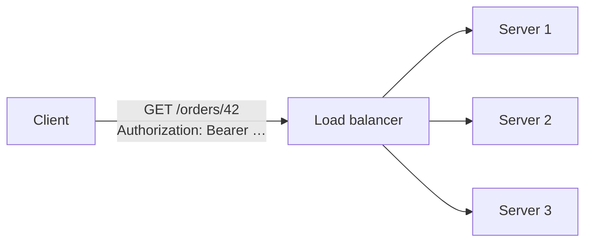

# 10.1 — REST Principles: Resources, Statelessness, Uniform Interface

> **[← Roadmap](../../ROADMAP.md)** · **Section:** [10. Web API Design and REST](../../ROADMAP.md#10-web-api-design-and-rest)
> **Prev:** [9.10 Front-end integration](../09-mvc-razor-views/9.10-frontend-integration.md) · **Next:** [10.2 HTTP verbs and idempotency](10.02-http-verbs-idempotency.md)

**Markers:** 🔥 🎯 · **Confidence:** 🔴 · **Last reviewed:** —

---

## TL;DR

**REST** is an architectural style for APIs where you expose **things** (resources) at **URLs**,
and act on them with **standard HTTP verbs** instead of inventing your own operations.

- The URL names a **noun**, not a verb: `/orders/42`, never `/getOrder?id=42`.
- **Stateless** — every request carries everything the server needs. The server remembers nothing between requests.
- Most "REST APIs" are really **HTTP APIs** — genuinely RESTful means hypermedia too, and almost nobody does that. Say so honestly.

---

## Definitions

| Term | What it is | What it means |
|---|---|---|
| **REST** | *an architectural style* | A set of constraints for designing networked APIs. Not a protocol, not a standard. |
| **Resource** | *a concept* | Any thing your API exposes — an order, a user, a report. |
| **URI / endpoint** | *an address* | The identifier for a resource: `/orders/42`. |
| **Representation** | *a concept* | The format a resource is sent in — JSON, XML. The resource is not the JSON. |
| **Stateless** | *a constraint* | The server keeps no client session between requests. |
| **Uniform interface** | *a constraint* | The same small set of verbs and conventions works across all resources. |
| **Idempotent** | *a property* | Doing it twice has the same effect as doing it once. |
| **Safe** | *a property* | Does not change anything on the server. |
| **HATEOAS** | *a constraint* | Responses include links telling the client what it can do next. |
| **Richardson Maturity Model** | *a classification* | Levels 0–3 measuring how RESTful an API actually is. |
| **RPC** | *the alternative style* | The URL names an **operation**: `/api/calculateTax`. |

---

## The concept

### The core idea

REST asks you to think in **nouns, not verbs**.

An RPC-style API invents a method name for every operation:

```
POST /api/getOrder
POST /api/createOrder
POST /api/cancelOrder
POST /api/updateOrderAddress
```

Every one of those is a new thing the client must learn. Nothing about `getOrder` tells a caller
whether it is safe to retry, whether the result can be cached, or what happens if it runs twice.

A REST API names the **resource** and uses HTTP's existing verbs:

```
GET    /orders/42        → read it
POST   /orders           → create one
PUT    /orders/42        → replace it
PATCH  /orders/42        → change part of it
DELETE /orders/42        → remove it
```

**The win is that the verbs already have agreed meanings.** Any caller, proxy, cache or load
balancer knows that `GET` is safe to retry and cache, and that `DELETE` is meant to be idempotent —
without knowing anything about orders.

### The analogy

Think of a filing cabinet.

RPC is asking an assistant to "fetch the Smith file", "file the Smith file", "shred the Smith
file" — a new instruction each time, and the assistant has to know what each means.

REST gives every folder a location and uses four standard gestures: look at it, add one, replace
it, throw it away. Anyone who understands the gestures can work the cabinet, whatever is in it.

---

## How it works

### The simple version — designing the URLs

| Do | Don't |
|---|---|
| `/orders` | `/getAllOrders` |
| `/orders/42` | `/order?id=42` |
| `/orders/42/lines` | `/getOrderLines?orderId=42` |
| `/orders/42/lines/7` | `/orderLine?order=42&line=7` |

The conventions:

- **Plural nouns** — `/orders`, not `/order`. Consistency matters more than the choice itself.
- **Lowercase, hyphenated** — `/purchase-orders`, not `/PurchaseOrders`. Paths are case-sensitive on Linux hosts.
- **Nest to show ownership** — `/orders/42/lines` says lines belong to that order.
- **Stop nesting at two levels.** `/customers/1/orders/42/lines/7/product/9` is unusable. Once a resource has its own identity, give it its own top-level path.
- **Filtering goes in the query string** — `/orders?status=pending&page=2`. It is not a different resource, it is the same collection narrowed.

### Statelessness — the constraint that actually matters

**The server stores nothing about the client between requests.** Every request carries its own
authentication, its own context, everything.



Because no server holds session state, **any server can answer any request**. That is what makes
horizontal scaling work: add a machine, and it can serve traffic immediately with no warm-up and no
sticky sessions ([24.12](../24-devops-hosting/24.12-scaling.md)).

⚠️ **This is the constraint most often broken in practice.** Storing a shopping basket in
`HttpContext.Session` makes the API stateful — and it then works fine on one machine and breaks the
moment you scale out, because request two lands on a server that never saw request one.

**Stateless does not mean the application has no state.** The database has plenty. It means the
*server process* holds no per-client state between requests. A JWT is the usual answer: the client
carries proof of who it is on every call, so the server needs to remember nothing
([15.5](../15-authentication/15.05-jwt-structure.md)).

### How it actually works — the six constraints

Roy Fielding's dissertation defines six. Worth being able to list, but only some matter day to day:

| Constraint | What it means | Matters in practice? |
|---|---|---|
| **Client–server** | Separate concerns; they evolve independently. | ✅ Yes, implicitly |
| **Stateless** | No client session on the server. | ✅ **Yes — the big one** |
| **Cacheable** | Responses say whether they can be cached. | ✅ Yes |
| **Uniform interface** | Standard verbs, resource identifiers, self-describing messages. | ✅ Yes |
| **Layered system** | The client cannot tell if it is talking to the server or a proxy. | ⚠️ Rarely thought about |
| **Code on demand** *(optional)* | The server can send executable code. | ❌ Essentially never |

### The deeper detail — the Richardson Maturity Model, and being honest

| Level | What it looks like |
|---|---|
| **0** | One URL, one verb. SOAP-style. `POST /api` with the operation in the body. |
| **1** | Resources have their own URLs — but everything is still `POST`. |
| **2** | Proper verbs and proper status codes. **This is where almost every real API lives.** |
| **3** | HATEOAS — responses carry links to what you can do next. |

Level 3 looks like this:

```json
{
  "id": 42,
  "status": "pending",
  "total": 99.50,
  "_links": {
    "self":   { "href": "/orders/42" },
    "cancel": { "href": "/orders/42/cancel", "method": "POST" },
    "pay":    { "href": "/orders/42/payment", "method": "POST" }
  }
}
```

The idea is that the client does not hardcode URLs or business rules — it reads the links. If the
order cannot be cancelled, the `cancel` link simply is not there.

⚠️ **Almost no production API does this**, because clients end up hardcoding the URLs anyway and
the extra payload buys little. **Fielding's own position is that an API without hypermedia is not
REST** — which means most "REST APIs", including nearly every one you have used, are Level 2 HTTP
APIs.

**How to handle this in an interview:** say exactly that. "We're at Level 2, which is where most
APIs sit. HATEOAS is the strict definition but the cost rarely pays back outside of long-lived
public APIs." That reads as someone who has thought about it, not someone reciting a definition.

### Where REST is the wrong choice

⚠️ **REST is not universally correct**, and saying so is a maturity signal:

| Situation | Better fit |
|---|---|
| Internal service-to-service, high volume | **gRPC** — binary, faster, contract-first |
| Clients need wildly different field sets | **GraphQL** |
| Event-driven, fire-and-forget | **Messaging** ([23.4](../23-microservices/23.04-async-messaging.md)) |
| Operations that are genuinely not CRUD | **RPC-style endpoints, deliberately** |

That last row matters. Some actions are simply not "create a thing": `POST /orders/42/cancel` is
not REST-pure, but it is clear, and forcing it into `PATCH /orders/42` with
`{"status": "cancelled"}` hides a business operation behind a field assignment — including the fact
that cancelling may refund money and email the customer. **Pragmatism beats purity**; be able to
say why you chose it ([10.14](10.14-rest-vs-grpc-vs-graphql.md)).

---

## Code

```csharp
[ApiController]
[Route("api/orders")]                            // plural noun, lowercase
public sealed class OrdersController : ControllerBase
{
    private readonly IOrderService _orders;

    public OrdersController(IOrderService orders) => _orders = orders;

    // GET /api/orders?status=pending&page=2&pageSize=20
    // Filtering narrows the SAME collection — query string, not a new path
    [HttpGet]
    public async Task<ActionResult<PagedResult<OrderSummaryDto>>> List(
        [FromQuery] OrderQuery query, CancellationToken ct)
        => Ok(await _orders.SearchAsync(query, ct));

    // GET /api/orders/42
    [HttpGet("{id:int}", Name = "GetOrder")]
    public async Task<ActionResult<OrderDto>> Get(int id, CancellationToken ct)
    {
        var order = await _orders.FindAsync(id, ct);
        return order is null ? NotFound() : Ok(order);   // 404 is a valid REST answer
    }

    // POST /api/orders  → 201 Created + Location header
    [HttpPost]
    public async Task<ActionResult<OrderDto>> Create(
        CreateOrderRequest request, CancellationToken ct)
    {
        var created = await _orders.CreateAsync(request, ct);

        // 201 + the URL of the new resource. The client should not have to build it.
        return CreatedAtRoute("GetOrder", new { id = created.Id }, created);
    }

    // PUT /api/orders/42 — full replacement, idempotent
    [HttpPut("{id:int}")]
    public async Task<IActionResult> Replace(
        int id, UpdateOrderRequest request, CancellationToken ct)
    {
        var updated = await _orders.ReplaceAsync(id, request, ct);
        return updated ? NoContent() : NotFound();       // 204 — nothing to return
    }

    // DELETE /api/orders/42 — idempotent: deleting twice is still "gone"
    [HttpDelete("{id:int}")]
    public async Task<IActionResult> Delete(int id, CancellationToken ct)
    {
        await _orders.DeleteAsync(id, ct);
        return NoContent();
    }

    // POST /api/orders/42/cancel
    // ⚠️ Deliberately not REST-pure. Cancelling refunds money and emails the customer —
    // that is a business operation, not a field assignment. Naming it is clearer than
    // hiding it inside PATCH { "status": "cancelled" }.
    [HttpPost("{id:int}/cancel")]
    public async Task<IActionResult> Cancel(int id, CancellationToken ct)
    {
        var result = await _orders.CancelAsync(id, ct);
        return result.Succeeded ? NoContent() : Conflict(result.Reason);
    }
}
```

The two lines worth dwelling on:

**`CreatedAtRoute`** returns 201 *and* a `Location` header pointing at the new resource. The client
gets told where the thing lives rather than having to guess the URL pattern — which is the uniform
interface doing its job.

**`NoContent()` on `PUT` and `DELETE`** returns 204. There is nothing meaningful to send back, and
returning the whole object after a delete is just noise.

---

## Interview questions

**Q: What is REST?**

An architectural style for APIs, not a protocol. You expose resources at URLs that name nouns, and
act on them with the standard HTTP verbs rather than inventing operation names. The key constraints
in practice are statelessness — the server holds no client session, so any instance can serve any
request — a uniform interface, and explicit cacheability. The payoff is that everything in the
chain, from proxies to client libraries, already understands what `GET` and `DELETE` mean without
knowing anything about your domain.

**Q: What does stateless mean, and why does it matter?**

The server stores nothing about the client between requests — each request carries its own
authentication and context, usually as a token. It matters because it is what makes horizontal
scaling work: with no server-side session, any instance can handle any request, so you can add
machines freely and lose one without losing user state. The usual way people break it is putting
data in `HttpContext.Session`, which works perfectly on one server and fails as soon as you scale
out, because the next request lands somewhere that never saw the first.

**Q: What is HATEOAS, and do you use it?**

It is the constraint that responses carry links describing what the client can do next, so the
client follows links rather than hardcoding URLs and business rules — if an order cannot be
cancelled, the cancel link simply is not present. Honestly, I have not used it in production and
almost nobody does. By Fielding's strict definition an API without it is not REST, which means most
"REST APIs" including ours are really Level 2 HTTP APIs. It is worth knowing the distinction, but
the cost rarely pays back outside long-lived public APIs with clients you do not control.

**Q: Is REST always the right choice?**

No. For high-volume internal service-to-service calls gRPC is usually better — binary, contract-first,
and much faster. When clients need very different subsets of the same data, GraphQL avoids the
over-fetching and endpoint sprawl. Anything fire-and-forget belongs on a message bus rather than a
synchronous call. And even inside a REST API, some operations are genuinely not CRUD: I would
rather have `POST /orders/42/cancel` than force a business action that refunds money and sends an
email into a `PATCH` that sets a status field.

---

## Traps ⚠️

- **Verbs in the URL** — `/getOrders`, `/createUser`. That is RPC wearing REST's clothes.
- **`HttpContext.Session` in an API** breaks statelessness and fails on scale-out.
- **Deep nesting** — `/customers/1/orders/42/lines/7/product/9` is unusable.
- **Claiming your API is RESTful when it is Level 2.** Know the distinction; state it honestly.
- **Filtering as a separate path** — `/orders/pending` instead of `/orders?status=pending`.
- **Everything returning 200** with a success flag in the body defeats the uniform interface.
- **Forcing genuine business operations into CRUD** hides what they actually do.
- **Inconsistent pluralisation** — `/order/42` next to `/customers/1`.
- **Mixed casing** — paths are case-sensitive on Linux, so `/Orders` and `/orders` differ.

---

## Related

- [10.2 HTTP verbs and idempotency](10.02-http-verbs-idempotency.md) — what each verb promises
- [10.3 Status codes](10.03-status-codes.md) — the other half of the uniform interface
- [10.7 Pagination and filtering](10.07-pagination-filtering.md) — collection conventions
- [10.14 REST vs gRPC vs GraphQL](10.14-rest-vs-grpc-vs-graphql.md) — when not to use REST
- [24.12 Scaling](../24-devops-hosting/24.12-scaling.md) — why statelessness pays off
- [15.5 JWT structure](../15-authentication/15.05-jwt-structure.md) — stateless authentication
- [23.4 Async messaging](../23-microservices/23.04-async-messaging.md) — the non-synchronous option
- [22.9 CQRS](../22-architecture-patterns/22.09-cqrs.md) — when reads and writes diverge

---

## Sources

- [Roy Fielding — Architectural Styles (Ch. 5)](https://ics.uci.edu/~fielding/pubs/dissertation/rest_arch_style.htm)
- [Microsoft — RESTful web API design](https://learn.microsoft.com/azure/architecture/best-practices/api-design)
- [Martin Fowler — Richardson Maturity Model](https://martinfowler.com/articles/richardsonMaturityModel.html)
