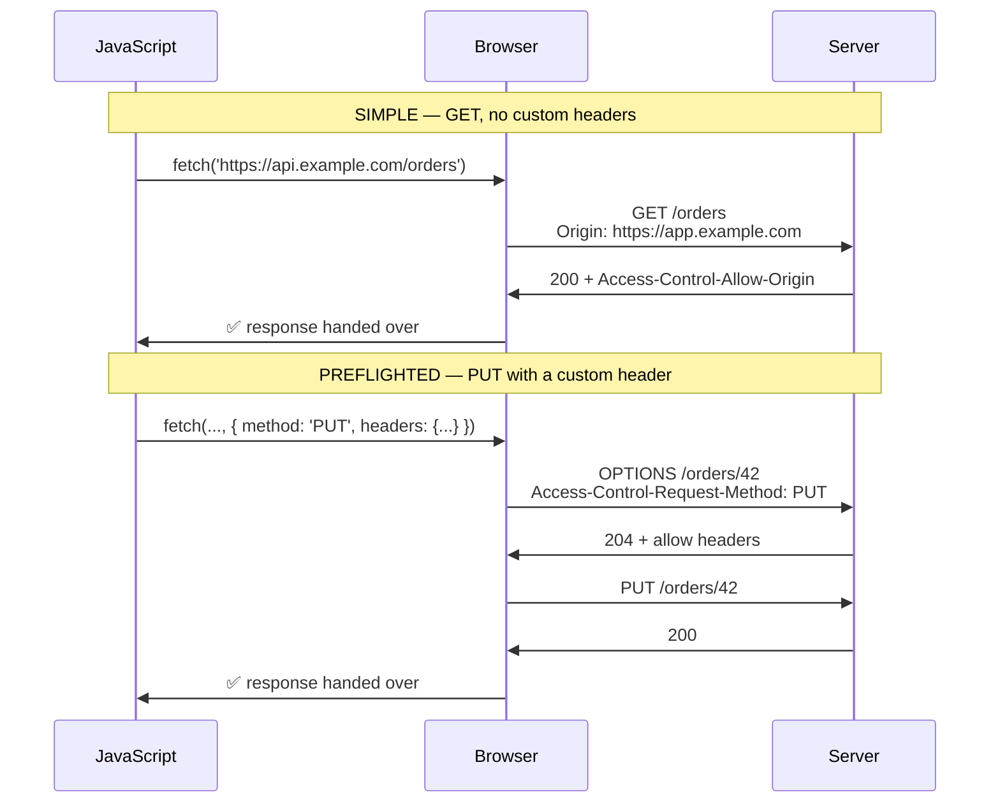

# 10.10 — CORS: Preflight, Policies and Common Misconfigurations

> **[← Roadmap](../../ROADMAP.md)** · **Section:** [10. Web API Design and REST](../../ROADMAP.md#10-web-api-design-and-rest)
> **Prev:** [10.9 OpenAPI and Swagger](10.09-openapi-swagger.md) · **Next:** [10.11 DTOs and mapping](10.11-dtos-and-mapping.md)

**Markers:** 🔥 ⚠️ 🎯 · **Confidence:** 🔴 · **Last reviewed:** —

---

## TL;DR

**CORS** (Cross-Origin Resource Sharing) is how a server tells a **browser** that a page from
another origin is allowed to read its responses.

- It is enforced **by the browser, not by your server**. Postman, curl and other servers ignore it entirely.
- **CORS relaxes a browser restriction — it is not a security feature of your API.** It cannot protect anything.
- The two things that go wrong: **`UseCors` in the wrong pipeline position**, and **`AllowAnyOrigin()` with `AllowCredentials()`**, which throws.

---

## Definitions

| Term | What it is | What it means |
|---|---|---|
| **Origin** | *a browser concept* | Scheme + host + port. All three must match. |
| **Same-origin policy** | *a browser rule* | A page may not read responses from another origin by default. |
| **CORS** | *a mechanism* | Response headers that relax that rule for named origins. |
| **Preflight** | *an extra request* | An automatic `OPTIONS` asking permission before the real request. |
| **Simple request** | *a classification* | A request that skips preflight. |
| **`Access-Control-Allow-Origin`** | *a response header* | Which origin may read this response. |
| **`Access-Control-Allow-Credentials`** | *a response header* | Whether cookies may be sent. |
| **`Access-Control-Expose-Headers`** | *a response header* | Which custom headers JS may read. |
| **`Access-Control-Max-Age`** | *a response header* | How long a preflight result may be cached. |
| **`AddCors` / `UseCors`** | *DI and middleware calls* | Register the policies; apply them. |
| **`[EnableCors]` / `[DisableCors]`** | *attributes* | Per-endpoint policy control. |

---

## The concept

### What the browser is actually protecting

A page at `evil.com` runs JavaScript. It calls `yourbank.com/api/balance`. The browser sends the
request **with the user's cookies**, because cookies go to their own domain regardless of who
triggered the request.

Without the same-origin policy, `evil.com` reads the response and gets the balance.

**The same-origin policy stops the *reading*, not the sending.** That distinction matters:

⚠️ **The request often still reaches your server and still executes.** For a simple request, the
browser sends it, gets the response, checks the CORS headers, and — finding none — refuses to hand
the body to the JavaScript. **The side effect already happened.** CORS did not prevent it.

**That is why CORS is not a defence against CSRF.** Antiforgery tokens and `SameSite` cookies are
([17.4](../17-application-security/17.04-csrf.md)).

### The analogy

CORS is a **guest list at the door of the reader's own building**, not a lock on your API.

The browser is the doorman. It refuses to carry your response back to a script from an unlisted
origin. But the doorman only works for people who employ one — a server, a script, or curl walks in
regardless. **CORS restricts browsers, and only browsers.**

⚠️ **This is the single most misunderstood point.** "We added CORS so the API is secure" is wrong,
and it is exactly the misconception an interviewer is checking for. Authentication and
authorization protect your API ([16.1](../16-authorization/16.01-authorize-attribute.md)); CORS
just permits legitimate browser clients.

---

## How it works

### Simple requests vs preflight



A request is **simple** — and skips preflight — only if all of these hold:

- Method is `GET`, `HEAD` or `POST`.
- Headers are only from the CORS-safelisted set (`Accept`, `Content-Language`, `Content-Type`, …).
- `Content-Type` is `application/x-www-form-urlencoded`, `multipart/form-data` or `text/plain`.

⚠️ **`Content-Type: application/json` is NOT on that list.** So essentially every JSON API call is
preflighted — two round trips per request. That is why `Access-Control-Max-Age` matters: it lets
the browser cache the preflight result.

⚠️ **But browsers cap it.** Chrome allows a maximum of 2 hours (7200 seconds) regardless of what
you send; Firefox 24 hours. Setting a week is silently clamped.

### The two configuration mistakes

**Mistake 1 — pipeline position.**

```csharp
// ⚠️ WRONG
app.UseRouting();
app.UseAuthentication();
app.UseAuthorization();
app.UseCors("Spa");        // ← too late
app.MapControllers();
```

The preflight `OPTIONS` request carries **no credentials** — browsers never attach them to a
preflight. So `UseAuthorization` sees an anonymous request to a protected endpoint and returns 401,
**before CORS ever runs**. The browser sees a failed preflight and blocks the real request.

The symptom is maddening: *"CORS works for my public endpoints and fails for authenticated ones."*

```csharp
// ✅ RIGHT
app.UseRouting();
app.UseCors("Spa");        // after UseRouting, before auth
app.UseAuthentication();
app.UseAuthorization();
app.MapControllers();
```

⚠️ **`UseCors` must be after `UseRouting` and before `UseAuthentication`**
([5.2](../05-middleware-pipeline/5.02-middleware-order.md)). After routing, because per-endpoint
CORS policies need the matched endpoint; before auth, so preflights are answered without
authentication.

**Mistake 2 — wildcard plus credentials.**

```csharp
// ⚠️ Throws at runtime — the CORS spec forbids this combination
policy.AllowAnyOrigin().AllowCredentials();
```

The spec bans it because `Access-Control-Allow-Origin: *` with credentials would let **any** site
make authenticated requests as the logged-in user and read the responses. That is the exact attack
the same-origin policy exists to prevent.

ASP.NET Core throws rather than emitting an insecure header — a good design choice, since the
failure is loud.

```csharp
// ✅ Name the origins
policy.WithOrigins("https://app.example.com", "https://admin.example.com")
      .AllowCredentials();
```

⚠️ **`SetIsOriginAllowed(_ => true)` with credentials is the dangerous workaround people find.** It
reflects whatever `Origin` the caller sent back as `Access-Control-Allow-Origin`, which is
functionally "allow any origin with credentials" while sidestepping the guard. **It is a real
vulnerability**, and it shows up in production more often than it should.

### The details that produce support tickets

**Origins are exact.** No trailing slash, no path, scheme and port included:

```csharp
policy.WithOrigins(
    "https://app.example.com",         // ✅
    "https://app.example.com/",        // ⚠️ trailing slash — never matches
    "app.example.com",                 // ⚠️ no scheme — never matches
    "http://localhost:3000");          // port is part of the origin
```

`https://app.example.com` and `https://app.example.com:443` are the same origin (default port), but
`http://localhost:3000` and `http://localhost:5173` are different.

**Custom response headers are invisible to JavaScript by default.** Only a handful are exposed. A
`X-Total-Count` pagination header is sent, arrives, and `response.headers.get('X-Total-Count')`
returns `null` ([10.7](10.07-pagination-filtering.md)):

```csharp
policy.WithExposedHeaders("X-Total-Count", "X-Pagination", "Location");
```

⚠️ **`Location` is not exposed by default either**, which breaks clients trying to read the URL
from a 201 Created.

**An error response with no CORS headers reports as a CORS error.** If your API throws before the
CORS middleware adds its headers, the browser cannot read the response and reports "blocked by
CORS" — hiding the actual 500. The lesson: **check the server logs before debugging CORS**, because
the browser message is often about a different problem entirely.

### The deeper detail — per-endpoint policies

```csharp
builder.Services.AddCors(options =>
{
    // The default — applied by a parameterless UseCors()
    options.AddDefaultPolicy(policy => policy
        .WithOrigins("https://app.example.com")
        .AllowAnyHeader()
        .AllowAnyMethod()
        .AllowCredentials());

    // A wider policy for genuinely public, unauthenticated data
    options.AddPolicy("PublicRead", policy => policy
        .AllowAnyOrigin()          // safe here — NO credentials
        .WithMethods("GET")
        .WithHeaders("Content-Type"));
});
```

```csharp
[EnableCors("PublicRead")]
[HttpGet("public/status")]
public IActionResult Status() => Ok(new { status = "ok" });

[DisableCors]
[HttpPost("internal/reindex")]
public IActionResult Reindex() => Accepted();
```

⚠️ **`[DisableCors]` does not make an endpoint unreachable.** It stops *browsers* calling it from
other origins. Anything that is not a browser is unaffected. If it must be internal-only, that is
authentication and network policy, not CORS.

---

## Code

```csharp
var builder = WebApplication.CreateBuilder(args);

// Origins from configuration — different per environment, and never hardcoded
var allowedOrigins = builder.Configuration
    .GetSection("Cors:AllowedOrigins").Get<string[]>() ?? [];

builder.Services.AddCors(options =>
{
    options.AddPolicy("Spa", policy =>
    {
        policy.WithOrigins(allowedOrigins)      // exact, no trailing slashes
              .AllowAnyHeader()
              .AllowAnyMethod()
              .AllowCredentials()               // ⚠️ requires named origins
              // Without this, JS reading these headers gets null
              .WithExposedHeaders("X-Total-Count", "Location", "X-Api-Version")
              // Cache preflights. Chrome caps at 2h regardless of what we send.
              .SetPreflightMaxAge(TimeSpan.FromHours(2));
    });
});

var app = builder.Build();

app.UseRouting();

// ⚠️ AFTER UseRouting (per-endpoint policies need the matched endpoint)
// ⚠️ BEFORE UseAuthentication (preflights carry no credentials and would 401)
app.UseCors("Spa");

app.UseAuthentication();
app.UseAuthorization();

app.MapControllers();
app.Run();
```

```json
// appsettings.Development.json
{ "Cors": { "AllowedOrigins": [ "http://localhost:5173", "http://localhost:3000" ] } }

// appsettings.Production.json
{ "Cors": { "AllowedOrigins": [ "https://app.example.com" ] } }
```

Reading the exposed header on the client — the part that fails silently without `WithExposedHeaders`:

```javascript
const response = await fetch('https://api.example.com/orders?page=2', {
  credentials: 'include'          // sends cookies → requires AllowCredentials server-side
});

// null unless the server listed it in Access-Control-Expose-Headers
const total = response.headers.get('X-Total-Count');
```

If a wildcard subdomain is genuinely required — validate, never reflect:

```csharp
policy.SetIsOriginAllowed(origin =>
{
    // ⚠️ NEVER `_ => true` with credentials. That reflects any origin and is
    // functionally "allow everything", bypassing the spec's guard.
    if (!Uri.TryCreate(origin, UriKind.Absolute, out var uri)) return false;

    return uri.Scheme == "https"
        && (uri.Host == "example.com" || uri.Host.EndsWith(".example.com",
               StringComparison.OrdinalIgnoreCase));
})
.AllowCredentials();
```

⚠️ **`EndsWith(".example.com")` is deliberate.** Checking `Contains("example.com")` would match
`example.com.evil.net`, and omitting the leading dot would match `notexample.com`. Subdomain
matching is where these checks usually go wrong.

---

## Interview questions

**Q: What is CORS and what problem does it solve?**

The browser's same-origin policy stops a page reading responses from a different origin, which is
what prevents a malicious site reading your bank balance using your cookies. CORS is the mechanism
for relaxing that deliberately: the server sends `Access-Control-Allow-Origin` and related headers
saying which origins may read its responses. The essential point is that it is enforced by the
browser, not the server — curl, Postman and other servers ignore it completely — so it is not a
security feature of your API. It permits legitimate browser clients; it protects nothing.

**Q: What is a preflight request?**

For anything that is not a simple request, the browser first sends an automatic `OPTIONS` asking
whether the real request is permitted, with `Access-Control-Request-Method` and
`-Request-Headers`. Only if the server approves does the real request go out. A request is simple
only for `GET`, `HEAD` or `POST` with safelisted headers and one of three content types — and
`application/json` is not one of them, so effectively every JSON API call is preflighted. That is
two round trips, which is what `Access-Control-Max-Age` mitigates, though browsers cap it at a
couple of hours.

**Q: What are the two mistakes people make configuring it?**

Pipeline position and the credentials wildcard. `UseCors` has to sit after `UseRouting` and before
`UseAuthentication` — put it after authorization and preflights, which carry no credentials, get
401'd before CORS runs, so it works for public endpoints and mysteriously fails for authenticated
ones. And `AllowAnyOrigin()` with `AllowCredentials()` throws, because the spec forbids the
combination; the dangerous workaround people find is `SetIsOriginAllowed(_ => true)`, which reflects
any origin back and is a genuine vulnerability rather than a config shortcut.

**Q: Does CORS protect against CSRF?**

No, and the reason is worth being precise about. The same-origin policy blocks the *reading* of the
response, not the *sending* of the request — for a simple request the browser sends it with cookies
attached and the server executes it, then withholds the body from the script. The side effect has
already happened. CSRF defence is antiforgery tokens and `SameSite` cookies. CORS being in place
does not help.

---

## Traps ⚠️

- **`UseCors` after `UseAuthorization`** — preflights get 401'd.
- **`UseCors` before `UseRouting`** — per-endpoint policies do not resolve.
- **`AllowAnyOrigin()` + `AllowCredentials()`** throws at runtime.
- **`SetIsOriginAllowed(_ => true)` with credentials** is a real vulnerability.
- **Trailing slash on an origin** — never matches.
- **Missing scheme or port** — never matches.
- **Custom headers invisible to JS** without `WithExposedHeaders` — including `Location`.
- **Believing CORS secures the API.** It restricts browsers only.
- **Believing CORS stops CSRF.** It does not.
- **A 500 with no CORS headers reports as a CORS error**, hiding the real failure.
- **`Access-Control-Max-Age` above the browser cap** is silently clamped.
- **`[DisableCors]` does not make an endpoint private.**
- **Subdomain matching with `Contains`** matches `example.com.evil.net`.

---

## Related

- [10.1 REST principles](10.01-rest-principles.md) — same-origin vs separate deployment
- [10.7 Pagination](10.07-pagination-filtering.md) — why `X-Total-Count` is invisible
- [9.10 Front-end integration](../09-mvc-razor-views/9.10-frontend-integration.md) — the hosting models
- [5.2 Middleware order](../05-middleware-pipeline/5.02-middleware-order.md) — where `UseCors` goes
- [17.4 CSRF](../17-application-security/17.04-csrf.md) — what actually stops CSRF
- [16.1 `[Authorize]`](../16-authorization/16.01-authorize-attribute.md) — what actually protects the API
- [15.12 Token storage](../15-authentication/15.12-token-storage.md) — cookies vs bearer tokens
- [17.9 Security headers](../17-application-security/17.09-security-headers.md) — the wider set

---

## Sources

- [Microsoft Learn — Enable CORS in ASP.NET Core](https://learn.microsoft.com/aspnet/core/security/cors)
- [MDN — Cross-Origin Resource Sharing](https://developer.mozilla.org/docs/Web/HTTP/CORS)
- [Fetch Standard — CORS protocol](https://fetch.spec.whatwg.org/#http-cors-protocol)
