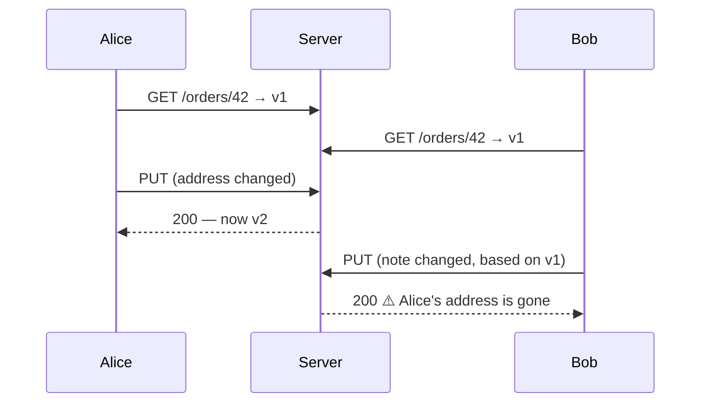

# 10.13 — Idempotency Keys, `ETag` and `If-Match`

> **[← Roadmap](../../ROADMAP.md)** · **Section:** [10. Web API Design and REST](../../ROADMAP.md#10-web-api-design-and-rest)
> **Prev:** [10.12 Minimal APIs](10.12-minimal-apis.md) · **Next:** [10.14 REST vs gRPC vs GraphQL](10.14-rest-vs-grpc-vs-graphql.md)

**Markers:** 🧠 · **Confidence:** 🔴 · **Last reviewed:** —

---

## TL;DR

Two mechanisms for two different problems, both about requests colliding with reality.

- **Idempotency keys** make a `POST` safe to retry. The client sends a unique ID; the server stores the result against it and replays it on a repeat.
- **`ETag` + `If-Match`** is optimistic concurrency over HTTP. The client says "update this only if it is still the version I read" — and gets **412** if not.
- **`ETag` + `If-None-Match`** is caching: **304 Not Modified**, no body, on an unchanged resource.

---

## Definitions

| Term | What it is | What it means |
|---|---|---|
| **Idempotency key** | *a client-generated ID* | Identifies one logical operation, so retries are recognised. |
| **`Idempotency-Key`** | *a request header* | Where that ID is sent. Conventional, not yet a ratified standard. |
| **`ETag`** | *a response header* | An opaque version marker for the current state of a resource. |
| **Strong ETag** | *a form* | `"abc123"` — byte-for-byte identical. |
| **Weak ETag** | *a form* | `W/"abc123"` — semantically equivalent, not necessarily identical. |
| **`If-Match`** | *a request header* | Do this only if the ETag still matches. Concurrency. |
| **`If-None-Match`** | *a request header* | Send a body only if it changed. Caching. |
| **412 Precondition Failed** | *a status code* | `If-Match` did not match — someone else got there first. |
| **304 Not Modified** | *a status code* | `If-None-Match` matched — use your cached copy. |
| **428 Precondition Required** | *a status code* | We require `If-Match` and you did not send one. |
| **Optimistic concurrency** | *a strategy* | Allow conflicts, detect them at write time. |
| **Lost update** | *a bug* | Two edits, the second silently overwrites the first. |

---

## The concept

### Problem 1 — the retry that charges twice

A client `POST`s a payment. The connection drops before the response arrives. **The client has no
idea whether the charge happened** ([10.2](10.02-http-verbs-idempotency.md)).

Retry, and you may charge twice. Do not retry, and the payment may never have happened.

**The idempotency key breaks the deadlock.** The client generates a unique ID *before* the first
attempt and sends it with every retry:

```http
POST /api/payments
Idempotency-Key: 0f8fad5b-d9cb-469f-a165-70867728950e

{ "amount": 5000, "currency": "GBP", "accountId": 4711 }
```

The server records the key with the outcome. A second request with that key returns **the stored
response**, without re-charging. Retrying becomes safe, so the client can retry freely.

⚠️ **The key must be generated by the client, once per logical operation, before the first
attempt.** Generating a fresh key per retry defeats the entire mechanism — which is the mistake to
watch for.

### Problem 2 — the lost update

Two people open order 42. Alice changes the delivery address; Bob changes the note. Both save.



**Bob's save was built on stale data and silently discarded Alice's change.** Nobody sees an error.

`ETag` and `If-Match` make it visible:

```http
GET /api/orders/42
→ 200 OK
  ETag: "v1-8fa1c2d3"

PUT /api/orders/42
If-Match: "v1-8fa1c2d3"

→ 412 Precondition Failed     ⚠️ someone else changed it — refetch and retry
```

### The analogy

The **idempotency key** is a cheque number. Present the same cheque twice and the bank pays once,
because it recognises the number.

The **ETag** is a signature on the version you read. Hand back an edit signed against an old
version and the clerk refuses it rather than quietly discarding the newer one.

---

## How it works

### Idempotency keys — the details that matter

**Where to store them.** Redis with a TTL is the usual answer — typically 24 hours, matching how
long a client might reasonably retry ([19.3](../19-caching-performance/19.03-distributed-cache-redis.md)).
A database table works and gives durability, at the cost of a write per request.

**What to store.** The status code, the response body, and **a hash of the request**.

⚠️ **The request hash is the part people leave out, and it matters.** Without it, a client that
reuses a key with a *different* body gets the first response back for an operation that never
happened. Comparing hashes lets you return **422** — "this key was used for a different request" —
rather than a wrong answer.

**Concurrent retries.** A client can retry before the first request has finished.

⚠️ **Two in-flight requests with the same key must not both execute.** The reservation must be
atomic — Redis `SET key value NX` or a unique constraint — and the second request should either wait
or return **409**. Checking "does this key exist?" and then inserting is a race with a real window.

**Scope keys per client.** Two customers can generate the same GUID, in theory, and a shared key
space is also a way to read someone else's stored response. Prefix with the authenticated client ID.

### `ETag` — strong vs weak, and where the value comes from

```http
ETag: "8fa1c2d3e4f5"        ← strong: byte-for-byte identical
ETag: W/"8fa1c2d3e4f5"      ← weak: semantically equivalent
```

⚠️ **`If-Match` requires a strong comparison; `If-None-Match` allows a weak one.** So a weak ETag
works for caching but is not sufficient for concurrency control.

Where the value comes from, in ascending order of quality:

| Source | Notes |
|---|---|
| **Hash of the serialized response** | ✅ Always correct, ⚠️ requires generating the response first |
| **A `rowversion` / `timestamp` column** | ✅ **Best** — the database maintains it ([13.13](../13-entity-framework-core/13.13-concurrency.md)) |
| **`LastModified` + `Id`** | ⚠️ Timestamp precision can hide same-second edits |
| **A version integer** | ✅ Fine, if incremented reliably on every write |

⚠️ **Hashing the response only saves bandwidth, not work** — you still did the query and the
serialization. The saving is real (no body over the wire, and the client skips parsing), but a
version column lets you answer 304 before doing the expensive part.

### Two headers, two completely different jobs

| | `If-Match` | `If-None-Match` |
|---|---|---|
| Used with | `PUT`, `PATCH`, `DELETE` | `GET` |
| Means | "Only if it is still this version" | "Only if it has changed" |
| Match → | ✅ Proceed | **304 Not Modified** |
| No match → | **412 Precondition Failed** | ✅ 200 with the body |
| Purpose | **Concurrency** | **Caching** |

⚠️ **Mixing them up is the classic error.** `If-None-Match` on a `PUT` does not protect against a
lost update — it means "only if it changed", which is the opposite of what you want.

**428 Precondition Required** is the one to know for a well-designed write endpoint: if `If-Match`
is *absent*, returning 428 forces the client to opt into concurrency checking rather than silently
allowing a blind overwrite.

### The deeper detail — how they fit together

They solve different halves of the same family of problems:

| | Idempotency key | `ETag` + `If-Match` |
|---|---|---|
| Protects against | **Duplicate** execution | **Lost updates** |
| Verb | `POST` | `PUT`, `PATCH`, `DELETE` |
| Generated by | The **client** | The **server** |
| Failure code | 409 (in flight) / 422 (key reuse) | **412** |
| Storage | Key → response, with TTL | Usually a `rowversion` column |

A payment endpoint often wants both: an idempotency key so the retry does not double-charge, and an
ETag on the account so the balance you read is the balance you are updating.

⚠️ **Neither replaces a database transaction.** They are protocol-level protections; the actual
atomicity still lives in the data layer ([13.12](../13-entity-framework-core/13.12-transactions-savechanges.md)).

---

## Code

An idempotency filter:

```csharp
public sealed class IdempotencyFilter : IAsyncActionFilter
{
    private readonly IDistributedCache _cache;
    private static readonly TimeSpan Ttl = TimeSpan.FromHours(24);

    public IdempotencyFilter(IDistributedCache cache) => _cache = cache;

    public async Task OnActionExecutionAsync(
        ActionExecutingContext context, ActionExecutionDelegate next)
    {
        var header = context.HttpContext.Request.Headers["Idempotency-Key"].FirstOrDefault();

        if (string.IsNullOrWhiteSpace(header))
        {
            context.Result = new BadRequestObjectResult(new ProblemDetails
            {
                Title  = "Idempotency-Key header is required",
                Status = StatusCodes.Status400BadRequest
            });
            return;
        }

        // ⚠️ Scope by client — two customers can pick the same GUID, and a shared
        // key space would also let one read another's stored response.
        var clientId = context.HttpContext.User.FindFirst("client_id")?.Value ?? "anon";
        var cacheKey = $"idem:{clientId}:{header}";

        var requestHash = await HashRequestBodyAsync(context.HttpContext.Request);

        var cached = await _cache.GetStringAsync(cacheKey);
        if (cached is not null)
        {
            var stored = JsonSerializer.Deserialize<StoredResponse>(cached)!;

            // ⚠️ Same key, different body → the client made a mistake. Do NOT
            // return the old response for an operation they did not request.
            if (stored.RequestHash != requestHash)
            {
                context.Result = new ObjectResult(new ProblemDetails
                {
                    Title  = "Idempotency key reused with a different request body",
                    Status = StatusCodes.Status422UnprocessableEntity
                }) { StatusCode = StatusCodes.Status422UnprocessableEntity };
                return;
            }

            if (stored.InProgress)
            {
                // A retry arrived while the first is still running
                context.Result = new ConflictObjectResult(new ProblemDetails
                {
                    Title  = "A request with this idempotency key is still in progress",
                    Status = StatusCodes.Status409Conflict
                });
                return;
            }

            context.Result = new ContentResult
            {
                StatusCode  = stored.StatusCode,
                Content     = stored.Body,
                ContentType = "application/json"
            };
            return;
        }

        // ⚠️ Atomic reservation. A get-then-set here is a race: two concurrent
        // retries would both find nothing and both execute.
        var reserved = await TryReserveAsync(cacheKey, requestHash, Ttl);
        if (!reserved)
        {
            context.Result = new ConflictObjectResult(new ProblemDetails
            {
                Title  = "A request with this idempotency key is already in progress",
                Status = StatusCodes.Status409Conflict
            });
            return;
        }

        var executed = await next();

        // Only successful outcomes are worth replaying. Caching a 500 would make a
        // transient failure permanent for that key.
        if (executed.Result is ObjectResult { StatusCode: >= 200 and < 300 } ok)
        {
            await _cache.SetStringAsync(cacheKey, JsonSerializer.Serialize(new StoredResponse
            {
                StatusCode  = ok.StatusCode ?? 200,
                Body        = JsonSerializer.Serialize(ok.Value),
                RequestHash = requestHash,
                InProgress  = false
            }), new DistributedCacheEntryOptions { AbsoluteExpirationRelativeToNow = Ttl });
        }
        else
        {
            // Release the reservation so a corrected retry can proceed
            await _cache.RemoveAsync(cacheKey);
        }
    }
}
```

ETag concurrency, backed by a `rowversion` column:

```csharp
[HttpGet("{id:int}")]
public async Task<IActionResult> Get(int id, CancellationToken ct)
{
    var order = await _db.Orders.AsNoTracking()
        .FirstOrDefaultAsync(o => o.Id == id, ct);
    if (order is null) return NotFound();

    // rowversion is maintained by the database on every write — so it is
    // always current, and cheap to read.
    var etag = $"\"{Convert.ToBase64String(order.RowVersion)}\"";

    // If-None-Match: caching. Unchanged → 304, no body sent at all.
    var ifNoneMatch = Request.Headers.IfNoneMatch.FirstOrDefault();
    if (ifNoneMatch == etag) return StatusCode(StatusCodes.Status304NotModified);

    Response.Headers.ETag = etag;
    return Ok(order.ToDto());
}

[HttpPut("{id:int}")]
public async Task<IActionResult> Update(
    int id, UpdateOrderRequest request, CancellationToken ct)
{
    var ifMatch = Request.Headers.IfMatch.FirstOrDefault();

    // 428 — require the client to opt into concurrency checking rather than
    // silently permitting a blind overwrite.
    if (string.IsNullOrEmpty(ifMatch))
    {
        return StatusCode(StatusCodes.Status428PreconditionRequired, new ProblemDetails
        {
            Title  = "If-Match header is required",
            Detail = "GET the resource first and send its ETag in If-Match.",
            Status = StatusCodes.Status428PreconditionRequired
        });
    }

    var order = await _db.Orders.FirstOrDefaultAsync(o => o.Id == id, ct);
    if (order is null) return NotFound();

    // Tell EF what version the client thinks it is editing. SaveChanges then
    // emits WHERE Id = @id AND RowVersion = @original — zero rows means a clash.
    _db.Entry(order).Property(o => o.RowVersion).OriginalValue =
        Convert.FromBase64String(ifMatch.Trim('"'));

    order.DeliveryNote = request.DeliveryNote;

    try
    {
        await _db.SaveChangesAsync(ct);
        Response.Headers.ETag = $"\"{Convert.ToBase64String(order.RowVersion)}\"";
        return NoContent();
    }
    catch (DbUpdateConcurrencyException)
    {
        // 412 — someone else saved first. The client refetches and decides.
        return StatusCode(StatusCodes.Status412PreconditionFailed, new ProblemDetails
        {
            Title  = "The resource was modified by another request",
            Detail = "Fetch the current version and reapply your changes.",
            Status = StatusCodes.Status412PreconditionFailed
        });
    }
}
```

⚠️ **`Trim('"')` on the incoming `If-Match` is necessary and easy to forget** — the header value
includes the quotes, and a Base64 string with a quote on each end will not parse.

---

## Interview questions

**Q: How do you make a payment endpoint safe to retry?**

An idempotency key. The client generates a unique ID once per logical operation, before the first
attempt, and sends it on every retry; the server stores the outcome against that key with a TTL —
usually 24 hours in Redis — and replays the stored response on a repeat rather than charging again.
Two details make or break it: store a hash of the request body alongside the key, so that reusing a
key with a different body returns 422 instead of the wrong stored answer; and reserve the key
atomically, because a client can retry before the first request has finished and a check-then-insert
is a real race.

**Q: What is an `ETag` and what is `If-Match` for?**

The ETag is an opaque version marker the server sends with a resource. `If-Match` on a write means
"apply this only if the resource is still that version" — if someone else has saved in the meantime
the server returns 412 and the client refetches and reapplies. That is optimistic concurrency at the
HTTP level, and it is what prevents a lost update where two people edit the same record and the
second save silently discards the first. The natural source for the value is a `rowversion` column,
because the database maintains it on every write and EF Core will already do the conflict detection.

**Q: What is the difference between `If-Match` and `If-None-Match`?**

Different jobs entirely. `If-Match` is for writes and concurrency: proceed only if the version still
matches, otherwise 412. `If-None-Match` is for reads and caching: send the body only if it has
changed, otherwise 304 with no body. Mixing them up is a classic error, because `If-None-Match` on a
`PUT` reads as "only if it changed", which is the opposite of what a concurrency check needs. There
is also a subtlety about ETag strength — `If-Match` requires a strong comparison, so a weak ETag is
fine for caching but not sufficient for concurrency.

**Q: Where do you store idempotency keys, and for how long?**

Redis with a TTL is the usual choice, typically around 24 hours, which is about as long as a client
might sensibly keep retrying — a database table works too and gives durability at the cost of a
write per request. Store the status code, the response body and the request hash. Scope the key by
authenticated client, because two customers can in principle generate the same GUID and a shared
key space is also a way to read someone else's stored response. And only cache successful outcomes:
storing a 500 makes a transient failure permanent for that key.

---

## Traps ⚠️

- **Generating a new idempotency key per retry** defeats the whole mechanism.
- **Not storing a request hash** returns the wrong response when a key is reused.
- **Check-then-insert on the key** is a race — reserve atomically.
- **Caching failed responses** makes a transient failure permanent.
- **Unscoped keys** let one client read another's stored response.
- **No TTL** grows the store forever.
- **`If-None-Match` on a `PUT`** does not protect against lost updates.
- **Weak ETags for concurrency** — `If-Match` needs a strong comparison.
- **Forgetting to strip the quotes** from an incoming `If-Match` value.
- **Allowing a write with no `If-Match`** silently permits blind overwrites. Use 428.
- **ETag from a low-precision timestamp** misses same-second edits.
- **Assuming these replace transactions.** Atomicity still lives in the database.

---

## Related

- [10.2 HTTP verbs and idempotency](10.02-http-verbs-idempotency.md) — why `POST` needs this
- [10.3 Status codes](10.03-status-codes.md) — 304, 409, 412, 422, 428
- [13.13 Concurrency](../13-entity-framework-core/13.13-concurrency.md) — `rowversion` in EF Core
- [13.12 Transactions](../13-entity-framework-core/13.12-transactions-savechanges.md) — the real atomicity
- [19.8 ETags](../19-caching-performance/19.08-etags.md) — the caching side in depth
- [19.3 Redis](../19-caching-performance/19.03-distributed-cache-redis.md) — where keys live
- [19.11 Polly resilience](../19-caching-performance/19.11-polly-resilience.md) — the retries this makes safe
- [23.7 Delivery guarantees](../23-microservices/23.07-delivery-guarantees.md) — the same problem in messaging

---

## Sources

- [RFC 9110 — Conditional Requests](https://www.rfc-editor.org/rfc/rfc9110#name-conditional-requests)
- [IETF draft — The Idempotency-Key HTTP Header Field](https://datatracker.ietf.org/doc/draft-ietf-httpapi-idempotency-key-header/)
- [Stripe — Idempotent requests](https://docs.stripe.com/api/idempotent_requests)
