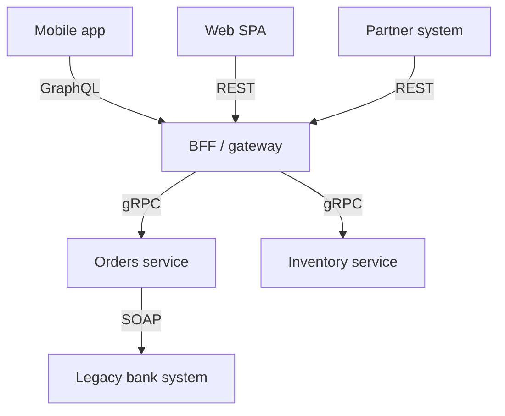

# 10.14 — REST vs gRPC vs GraphQL vs SOAP

> **[← Roadmap](../../ROADMAP.md)** · **Section:** [10. Web API Design and REST](../../ROADMAP.md#10-web-api-design-and-rest)
> **Prev:** [10.13 Idempotency keys and ETags](10.13-idempotency-etags.md) · **Next:** [11.1 Binding sources](../11-model-binding-validation/11.01-binding-sources.md)

**Markers:** ⭐ 🎯 · **Confidence:** 🔴 · **Last reviewed:** —

---

## TL;DR

Four ways to expose an API, each with a situation it genuinely wins.

- **REST** — the default. Universally understood, cacheable, works everywhere. Over-fetches.
- **gRPC** — binary over HTTP/2, contract-first, fast. **Internal service-to-service.** Not callable from a browser without a proxy.
- **GraphQL** — the client asks for exactly the fields it wants. Solves over-fetching; **breaks HTTP caching** and creates real security problems.
- **SOAP** — legacy. Know what it is; you will meet it integrating with banks and government.

---

## Definitions

| Term | What it is | What it means |
|---|---|---|
| **REST** | *an architectural style* | Resources at URLs, standard HTTP verbs, JSON. |
| **gRPC** | *an RPC framework* | Binary Protobuf over HTTP/2, defined by a `.proto` contract. |
| **Protobuf** | *a serialization format* | Compact binary. Requires a schema. |
| **GraphQL** | *a query language* | The client specifies the shape of the response. |
| **SOAP** | *a protocol* | XML envelopes, usually over HTTP. Described by WSDL. |
| **Over-fetching** | *a problem* | Receiving fields you do not need. |
| **Under-fetching** | *a problem* | Needing several calls to build one screen. |
| **N+1 (GraphQL)** | *a problem* | A nested query triggering one database call per item. |
| **DataLoader** | *a pattern* | Batching resolver calls to fix that N+1. |
| **gRPC-Web** | *a variant* | A proxy layer letting browsers call gRPC. |
| **Streaming** | *a capability* | gRPC supports client, server and bidirectional streams. |
| **Query depth limiting** | *a defence* | Rejecting deeply nested GraphQL queries. |

---

## The concept

The four differ along one axis more than any other: **who decides the shape of the response.**

- **REST** — the server decides. One endpoint, one shape, for everyone.
- **GraphQL** — the client decides, per request.
- **gRPC** — both agree in advance, in a contract file compiled into code on both sides.
- **SOAP** — the same idea as gRPC, twenty years earlier, in XML, with far more ceremony.

Everything else — performance, caching, tooling — follows from that.

### The analogy

- **REST** — a **set menu**. Order dish 4; you get dish 4 as written, including the garnish.
- **GraphQL** — **à la carte**. Describe exactly what you want. Flexible, and a kitchen can be overwhelmed by an elaborate order.
- **gRPC** — a **standing contract with a supplier**. Agreed in advance, efficient, and changing it means both sides agree.
- **SOAP** — the same contract, notarised, in triplicate, with a covering letter.

---

## How it works

### The comparison

| | REST | gRPC | GraphQL | SOAP |
|---|---|---|---|---|
| Transport | HTTP/1.1+ | **HTTP/2 only** | HTTP (usually `POST`) | HTTP, SMTP, … |
| Format | JSON | **Binary Protobuf** | JSON | XML |
| Contract | OpenAPI *(optional)* | **`.proto` (required)** | **Schema (required)** | **WSDL (required)** |
| Browser support | ✅ Native | ❌ **Needs gRPC-Web** | ✅ | ✅ |
| HTTP caching | ✅ **Free** | ❌ | ❌ **Hard** | ❌ |
| Over-fetching | ⚠️ Yes | ⚠️ Yes | ✅ **Solved** | ⚠️ Yes |
| Streaming | ⚠️ SSE / WebSocket | ✅ **Bidirectional** | ⚠️ Subscriptions | ❌ |
| Payload size | Baseline | ✅ **~30–50% smaller** | Varies | ⚠️ **Largest** |
| Human-readable | ✅ | ❌ | ✅ | ⚠️ Verbose |
| Tooling maturity | ✅ Universal | ✅ Good | ✅ Good | ⚠️ Legacy |
| Learning curve | ✅ Low | ⚠️ Medium | ⚠️ **High to do safely** | ⚠️ High |

### gRPC — what it is actually for

```protobuf
syntax = "proto3";

service OrderService {
  rpc GetOrder (GetOrderRequest) returns (Order);
  rpc StreamOrders (StreamRequest) returns (stream Order);   // server streaming
}

message GetOrderRequest { int32 id = 1; }

message Order {
  int32 id = 1;
  string reference = 2;
  double total = 3;
  repeated OrderLine lines = 4;
}
```

**The `.proto` file is the contract**, and it compiles to strongly-typed client and server code in
C#, Go, Java, Python and more. A field removed from the contract is a compile error on both sides —
which is the real appeal, not just the speed.

```csharp
// Server
public sealed class OrderGrpcService : OrderService.OrderServiceBase
{
    public override async Task<Order> GetOrder(GetOrderRequest request, ServerCallContext context)
    {
        var order = await _orders.FindAsync(request.Id, context.CancellationToken);
        if (order is null)
            throw new RpcException(new Status(StatusCode.NotFound, "Order not found"));

        return order.ToProto();
    }
}

// Client — a generated, typed proxy
var client = new OrderService.OrderServiceClient(channel);
var order = await client.GetOrderAsync(new GetOrderRequest { Id = 42 });
```

⚠️ **A browser cannot call gRPC directly.** It requires HTTP/2 trailers, which the browser fetch API
does not expose. gRPC-Web adds a proxy layer at the cost of most streaming support. **That single
fact settles most "should our public API be gRPC?" questions** ([21.6](../21-advanced-features/21.06-grpc.md)).

⚠️ **Field numbers in a `.proto` are the contract, not the names.** Renaming a field is safe;
**changing or reusing a number silently corrupts data** on any client still using the old build.

### GraphQL — one endpoint, client-shaped responses

```graphql
query {
  order(id: 42) {
    reference
    total
    customer { name email }
    lines { productName quantity }
  }
}
```

One request, exactly those fields, and the nested customer comes back in the same round trip. For a
mobile client assembling a screen from several resources, that is a genuine win — no over-fetching,
no under-fetching, no waterfall of REST calls.

**The costs are substantial and worth being able to name:**

⚠️ **HTTP caching stops working.** Everything is a `POST` to `/graphql`, so CDN and proxy caching —
which REST gets for free — is gone. You rebuild it inside the application with persisted queries or
a response cache ([19.5](../19-caching-performance/19.05-response-caching.md)).

⚠️ **N+1 by construction.** A query for 100 orders each with a customer calls the customer resolver
100 times. **DataLoader batching is not optional** — it is required to make GraphQL viable
([13.9](../13-entity-framework-core/13.09-n-plus-one.md)).

⚠️ **Query complexity is a denial-of-service vector.** A client can nest
`order → customer → orders → customer → …` and generate enormous work from a tiny request. Depth
limits, complexity scoring and query allowlists are **mandatory**, not hardening.

⚠️ **Authorization is per-field, not per-endpoint.** `[Authorize]` on a controller covers one
endpoint; in GraphQL every field of every type needs its own check, or one deeply-nested query
becomes a data leak ([16.8](../16-authorization/16.08-authz-everywhere.md)).

⚠️ **Errors return 200.** GraphQL puts failures in an `errors` array with a 200 status, which is
exactly the anti-pattern REST avoids ([10.3](10.03-status-codes.md)) — monitoring that alerts on
5xx rate sees nothing.

**The honest framing:** GraphQL solves a real problem — many clients wanting different shapes of the
same data — and introduces four problems REST does not have. It is worth it when the first problem
is genuinely yours.

### SOAP — what you need to know

XML envelopes, a WSDL describing operations, and WS-* extensions for security and transactions.

⚠️ **Nobody starts a new SOAP service.** But banks, insurers, government and legacy enterprise
systems run on it, and being able to consume one is a practical skill:

```bash
# Generates a typed client from a WSDL
dotnet-svcutil https://partner.example.com/service.asmx?wsdl
```

Its genuine strengths, which explain why it persists: a strict machine-readable contract,
message-level security (WS-Security signs the message, not just the transport), and standardised
distributed transactions. REST has no equivalent to the second and third.

### The deeper detail — choosing

| Situation | Choose |
|---|---|
| Public API for unknown clients | **REST** |
| Internal service-to-service, high volume | **gRPC** |
| Polyglot microservices needing a strict contract | **gRPC** |
| Mobile client, expensive round trips, varied screens | **GraphQL** |
| Many clients each wanting different field sets | **GraphQL** |
| Response must be CDN-cacheable | **REST** |
| Real-time bidirectional streaming | **gRPC** or SignalR ([21.4](../21-advanced-features/21.04-signalr.md)) |
| Integrating with a bank or government system | **SOAP**, because you have no choice |
| A CRUD app | **REST** — do not overthink it |

**They are not exclusive, and the strongest answer says so.** A realistic architecture:



REST at the public edge because everyone can call it, gRPC between internal services because it is
fast and contract-checked, GraphQL for the mobile client that needs flexible shapes, and SOAP where
an external system leaves no choice ([23.10](../23-microservices/23.10-api-gateway-bff.md)).

---

## Code

The same operation, four ways.

**REST:**

```csharp
[HttpGet("api/orders/{id:int}")]
public async Task<ActionResult<OrderDto>> Get(int id, CancellationToken ct)
{
    var order = await _orders.FindAsync(id, ct);
    return order is null ? NotFound() : Ok(order);
    // Fixed shape. Cacheable. Every client gets every field.
}
```

**gRPC:**

```csharp
public override async Task<Order> GetOrder(GetOrderRequest request, ServerCallContext context)
{
    var order = await _orders.FindAsync(request.Id, context.CancellationToken);

    // gRPC has its own status codes, not HTTP ones
    if (order is null)
        throw new RpcException(new Status(StatusCode.NotFound, "Order not found"));

    return order.ToProto();
}
```

**GraphQL** (Hot Chocolate — the standard .NET implementation):

```csharp
public sealed class Query
{
    [UseProjection]                    // translates the selection set into a SQL projection
    [Authorize]
    public IQueryable<Order> GetOrders([Service] AppDbContext db) => db.Orders;
}

public sealed class OrderType : ObjectType<Order>
{
    protected override void Configure(IObjectTypeDescriptor<Order> descriptor)
    {
        // ⚠️ Per-FIELD authorization. There is no single endpoint to protect —
        // a nested query reaches this field from many directions.
        descriptor.Field(o => o.CostPrice).Authorize("StaffOnly");

        // ⚠️ Without DataLoader batching this is N+1: one query per order.
        descriptor.Field(o => o.Customer)
                  .ResolveWith<Resolvers>(r => r.GetCustomer(default!, default!));
    }
}

public sealed class Resolvers
{
    public async Task<Customer> GetCustomer(
        [Parent] Order order,
        CustomerByIdDataLoader loader)      // batches all customer IDs into ONE query
        => await loader.LoadAsync(order.CustomerId);
}
```

The mandatory GraphQL hardening, which is the part worth remembering:

```csharp
builder.Services
    .AddGraphQLServer()
    .AddQueryType<Query>()
    .AddAuthorization()
    // ⚠️ All three of these are required, not optional. Without them a single
    // small request can generate unbounded database work.
    .ModifyRequestOptions(o => o.ExecutionTimeout = TimeSpan.FromSeconds(10))
    .AddMaxExecutionDepthRule(8)
    .ModifyCostOptions(o =>
    {
        o.MaxFieldCost = 1_000;
        o.EnforceCostLimits = true;
    });
```

**SOAP client:**

```csharp
// Generated from the WSDL by dotnet-svcutil
var client = new PartnerServiceClient(
    PartnerServiceClient.EndpointConfiguration.PartnerServiceSoap);

var response = await client.GetOrderAsync(new GetOrderRequest { OrderId = 42 });
```

---

## Interview questions

**Q: When would you choose gRPC over REST?**

Internal service-to-service traffic, especially high volume or polyglot. The payload is binary
Protobuf, so it is roughly 30–50% smaller, it runs on HTTP/2 with multiplexing, and the `.proto`
file gives both sides a compile-checked contract — removing a field breaks the build rather than
producing a runtime null. It also has proper bidirectional streaming. What rules it out for a public
API is that browsers cannot call it directly: it needs HTTP/2 trailers that the fetch API does not
expose, so you need gRPC-Web and a proxy, and you lose most of the streaming.

**Q: What problem does GraphQL solve, and what does it cost?**

It solves over-fetching and under-fetching — the client specifies exactly which fields it wants, so
a mobile screen that would take four REST calls becomes one request with no wasted data. The costs
are real and there are four. HTTP caching stops working, because everything is a `POST` to one
endpoint, so you rebuild caching inside the application. N+1 is built into the resolver model, so
DataLoader batching is mandatory rather than an optimisation. Query complexity is a DoS vector, so
depth and cost limits are mandatory too. And authorization moves from per-endpoint to per-field,
which is a lot more surface area to get right.

**Q: Do you have to pick one?**

No, and in a real system you usually do not. A common shape is REST at the public edge because
anything can call it and it caches for free, gRPC between internal services for speed and a checked
contract, GraphQL fronting a mobile client through a BFF where flexible shapes actually pay, and
SOAP wherever an external partner leaves no choice. The interesting question is not which is best
but which boundary you are designing — a public edge and an internal hop have genuinely different
requirements.

**Q: What do you need to know about SOAP?**

That you will not build one but you may have to consume one, because banks, insurers and government
systems still run on it. It is XML envelopes over HTTP with a WSDL describing the operations, and
`dotnet-svcutil` generates a typed client from that WSDL. Its real strengths explain why it survives:
a strict machine-readable contract, message-level security through WS-Security — signing the message
itself rather than relying on the transport — and standardised distributed transactions. REST has no
direct equivalent to the last two.

---

## Traps ⚠️

- **"gRPC is just faster REST."** It is a different model — contract-first, binary, HTTP/2 only.
- **Proposing gRPC for a browser-facing API.** It needs a proxy.
- **Reusing or changing a `.proto` field number** silently corrupts data.
- **GraphQL without DataLoader** is N+1 by construction.
- **GraphQL without depth and cost limits** is a DoS vector.
- **GraphQL authorization at the endpoint** — it must be per field.
- **GraphQL errors return 200**, so 5xx-based monitoring sees nothing.
- **Expecting HTTP caching from GraphQL.** One `POST` endpoint defeats it.
- **Choosing GraphQL for a single client.** The flexibility buys nothing.
- **Choosing gRPC for a public API** with unknown consumers.
- **Dismissing SOAP entirely** — WS-Security has no REST equivalent.
- **Treating this as a ranking.** It is a fit question.

---

## Related

- [10.1 REST principles](10.01-rest-principles.md) — the baseline
- [10.3 Status codes](10.03-status-codes.md) — why GraphQL's 200s are a problem
- [10.7 Pagination](10.07-pagination-filtering.md) — cursors came from GraphQL
- [21.6 gRPC](../21-advanced-features/21.06-grpc.md) — gRPC in depth
- [21.4 SignalR](../21-advanced-features/21.04-signalr.md) — the other real-time option
- [21.5 Real-time transports](../21-advanced-features/21.05-realtime-transports.md) — WebSockets vs SSE
- [23.3 Sync communication](../23-microservices/23.03-sync-communication.md) — between services
- [23.10 API gateway and BFF](../23-microservices/23.10-api-gateway-bff.md) — mixing the styles
- [13.9 N+1](../13-entity-framework-core/13.09-n-plus-one.md) — the GraphQL resolver problem

---

## Sources

- [Microsoft Learn — Compare gRPC services with HTTP APIs](https://learn.microsoft.com/aspnet/core/grpc/comparison)
- [GraphQL — Best Practices](https://graphql.org/learn/best-practices/)
- [Hot Chocolate documentation](https://chillicream.com/docs/hotchocolate)
